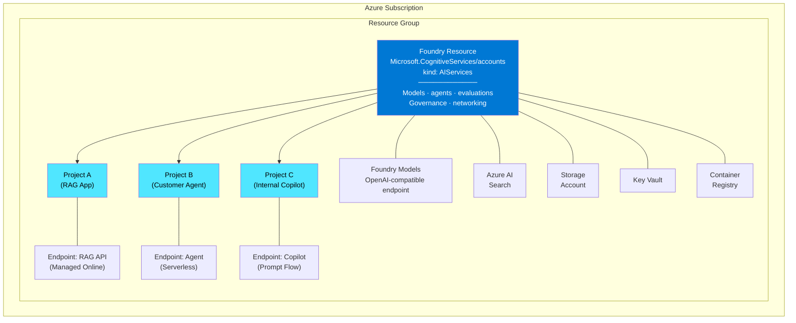
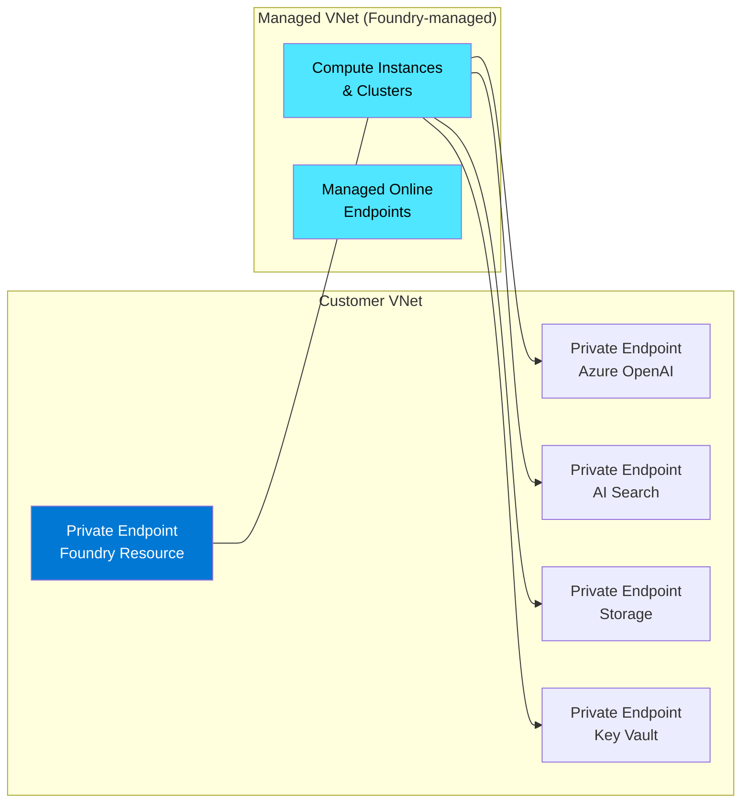
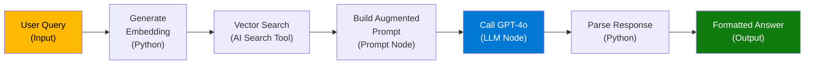
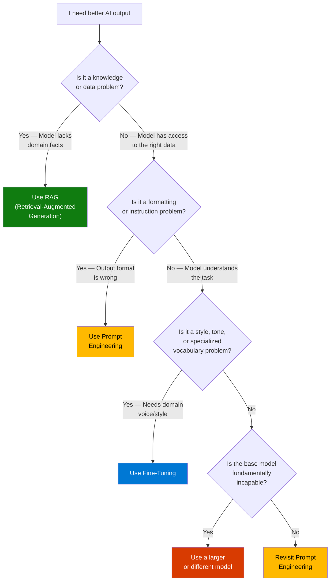
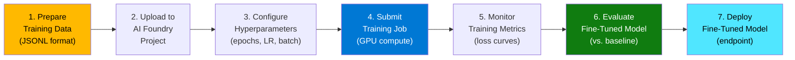
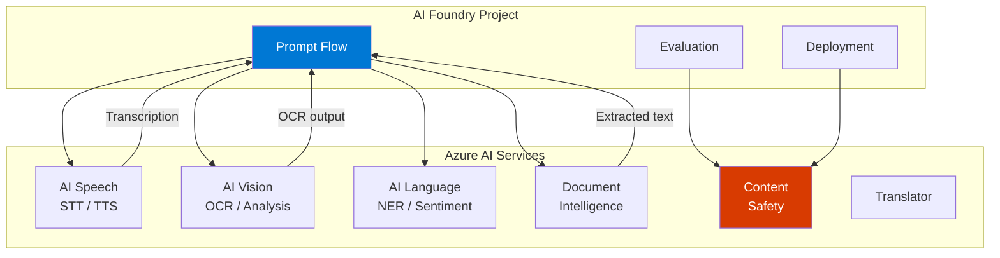
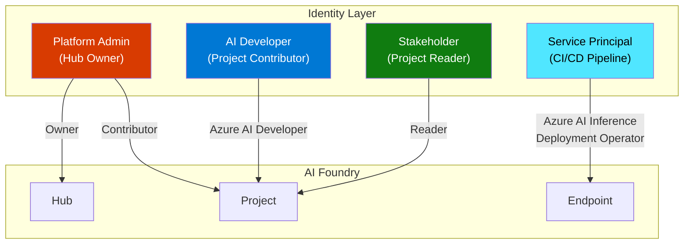

# Module O4: Microsoft Foundry — Platform Deep Dive

> **Duration:** 60-90 minutes | **Level:** Platform
> **Audience:** Cloud Architects, Platform Engineers, CSAs
> **Last Updated:** August 2026
> **Platform facts verified:** 2026-08-03 against [Microsoft Foundry architecture](https://learn.microsoft.com/azure/foundry/concepts/architecture) and the [classic migration guide](https://learn.microsoft.com/azure/foundry/how-to/navigate-from-classic)

---

<!-- FROOT-PEDAGOGY:O4:INTRO -->
## Learning Outcomes

After completing this module, you can:

- Model Microsoft Foundry resources and projects as governance and application boundaries.
- Choose deployment, networking, identity, quota, and evaluation patterns from workload requirements.
- Separate current Foundry guidance from classic migration references.
- Create an evidence-backed production readiness decision for a Foundry workload.

## Prerequisites

**Prerequisites:** Complete [F1](./GenAI-Foundations.md), [O2](./AI-Agents-Deep-Dive.md), and have basic Azure CLI and RBAC experience.

## 3.1 What is Microsoft Foundry?

Microsoft Foundry is Microsoft's **unified platform for building, evaluating, governing, and operating AI applications and agents** on Azure. The current platform brings models, agents, evaluations, and Foundry Tools under a Foundry resource with child projects.

### The Evolution

The naming journey matters because customers still encounter every generation in repositories and deployed resources.

| Era | Name | What It Was | Key Limitation |
|-----|------|-------------|----------------|
| 2016-2022 | **Azure Machine Learning Studio** | Drag-and-drop ML training and deployment | Focused on classical ML; poor LLM support |
| 2023-2024 | **Azure AI Studio** | Preview portal for generative AI projects | Separate from Azure ML; fragmented experience |
| Late 2024-2025 | **Azure AI Foundry / Foundry (classic)** | Hub-based generative AI platform | Classic SDK and resource architecture |
| 2026+ | **Microsoft Foundry** | Foundry resource, child projects, models, agents, evaluations, and Foundry Tools | Current platform -- this module's focus |

The current Foundry resource is an Azure resource: `Microsoft.CognitiveServices/accounts` with `kind: AIServices`. A Foundry project is its `Microsoft.CognitiveServices/accounts/projects` child resource. This differs from the classic Hub/Project architecture based on `Microsoft.MachineLearningServices/workspaces`.

### Three Interfaces, One Platform

| Interface | Best For | Example Use Case |
|-----------|----------|-----------------|
| **Foundry portal** | Models, agents, evaluations, project operations | A team developing and operating an agent |
| **Foundry SDKs** | Project automation, agents, evaluations, connections | A platform team automating application delivery |
| **OpenAI v1 endpoint and SDK** | Model inference through a stable OpenAI-compatible route | An application using Responses or chat-completions APIs |
| **ARM, Bicep, CLI, and `azd`** | Repeatable resource and application delivery | A platform pipeline provisioning governed environments |

:::tip Architect's Mental Model
Think of Microsoft Foundry as an **AI application and agent platform that participates in Azure's control plane**. ARM still provisions resources, while Foundry supplies project, model, agent, evaluation, and operational experiences.
:::

:::warning Migration Boundary
The classic Hub architecture, `azure-ai-projects` 1.x, Assistants API, and monthly `api-version` examples are not the default for new development. Use `azure-ai-projects` 2.x and OpenAI v1 guidance for the current portal. The Assistants API sunsets on **2026-08-26**; migrate agent workloads to Foundry Agents and Responses APIs. See the [official migration guide](https://learn.microsoft.com/azure/foundry/how-to/navigate-from-classic).
:::

---

## 3.2 Architecture & Resource Model

The current architecture uses a **Foundry resource** as the governance and capability boundary and **child projects** as application isolation boundaries.

### Foundry Resource and Project Model



### Foundry Resource (Parent)

The **Foundry resource** is the shared administrative boundary. It provides:

- **Model deployments** -- Microsoft and partner models exposed through supported endpoints
- **Agent and evaluation capabilities** -- shared platform services consumed by projects
- **Networking configuration** -- public access, private endpoints, managed VNet
- **Security policies** -- RBAC role assignments, managed identity, customer-managed keys
- **Foundry Tools** -- Speech, Vision, Language, Content Safety, and related prebuilt capabilities

A Foundry resource maps to `Microsoft.CognitiveServices/accounts` with `kind: AIServices`.

### Project (Child Resource)

A **Project** is an isolated development and operations boundary scoped to an AI application or workload. It maintains its own:

- Model deployments and endpoints
- Agent versions and application assets
- Evaluation runs and datasets
- Fine-tuning jobs
- Artifacts and logs

A Project maps to `Microsoft.CognitiveServices/accounts/projects` beneath its parent Foundry resource.

### Resource Relationship Summary

| Resource | Scope | Cardinality | Key Responsibility |
|----------|-------|-------------|-------------------|
| **Foundry resource** | Organization or platform boundary | One or more per landing zone | Models, agents, evaluations, Tools, governance, networking |
| **Project** | Application boundary | Many per Foundry resource | Isolated application development and operations |
| **Azure AI Search** | Connected Azure resource | As required | Retrieval and grounding |
| **Storage / Cosmos DB / Key Vault** | Connected Azure resources | Architecture-dependent | Data, state, artifacts, and secrets |
| **Application Insights** | Connected Azure resource | Recommended per operational boundary | Traces, metrics, and evaluation correlation |

### RBAC Model

Microsoft Foundry uses Azure RBAC with purpose-built roles.

| Role | Scope | Permissions |
|------|-------|-------------|
| **Foundry User** | Project | Build and use project capabilities without broad resource administration |
| **Foundry Project Manager** | Project | Manage project-level assets and access |
| **Foundry Owner** | Foundry resource | Govern the resource and its projects |
| **Contributor / Reader** | Azure resource scope | General Azure control-plane access; combine carefully with data-plane roles |

:::tip RBAC Best Practice
Assign developer access at the **Project level** and reserve Foundry-resource roles for platform administrators. Control-plane roles alone do not necessarily grant the required data-plane permissions.
:::

### Networking Options

| Mode | Description | Use Case |
|------|-------------|----------|
| **Public** | Foundry endpoints use public networking with Microsoft Entra authentication | Development and approved low-risk workloads |
| **Private Endpoints** | Foundry and connected Azure resources are reachable through private endpoints | Production enterprise workloads |
| **Managed VNet** | Foundry manages a VNet on your behalf; you control outbound rules. Compute runs inside this managed VNet | Simplified private networking without BYO VNet complexity |
| **Managed VNet + Data Exfiltration Protection** | Managed VNet with outbound restricted to approved destinations only | Highly regulated industries (financial services, healthcare) |



---

## 3.3 Model Catalog

The model catalog is the front door of Microsoft Foundry. Its contents, deployment types, licenses, regions, and lifecycle states change continuously; query the [current Foundry model catalog](https://ai.azure.com/explore/models) before selecting a model. Do not use a fixed catalog count for architecture or procurement decisions.

### Model Providers

| Provider | Example Models | License Type |
|----------|---------------|-------------|
| **Azure OpenAI (Microsoft)** | GPT-4o, GPT-4.1, GPT-4.1-mini, GPT-4.1-nano, o3, o4-mini | Proprietary (Microsoft-hosted) |
| **Microsoft Research** | Phi-4, Phi-4-mini, Phi-4-multimodal, MAI-1 | Open-weight (MIT license) |
| **Meta** | Llama 4 Scout, Llama 4 Maverick, Llama 3.3 70B | Open-weight (Llama license) |
| **Mistral** | Mistral Large 2, Mistral Small, Codestral, Pixtral | Open-weight / Commercial |
| **Cohere** | Command R+, Command R, Embed v3 | Commercial |
| **AI21 Labs** | Jamba 1.5 Large, Jamba 1.5 Mini | Commercial |
| **Hugging Face** | Hundreds of community models (BERT, T5, Whisper variants) | Various open-source |
| **NVIDIA** | Nemotron, NV-Embed | Open-weight |

### Two Deployment Paradigms

The catalog offers two fundamentally different ways to run a model. Understanding this distinction is critical for cost planning and architecture.

| Dimension | Models as a Service (MaaS) | Managed Compute |
|-----------|---------------------------|-----------------|
| **What it is** | Serverless API -- Microsoft hosts the model | You deploy the model onto dedicated VMs |
| **Billing** | Pay-per-token (input + output tokens) | Pay-per-hour for the VM SKU |
| **Compute management** | None -- fully managed | You choose VM size, instance count, scaling rules |
| **Cold start** | None (always warm) | Possible if scaled to zero |
| **Customization** | System prompts and parameters only | Full control -- custom containers, fine-tuned weights |
| **Available models** | Azure OpenAI models, select partner models (Llama, Mistral, Cohere) | Any model from the catalog or a custom model |
| **Networking** | Public endpoint with AAD auth; private endpoint available | Private endpoint, VNet integration, managed VNet |
| **Best for** | Quick prototyping, variable workloads, multi-model testing | Production workloads with predictable traffic, custom models, strict isolation |

### Serverless API Endpoints (MaaS)

Serverless API endpoints are the simplest path from model selection to production. You select a model from the catalog, accept the terms, and receive an API endpoint and key. No compute provisioning, no VM sizing, no scaling configuration.

**Key characteristics:**

- **Pay-per-token pricing** -- you pay only for the tokens you consume (input + output)
- **No infrastructure to manage** -- Microsoft handles scaling, availability, and hardware
- **Azure OpenAI-compatible API** -- same SDK and API contract as Azure OpenAI deployments
- **Immediate availability** -- endpoint is live within seconds of deployment
- **Regional availability matters** -- not all models are available in all regions

### Managed Online Endpoints

Managed Online Endpoints give you **dedicated compute** for model serving. You deploy a model (from the catalog or your own custom model) to a specific VM SKU and control scaling.

**Key characteristics:**

- **Dedicated VMs** -- choose from CPU or GPU SKUs (e.g., `Standard_NC24ads_A100_v4`)
- **Autoscaling** -- scale based on request count, CPU, or custom metrics
- **Blue-green deployments** -- traffic splitting across multiple deployments for safe rollouts
- **Custom containers** -- bring your own inference server (e.g., vLLM, TGI, Triton)
- **VNet integration** -- deploy endpoints inside a managed VNet with private endpoint access

### Comparing Models in the Catalog

The portal provides built-in tools for model comparison:

1. **Benchmark scores** -- view standardized benchmarks (MMLU, HumanEval, MT-Bench) side by side
2. **Model cards** -- detailed descriptions of capabilities, limitations, and intended use cases
3. **Try it out** -- interactive playground to test models with your own prompts before deploying
4. **Pricing calculator** -- estimate costs based on expected token volume
5. **Region availability** -- check which regions support which models

---

## 3.4 Model Deployments

Deployment is where architecture decisions meet operational reality. Azure AI Foundry supports three deployment types, each with different performance, cost, and management characteristics.

### Deployment Type 1: Azure OpenAI Deployments

These are deployments of Microsoft's proprietary models (GPT-4o, GPT-4.1, o3, etc.) through the Azure OpenAI Service resource connected to your Hub.

| Variant | Description | Billing | SLA | Best For |
|---------|-------------|---------|-----|----------|
| **Standard** | Shared capacity in a single region | Pay-per-token | 99.9% | Development, moderate production workloads |
| **Global Standard** | Shared capacity across global regions (auto-routed) | Pay-per-token (same price) | 99.9% | Production workloads that benefit from global capacity and lower latency |
| **Provisioned (PTU)** | Reserved throughput units in a specific region | Pay-per-PTU-hour (reserved) | 99.9% | Predictable high-volume workloads, latency-sensitive apps |
| **Global Provisioned (PTU)** | Reserved throughput units across global regions | Pay-per-PTU-hour (reserved) | 99.9% | High-volume global workloads needing guaranteed throughput |
| **Data Zone Standard** | Shared capacity within a data boundary (e.g., EU) | Pay-per-token | 99.9% | Data residency requirements |
| **Data Zone Provisioned** | Reserved throughput within a data boundary | Pay-per-PTU-hour | 99.9% | High-volume workloads with data residency requirements |

:::tip Understanding PTUs
A **Provisioned Throughput Unit (PTU)** is a unit of reserved model processing capacity. One PTU does not equal one request -- the relationship depends on the model, prompt size, and generation length. Use the Azure OpenAI **capacity calculator** to estimate how many PTUs your workload needs. PTUs are committed in monthly or yearly reservations, with significant discounts for longer commitments.
:::

### Deployment Type 2: Serverless API Deployments

These are pay-per-token deployments for partner models (Llama, Mistral, Cohere) and some Microsoft models that use the Models as a Service (MaaS) infrastructure.

- No compute to manage
- You accept the model provider's terms of use
- Charged per million input/output tokens
- Endpoint is Azure OpenAI-compatible (same SDK, same API shape)

### Deployment Type 3: Managed Online Endpoints

These are dedicated-compute deployments for any model -- from the catalog or custom.

- You select the VM SKU and instance count
- Support for autoscaling (min/max replicas, scaling metric)
- Blue-green deployment with traffic splitting
- Custom inference containers supported
- Full VNet integration and private endpoint access

### Deployment Types Comparison

| Dimension | Azure OpenAI (Standard) | Azure OpenAI (PTU) | Serverless API (MaaS) | Managed Online Endpoint |
|-----------|------------------------|--------------------|-----------------------|------------------------|
| **Models** | GPT-4o, GPT-4.1, o3, etc. | GPT-4o, GPT-4.1, o3, etc. | Llama, Mistral, Cohere, etc. | Any (catalog or custom) |
| **Billing** | Per token | Per PTU-hour (reserved) | Per token | Per VM-hour |
| **Throughput** | Shared, rate-limited | Guaranteed (reserved) | Shared, rate-limited | Dedicated (VM-bound) |
| **Latency** | Variable (shared pool) | Predictable (reserved) | Variable (shared pool) | Predictable (dedicated) |
| **Scaling** | Automatic (within quota) | Fixed PTU allocation | Automatic (within quota) | Manual or autoscale |
| **Networking** | Public + Private Endpoint | Public + Private Endpoint | Public + Private Endpoint | Managed VNet + Private Endpoint |
| **GPU management** | None | None | None | You choose VM SKU |
| **Customization** | System prompt, parameters | System prompt, parameters | System prompt, parameters | Full (custom container, weights) |

### Quotas and Rate Limits

Every deployment type has quotas. Platform architects must plan for quota as a first-class infrastructure concern.

| Quota Type | Applies To | Unit | How to Increase |
|------------|-----------|------|-----------------|
| **Tokens per Minute (TPM)** | Azure OpenAI Standard | Tokens/min per deployment | Azure portal quota page or support ticket |
| **Requests per Minute (RPM)** | Azure OpenAI Standard | Requests/min per deployment | Derived from TPM (approximately TPM / 6) |
| **PTU allocation** | Azure OpenAI Provisioned | PTU count per subscription/region | Capacity reservation via portal or support |
| **Endpoint count** | Managed Online Endpoints | Endpoints per subscription/region | Support ticket |
| **VM cores** | Managed Online Endpoints | vCPU cores per subscription/region | Standard Azure quota increase |

---

## 3.5 Prompt Flow

Prompt Flow is Azure AI Foundry's **visual orchestration tool for building LLM applications**. If you are familiar with Azure Logic Apps or Power Automate, the mental model is similar -- but purpose-built for AI workflows.

### What is Prompt Flow?

Prompt Flow lets you build **DAG-based flows** (Directed Acyclic Graphs) where each node performs a specific operation: call an LLM, execute Python code, process a prompt template, or invoke a tool. The output of one node feeds into the next, creating a composable pipeline.



### Node Types

| Node Type | Purpose | Example |
|-----------|---------|---------|
| **LLM** | Call a language model (Azure OpenAI, Serverless API) | Generate a response given context and query |
| **Prompt** | Define a prompt template with variable substitution | Build a system message with `{{context}}` and `{{query}}` placeholders |
| **Python** | Execute arbitrary Python code | Parse JSON, call an external API, transform data |
| **Tool** | Invoke a pre-built or custom tool | Azure AI Search retrieval, Bing Search, custom REST calls |
| **LLM + Function Calling** | Call an LLM with tool definitions for autonomous tool selection | Agent-style node that decides which tools to call |
| **Conditional** | Branch the flow based on a condition | Route to different LLMs based on query complexity |

### Use Case: Building a RAG Pipeline in Prompt Flow

Here is how you would build a Retrieval-Augmented Generation pipeline visually in Prompt Flow:

**Step 1: Input Node** -- Accept the user's query as a string input.

**Step 2: Embedding Node (Python)** -- Call the Azure OpenAI embedding model to convert the query into a vector.

**Step 3: Search Node (Tool)** -- Query Azure AI Search with the vector to retrieve the top-k most relevant document chunks.

**Step 4: Prompt Node** -- Construct an augmented prompt that injects the retrieved chunks as context, along with the user query.

**Step 5: LLM Node** -- Send the augmented prompt to GPT-4o for answer generation.

**Step 6: Output Node** -- Return the generated answer along with source citations.

The entire flow is defined as a YAML file (`flow.dag.yaml`) that can be version-controlled in Git, making it CI/CD-friendly.

### Evaluation Flows

Prompt Flow supports a special type of flow called an **evaluation flow**. Instead of processing user queries, evaluation flows **score the quality of outputs** produced by your main flow.

An evaluation flow typically:

1. Takes the main flow's output (answer), the ground-truth answer, and the original question as inputs
2. Calls an LLM (or runs custom Python logic) to score the output on metrics like groundedness, relevance, and coherence
3. Outputs numerical scores that can be aggregated across a test dataset

This enables automated quality gates in your CI/CD pipeline -- if the evaluation scores drop below a threshold, the deployment is blocked.

### Deploying a Flow as an Endpoint

Once you have built and tested a Prompt Flow:

1. **Build** the flow into a Docker container (Foundry handles this automatically)
2. **Deploy** the container to a Managed Online Endpoint
3. **Configure** autoscaling, traffic splitting, and authentication
4. **Monitor** with built-in metrics (latency, throughput, error rate, token consumption)

The deployed flow exposes a REST API endpoint that your application calls -- just like any other microservice.

---

## 3.6 Model Evaluation

Evaluation is the most underinvested area in most AI projects and the most important area for production readiness. Azure AI Foundry provides built-in evaluation capabilities that let you systematically measure model quality before deployment.

### Why Evaluation Matters

| Without Evaluation | With Evaluation |
|--------------------|-----------------|
| "It seems to work okay in my testing" | Quantified quality scores across hundreds of test cases |
| Ship and hope | Ship with confidence backed by metrics |
| Catch problems from user complaints | Catch problems before users see them |
| No regression detection | Automated regression testing in CI/CD |
| Anecdotal quality assessment | Data-driven model selection and prompt optimization |

### Built-in Evaluation Metrics

Azure AI Foundry provides LLM-as-a-judge evaluation metrics that use a grader model (typically GPT-4o) to score your application's outputs.

| Metric | What It Measures | Scale | When It Matters |
|--------|-----------------|-------|-----------------|
| **Groundedness** | Is the answer supported by the provided context? (Not hallucinated) | 1-5 | RAG applications -- critical for factual accuracy |
| **Relevance** | Does the answer address the user's actual question? | 1-5 | All applications -- ensures on-topic responses |
| **Coherence** | Is the answer logically structured and readable? | 1-5 | Long-form generation -- reports, summaries, explanations |
| **Fluency** | Is the language natural, grammatically correct? | 1-5 | Customer-facing applications |
| **Similarity** | How close is the answer to a known ground-truth answer? | 1-5 | Applications with deterministic expected outputs |
| **F1 Score** | Token-level overlap with ground-truth | 0-1 | Extractive QA tasks |
| **ROUGE** | N-gram overlap with reference text | 0-1 | Summarization tasks |
| **BLEU** | Precision of n-gram overlap | 0-1 | Translation tasks |

### Custom Evaluation Metrics

When built-in metrics are not sufficient, you can define custom evaluation metrics using:

- **Python functions** -- Write a Python function that takes the model output and returns a score
- **LLM-as-a-judge prompts** -- Write a custom prompt that instructs GPT-4o to score the output on your domain-specific criteria (e.g., "Does this medical summary include all required ICD-10 codes?")
- **Composite metrics** -- Combine multiple metrics into a single quality score with weighted averages

### Red-Teaming Evaluations

Red-teaming tests whether your AI application can be manipulated into producing harmful, biased, or policy-violating outputs.

Azure AI Foundry supports red-teaming through:

1. **Automated adversarial testing** -- Built-in adversarial datasets that probe for jailbreaks, prompt injections, and content policy violations
2. **Custom red-team datasets** -- Define your own adversarial prompts tailored to your application's domain
3. **Azure AI Content Safety integration** -- Automatically score outputs for hate speech, violence, self-harm, and sexual content severity levels
4. **Human-in-the-loop review** -- Export flagged outputs for manual review by your safety team

### Evaluation Datasets and Test Suites

A robust evaluation requires a well-curated test dataset. Best practices:

| Component | Description | Recommended Size |
|-----------|-------------|-----------------|
| **Golden dataset** | Curated question-answer pairs with verified ground-truth | 100-500 examples |
| **Edge case dataset** | Unusual, ambiguous, or boundary-condition queries | 50-100 examples |
| **Adversarial dataset** | Prompt injection attempts, jailbreak probes, out-of-scope queries | 50-200 examples |
| **Regression dataset** | Previously failed cases that were fixed -- prevents regressions | Grows over time |

:::tip Evaluation as a CI/CD Gate
The highest-maturity AI teams treat evaluation as a **deployment gate**. Every PR that changes a prompt, updates a RAG pipeline, or swaps a model triggers an automated evaluation run. If scores drop below the baseline, the deployment is blocked. This is no different from blocking a deployment on failing unit tests -- the principle is identical.
:::

---

## 3.7 Fine-Tuning

Fine-tuning is the process of further training a pre-trained model on your domain-specific data to improve its performance on your specific use case. Azure AI Foundry supports fine-tuning for select models directly within the platform.

### When to Fine-Tune (And When NOT To)



### Fine-Tuning Decision Matrix

| Technique | Cost | Time to Implement | Data Required | Best For | Risk |
|-----------|------|-------------------|---------------|----------|------|
| **Prompt Engineering** | Free | Minutes to hours | 0 - a few examples | Formatting, behavior control, output structure | Low |
| **RAG** | Medium ($) | Hours to days | Document corpus | Factual grounding, dynamic/changing knowledge | Low-Medium |
| **Fine-Tuning** | High ($$) | Days to weeks | 50-10,000+ examples | Domain style, specialized vocabulary, consistent tone | Medium (catastrophic forgetting) |
| **Pre-Training from scratch** | Very High ($$$$$) | Weeks to months | Billions of tokens | Entirely new language or domain | Very High |

### Supported Models for Fine-Tuning

| Model | Minimum Examples | Recommended Examples | Max Training Tokens | Fine-Tuning Method |
|-------|-----------------|---------------------|--------------------|--------------------|
| **GPT-4o** | 10 | 50-500 | Varies by tier | Supervised fine-tuning |
| **GPT-4o-mini** | 10 | 50-500 | Varies by tier | Supervised fine-tuning |
| **GPT-4.1-mini** | 10 | 50-500 | Varies by tier | Supervised fine-tuning |
| **Phi-4** | 10 | 100-1,000 | Varies | LoRA / Full fine-tuning |
| **Phi-4-mini** | 10 | 100-1,000 | Varies | LoRA / Full fine-tuning |
| **Llama 3.3 70B** | 10 | 100-1,000 | Varies | LoRA |
| **Mistral models** | 10 | 100-1,000 | Varies | LoRA |

### Fine-Tuning Workflow



**Data preparation format (JSONL):**

```json
{"messages": [{"role": "system", "content": "You are a medical coding specialist."}, {"role": "user", "content": "Patient presents with acute bronchitis and mild dehydration."}, {"role": "assistant", "content": "ICD-10 Codes:\n- J20.9 (Acute bronchitis, unspecified)\n- E86.0 (Dehydration)"}]}
{"messages": [{"role": "system", "content": "You are a medical coding specialist."}, {"role": "user", "content": "Follow-up for type 2 diabetes, well controlled."}, {"role": "assistant", "content": "ICD-10 Code:\n- E11.65 (Type 2 diabetes mellitus with hyperglycemia)"}]}
```

### LoRA and Parameter-Efficient Fine-Tuning

**LoRA (Low-Rank Adaptation)** is a technique that fine-tunes only a small number of additional parameters (adapters) rather than updating all model weights. This has major implications for architects:

| Dimension | Full Fine-Tuning | LoRA Fine-Tuning |
|-----------|-----------------|------------------|
| **Parameters updated** | All (billions) | Small adapter matrices (millions) |
| **GPU memory required** | Very high (40-80 GB+) | Much lower (often fits on a single GPU) |
| **Training time** | Hours to days | Minutes to hours |
| **Storage per model** | Full model copy (tens of GB) | Small adapter file (tens of MB) |
| **Risk of catastrophic forgetting** | Higher | Lower (base model unchanged) |
| **Multiple specialties** | Need a full copy per specialty | Swap adapters at inference time |
| **Quality** | Marginally better for large domain shifts | Excellent for most use cases |

### Cost and Compute Requirements

Fine-tuning costs are driven by three factors:

1. **Training compute** -- GPU hours consumed during training (typically `Standard_NC24ads_A100_v4` or similar)
2. **Hosting cost** -- Fine-tuned Azure OpenAI models incur higher per-token costs than base models; custom models on Managed Online Endpoints cost per VM-hour
3. **Data preparation** -- Human time to curate, clean, and validate training data (often the most expensive part)

---

## 3.8 Azure AI Services (Integrated)

Azure AI Foundry integrates with the broader **Azure AI Services** family -- pre-built, task-specific AI capabilities that were previously known as Azure Cognitive Services. These services complement generative AI models by handling specialized tasks like speech recognition, document parsing, and content moderation.

### Service Overview

| Service | Capabilities | Common Use Cases | Integration with Foundry |
|---------|-------------|-----------------|--------------------------|
| **Azure AI Speech** | Speech-to-text (STT), text-to-speech (TTS), speech translation, speaker recognition | Voice-enabled copilots, call center analytics, accessibility | Prompt Flow speech nodes, real-time conversation APIs |
| **Azure AI Vision** | Image analysis, OCR, spatial analysis, face detection, custom image classification | Document digitization, visual search, accessibility | Multi-modal RAG (image + text), document processing pipelines |
| **Azure AI Language** | Named Entity Recognition (NER), sentiment analysis, key phrase extraction, summarization, PII detection | Customer feedback analysis, compliance scanning, content tagging | Pre-processing nodes in Prompt Flow, PII redaction before LLM calls |
| **Azure AI Document Intelligence** | Form extraction, invoice processing, receipt parsing, layout analysis, custom document models | Accounts payable automation, contract analysis, claims processing | Document ingestion for RAG pipelines, structured data extraction |
| **Azure AI Content Safety** | Text and image content moderation, prompt shield, groundedness detection, protected material detection | Guardrails for AI applications, user-generated content moderation | Built-in content filtering for Azure OpenAI deployments, evaluation metrics |
| **Azure AI Translator** | Text translation (100+ languages), document translation, custom terminology | Multi-language copilots, document localization | Pre/post-processing in Prompt Flow |

### How These Integrate with Foundry Projects



**Key integration patterns:**

1. **Document Intelligence as RAG Ingestion** -- Use Document Intelligence to extract text, tables, and structure from PDFs and images, then chunk and embed the output for vector search
2. **Content Safety as a Guardrail** -- Content Safety filters run automatically on Azure OpenAI deployments; you can also invoke them explicitly in Prompt Flow for custom models
3. **Speech as an I/O Layer** -- Add voice input/output to any Prompt Flow by using Speech STT (input) and TTS (output) nodes
4. **Language for Pre-Processing** -- Use PII detection to redact sensitive data before sending to an LLM; use NER to extract entities for structured queries

---

## 3.9 Infrastructure Considerations

This section addresses the infrastructure decisions that platform architects must make when deploying Azure AI Foundry in production.

### Compute Options

| Compute Type | Used For | Management | GPU | Typical SKUs |
|-------------|----------|------------|-----|-------------|
| **Serverless (MaaS)** | Azure OpenAI and partner model inference | Fully managed by Microsoft | N/A (abstracted) | N/A |
| **Managed Compute Instance** | Development, Prompt Flow authoring, notebooks | Managed VM (start/stop) | Optional | Standard_DS3_v2, Standard_NC6s_v3 |
| **Managed Compute Cluster** | Training, fine-tuning, batch inference | Managed cluster (auto-scaling) | Yes | Standard_NC24ads_A100_v4, Standard_ND96amsr_A100_v4 |
| **Managed Online Endpoint** | Production model serving | Managed deployment (auto-scaling) | Yes, for LLM serving | Standard_NC24ads_A100_v4, Standard_NC48ads_H100_v5 |
| **Kubernetes (AKS)** | Self-managed model serving via attached AKS | Customer-managed | Yes (GPU node pools) | Any AKS-supported GPU VM |

### Networking Deep Dive

Production deployments of Azure AI Foundry require careful networking design. The following table summarizes the network endpoints you need to plan for:

| Resource | Private Endpoint Required? | DNS Zone | Notes |
|----------|---------------------------|----------|-------|
| AI Foundry Hub | Yes | `privatelink.api.azureml.ms` | Controls access to the workspace API |
| Azure OpenAI | Yes | `privatelink.openai.azure.com` | Must be in the same or peered VNet |
| Azure AI Search | Yes | `privatelink.search.windows.net` | Required for private RAG pipelines |
| Storage Account (blob) | Yes | `privatelink.blob.core.windows.net` | Data, artifacts, logs |
| Storage Account (file) | Yes | `privatelink.file.core.windows.net` | File shares for compute instances |
| Key Vault | Yes | `privatelink.vaultcore.azure.net` | Secrets and connection strings |
| Container Registry | Yes | `privatelink.azurecr.io` | Custom model images |
| Managed Online Endpoint | Automatic | Managed by Foundry | When using Managed VNet |

:::tip DNS Resolution
Private endpoints require proper DNS resolution. Use **Azure Private DNS Zones** linked to your VNet, or configure conditional forwarders in your on-premises DNS infrastructure. Missing or incorrect DNS resolution is the #1 cause of connectivity failures in private AI Foundry deployments.
:::

### Data Residency and Compliance

| Concern | How Azure AI Foundry Addresses It |
|---------|----------------------------------|
| **Data residency** | Choose Hub region carefully. Data (prompts, completions, training data) stays in the Hub's region. Azure OpenAI processing region depends on deployment type (Standard = single region; Global Standard = Microsoft-routed). |
| **Data processing** | Prompts and completions are NOT used to train Microsoft models. Opt-out is the default for Azure OpenAI Service. |
| **Compliance certifications** | Azure OpenAI and AI Foundry inherit Azure's compliance portfolio (SOC 2, ISO 27001, HIPAA BAA, FedRAMP, etc.). Verify per-model availability in compliance-scoped regions. |
| **Customer-Managed Keys (CMK)** | Supported at the Hub level for encrypting data at rest with your own Key Vault key. |
| **Managed Identity** | Hub and Projects use system-assigned or user-assigned managed identities for authentication to connected resources -- no API keys in code. |

### RBAC and Security Model (Expanded)



**Security best practices:**

1. **Use Managed Identity** for all service-to-service communication. Avoid storing API keys in Key Vault when managed identity is supported.
2. **Enable Managed VNet** with data exfiltration protection for regulated workloads.
3. **Apply RBAC at the Project level** -- not the Hub level -- to enforce least privilege.
4. **Use Conditional Access policies** in Entra ID to enforce MFA and compliant device requirements for Foundry portal access.
5. **Enable diagnostic logging** to send Hub and Project audit logs to a Log Analytics workspace or SIEM.

### Cost Management

| Cost Driver | How to Optimize |
|-------------|----------------|
| **Azure OpenAI Standard (pay-per-token)** | Monitor token usage per deployment; set TPM quotas to prevent runaway costs; use smaller models (GPT-4.1-mini, GPT-4.1-nano) for simpler tasks |
| **Azure OpenAI Provisioned (PTU)** | Right-size PTU allocation using the capacity calculator; commit to 1-year reservations for ~40% discount; consolidate workloads on shared PTUs |
| **Managed Online Endpoints** | Enable autoscaling with scale-to-zero for dev/test; use spot VMs for non-production fine-tuning; right-size GPU SKUs |
| **Storage** | Lifecycle management policies for training data and logs; delete unused evaluation datasets |
| **Azure AI Search** | Right-size the Search SKU; use semantic ranker only when needed; partition indexes by workload |
| **Compute Instances** | Auto-shutdown schedules for dev instances; use small SKUs for Prompt Flow authoring |

---

## 3.10 Microsoft Foundry vs AWS Bedrock vs Google Vertex AI

Platform architects in multi-cloud environments should compare ownership boundaries and live workload evidence, not frozen model counts or benchmark headlines. Provider catalogs, regions, quotas, and feature support change independently.

### Feature Comparison

| Capability | Microsoft Foundry | AWS Bedrock | Google Vertex AI |
|-----------|-----------------|-------------|-----------------|
| Decision boundary | Microsoft Foundry | AWS | Google Cloud |
| **Application boundary** | Foundry resource with child projects | AWS account/resource boundaries across Bedrock and related services | Google Cloud project with Vertex AI resources |
| **Identity** | Microsoft Entra ID, Azure RBAC, managed identities | AWS IAM roles and resource policies | Google Cloud IAM and service accounts |
| **Private connectivity** | Azure private endpoints and supported managed-network patterns | VPC endpoints and PrivateLink-supported services | Private Service Connect and VPC Service Controls |
| **Agent platform** | Foundry Agent Service and supported SDKs | Amazon Bedrock Agents and related orchestration services | Vertex AI Agent Builder and Agent Engine |
| **Grounding services** | Azure AI Search and supported data connections | Bedrock Knowledge Bases and AWS data services | Vertex AI Search and Google Cloud data services |
| **Current model availability** | Verify the [Foundry model documentation](https://learn.microsoft.com/azure/foundry/foundry-models/concepts/models) and target subscription | Verify the current Bedrock model catalog and target region | Verify the current Vertex AI Model Garden and target region |

### Durable Decision Signals

1. **Existing platform ownership** -- Prefer the cloud where identity, networking, data governance, incident response, and platform expertise are already mature unless workload evidence justifies another boundary.
2. **Required live capability** -- Verify the exact model, region, deployment type, quota, fine-tuning support, safety controls, and endpoint behavior in the target account or subscription.
3. **Data and regulatory boundary** -- Compare where prompts, outputs, logs, embeddings, and training data are processed and retained.
4. **Operational evidence** -- Benchmark the real workload for quality, p95 latency, throughput, failure behavior, and total cost instead of comparing catalog counts.
5. **Exit strategy** -- Keep business contracts, evaluation datasets, and tool interfaces separable from provider-specific deployment code where portability has measurable value.

### Multi-Cloud Considerations

For organizations running multi-cloud AI strategies:

- **Own an application-level contract** -- Define the messages, tool schemas, structured outputs, streaming events, errors, and telemetry your application requires. Provider adapters must pass contract tests; a similar API shape alone does not guarantee portability.
- **Abstract only proven differences** -- Keep orchestration and business policy independent of provider SDKs where the workload exercises multiple providers. Do not add a framework solely to claim theoretical portability.
- **Separate model selection from infrastructure** -- Resolve deployment identifiers and routing policy from configuration while retaining explicit adapters for provider-specific identity, safety, quota, and lifecycle behavior.
- **Evaluate per workload** -- Compare qualified deployments with the same versioned dataset, SLOs, failure cases, residency requirements, and cost model. Record the verification date and exact deployment identifiers.

---


<!-- FROOT-PEDAGOGY:O4:SCENARIO -->
## Applied Scenario: Approve a Foundry Project for Production

**Situation:** A platform team must onboard a RAG agent with private data, separate application ownership, managed identity, and regional recovery requirements.

**Discovery commands:** Inspect the target subscription instead of copying resource IDs, regions, or quotas from documentation.

```bash
az account show --query "{subscription:id, tenant:tenantId}" -o json
az cognitiveservices account list --query "[].{name:name, kind:kind, location:location, id:id}" -o table
az role assignment list --assignee "<managed-identity-object-id>" --all -o table
```

**Decision record:** Capture the parent Foundry resource, child project, identity assignments, private connectivity, model deployment name, quota evidence, evaluation baseline, telemetry destination, and rollback model.

```json
{
  "projectBoundary": "one workload and owning team",
  "identity": "managed identity; no embedded API keys",
  "network": "private ingress and approved egress",
  "releaseGates": ["evaluation baseline", "quota evidence", "rollback test"],
  "liveChecks": ["model catalog", "target-region availability", "RBAC assignments"]
}
```

**Validation:** Deny public access where required, prove least-privilege access, exercise quota exhaustion and regional fallback, and retain dated catalog evidence.
## Key Takeaways

| # | Takeaway |
|---|---------|
| 1 | Microsoft Foundry is Azure's current platform for building, evaluating, governing, and operating AI applications and agents. |
| 2 | The current hierarchy is a parent **Foundry resource** (`Microsoft.CognitiveServices/accounts`, `kind: AIServices`) with child **projects** (`accounts/projects`) for application boundaries. Classic Azure ML Hub/Project workspaces are migration context, not the default for new designs. |
| 3 | Model and deployment availability is live commercial data. Verify the current Foundry catalog, target region, subscription quota, and deployment type before design approval. |
| 4 | Use the OpenAI v1 endpoint where supported for model inference, and use current Foundry SDKs and ARM/Bicep/CLI surfaces for their owned control-plane or project operations. |
| 5 | Treat visual orchestration and prompt tooling as implementation options, not substitutes for versioned code, evaluation evidence, identity, and deployment controls. |
| 6 | **Evaluation is not optional** -- use built-in metrics (groundedness, relevance, coherence) and red-teaming evaluations as CI/CD gates before every production deployment. |
| 7 | **Fine-tune only when prompt engineering and RAG are insufficient** -- fine-tuning is for style, tone, and specialized vocabulary, not for injecting knowledge (use RAG for that). |
| 8 | Azure AI Services (Speech, Vision, Language, Document Intelligence, Content Safety) integrate natively with Foundry projects as pre/post-processing capabilities. |
| 9 | **Networking, RBAC, and cost management** are the same disciplines you apply to any Azure workload -- private endpoints, managed identity, least-privilege RBAC, right-sized compute, and autoscaling. |
| 10 | In a multi-cloud comparison, choose from live workload evidence and the organization's identity, data, networking, operations, and regulatory boundaries -- not frozen provider rankings. |

---

## What is Next?

You now understand the platform where AI applications are built and deployed. In the next module, we explore the **consumer-facing side of Microsoft's AI strategy** -- the Copilot ecosystem that sits on top of this platform.

**Next:** [Module 4: Microsoft Copilot Ecosystem](./Copilot-Ecosystem.md) -- M365 Copilot, Copilot Studio, Copilot Actions, GitHub Copilot, Copilot for Azure, and the extensibility model that connects them all.

**Previous:** [Module 2: LLM Landscape](./LLM-Landscape.md)

---

<!-- FROOT-PEDAGOGY:O4:CHECK -->
## Knowledge Check

### 1. What boundary does a Foundry project represent?

<details>
<summary>Expected evidence</summary>

An application/workload boundary under a parent Foundry resource, with ownership and isolation appropriate to the project.

</details>

### 2. Why can documentation not guarantee model availability?

<details>
<summary>Expected evidence</summary>

Availability depends on current region, subscription, quota, deployment type, and provider lifecycle.

</details>

### 3. What makes a Foundry deployment production-ready?

<details>
<summary>Expected evidence</summary>

Proven identity, network, quota, evaluation, observability, rollback, and operational ownership controls.

</details>
