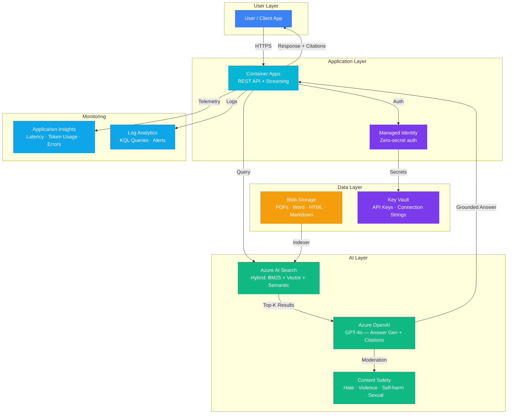

# Play 01 — Enterprise RAG Q&A 🔍

> Production RAG with hybrid search, semantic reranking, and pre-tuned guardrails.

Build a production-grade Retrieval-Augmented Generation system. AI Search indexes your documents, GPT-4o generates grounded answers with citations, and Container Apps hosts the API.

## Quick Start
```bash
# 1. Clone and navigate
cd solution-plays/01-enterprise-rag

# 2. Deploy infrastructure
az deployment group create -g $RG -f infra/main.bicep -p infra/parameters.json

# 3. Open in VS Code with Copilot
code .
# Use @builder to implement, @reviewer to audit, @tuner to optimize
```

## Architecture



| Service | Layer | Role |
|---------|-------|------|
| Container Apps | Compute | API hosting, auto-scaling, HTTPS ingress |
| Azure AI Search | AI | Hybrid search index, semantic reranking |
| Azure OpenAI (GPT-4o) | AI | Answer generation with citation grounding |
| Content Safety | AI | Response moderation, category filtering |
| Blob Storage | Data | Document storage, indexing source |
| Key Vault | Security | API keys, connection strings, managed identity |
| Managed Identity | Security | Zero-secret service-to-service auth |
| Application Insights | Monitoring | APM, distributed tracing, custom AI metrics |
| Log Analytics | Monitoring | Centralized logging, KQL, alert rules |

> 📐 [Full architecture details](architecture.md) — data flow, security architecture, scaling guide, WAF alignment

## Pre-Tuned Defaults
- Temperature: 0.1 · Top-k: 5 · Hybrid weights: 60/40 (vector/keyword)
- Chunking: 512 tokens, semantic strategy, 10% overlap
- Guardrails: Groundedness ≥0.8, Relevance ≥0.7, Content Safety enabled

## Cost Estimate

| Service | Dev/PoC | Production | Enterprise |
|---------|---------|-----------|------------|
| Azure AI Search | $75 (Basic) | $250 (Standard S1) | $750 (Standard S2) |
| Azure OpenAI | $50 (PAYG) | $300 (PAYG) | $1,200 (PTU Reserved) |
| Container Apps | $10 (Consumption) | $80 (Dedicated) | $250 (Dedicated HA) |
| Blob Storage | $2 (Hot LRS) | $15 (Hot LRS) | $50 (Hot GRS) |
| Key Vault | $1 (Standard) | $3 (Standard) | $10 (Premium HSM) |
| Application Insights | $0 (Free) | $25 (Pay-per-GB) | $100 (Pay-per-GB) |
| Log Analytics | $0 (Free) | $15 (Pay-per-GB) | $50 (Commitment) |
| Content Safety | $0 (Free) | $15 (Standard) | $50 (Standard) |
| **Total** | **$138/mo** | **$703/mo** | **$2,460/mo** |

> 💰 [Full cost breakdown](cost.json) — per-service SKUs, usage assumptions, optimization tips

## DevKit (AI-Assisted Development)
| Primitive | What It Does |
|-----------|-------------|
| `agent.md` | Root orchestrator with builder→reviewer→tuner handoffs |
| `copilot-instructions.md` | RAG domain knowledge (hybrid search, chunking, Azure SDK pitfalls) |
| 3 agents | Builder (implements), Reviewer (audits security + quality), Tuner (optimizes config) |
| 3 skills | Deploy (106 lines), Evaluate (153 lines), Tune (167 lines) |
| 4 prompts | `/deploy`, `/test`, `/review`, `/evaluate` |

---

📖 [Full documentation](spec/README.md) · 🌐 [frootai.dev/solution-plays/01-enterprise-rag](https://frootai.dev/solution-plays/01-enterprise-rag) · 📦 [FAI Protocol](spec/fai-manifest.json)


## FAI Manifest

| Field | Value |
|-------|-------|
| Play | `01-enterprise-rag` |
| Version | `1.0.0` |
| Knowledge | R2-RAG-Architecture, O3-MCP-Tools-Functions, T3-Production-Patterns, F1-GenAI-Foundations |
| WAF Pillars | security, reliability, cost-optimization, performance-efficiency, responsible-ai |
| Groundedness | ≥ 95% |
| Safety | 0 violations max |
