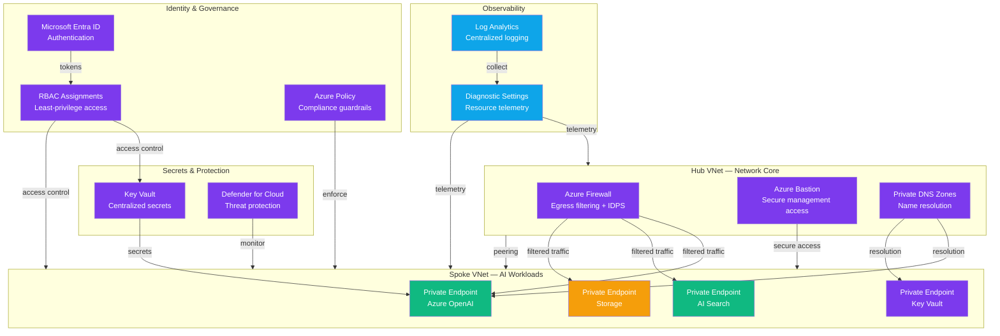

# Play 02 — AI Landing Zone ⛰️

> Foundational Azure infrastructure for AI workloads — networking, identity, governance.

Deploy the foundational infrastructure every AI workload needs. VNet with private endpoints keeps traffic off the public internet, Managed Identity eliminates secrets, RBAC locks down access, and Key Vault stores what must be stored.

## Quick Start
```bash
cd solution-plays/02-ai-landing-zone
az deployment group create -g $RG -f infra/main.bicep -p infra/parameters.json
code .  # Use @builder for Bicep, @reviewer for security audit, @tuner for cost
```

## DevKit
| Primitive | What It Does |
|-----------|-------------|
| 3 agents | Builder (Bicep infra), Reviewer (security/compliance), Tuner (SKU/cost) |
| 3 skills | Deploy (161 lines), Evaluate (170 lines), Tune (227 lines) |
| 4 prompts | `/deploy`, `/test`, `/review`, `/evaluate` |

## Architecture



> 📐 [Full architecture details](architecture.md) — data flow, security architecture, scaling guide

## Cost Estimate

| Service | Dev/PoC | Production | Enterprise |
|---------|---------|-----------|------------|
| Virtual Network | $0 (Standard) | $25 (Standard) | $80 (Standard) |
| Private Endpoints | $8 (Standard) | $40 (Standard) | $120 (Standard) |
| Azure Firewall | $250 (Basic) | $900 (Standard) | $1,800 (Premium) |
| Key Vault | $1 (Standard) | $5 (Standard) | $15 (Premium HSM) |
| Azure Policy | $0 (Free) | $0 (Free) | $0 (Free) |
| Log Analytics | $0 (Free) | $30 (Pay-per-GB) | $100 (Commitment) |
| Defender for Cloud | $0 (Free) | $50 (Defender CSPM) | $200 (Defender P2) |
| Azure Bastion | $0 (Developer) | $140 (Basic) | $330 (Standard) |
| **Total** | **$259/mo** | **$1,190/mo** | **$2,645/mo** |

> 💰 [Full cost breakdown](cost.json) — per-service SKUs, usage assumptions, optimization tips

📖 [Full docs](spec/README.md) · 🌐 [frootai.dev/solution-plays/02-ai-landing-zone](https://frootai.dev/solution-plays/02-ai-landing-zone)


## FAI Manifest

| Field | Value |
|-------|-------|
| Play | `02-ai-landing-zone` |
| Version | `1.0.0` |
| Knowledge | O5-GPU-Infra, T3-Production-Patterns |
| WAF Pillars | security, reliability, cost-optimization, operational-excellence |
| Groundedness | ≥ 85% |
| Safety | 0 violations max |
