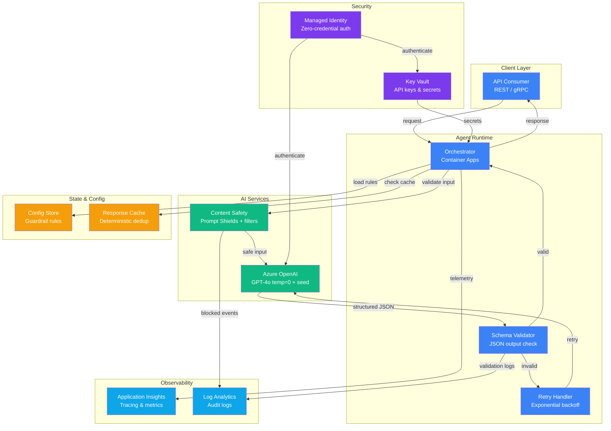

# Play 03 — Deterministic Agent 🎯

> Reliable, reproducible AI agent with zero temperature and multi-layer guardrails.

When you need AI that gives the same answer every time. Temperature=0, seed pinning, structured JSON output, confidence scoring, anti-sycophancy prompts, and a multi-layer guardrail pipeline.

## Quick Start
```bash
cd solution-plays/03-deterministic-agent
az deployment group create -g $RG -f infra/main.bicep -p infra/parameters.json
code .  # Use @builder for pipelines, @reviewer for determinism audit, @tuner for thresholds
```

## Pre-Tuned Defaults
- Temperature: 0.0 · Seed: 42 · Structured JSON output
- Confidence threshold: ≥0.7 (abstain below)
- Anti-sycophancy prompts · Citation requirements

## DevKit
| Primitive | What It Does |
|-----------|-------------|
| 3 agents | Builder (zero-temp pipelines), Reviewer (reproducibility audit), Tuner (confidence thresholds) |
| 3 skills | Deploy (106 lines), Evaluate (152 lines), Tune (153 lines) |

## Architecture



> 📐 [Full architecture details](architecture.md) — data flow, security architecture, scaling guide

## Cost Estimate

| Service | Dev/PoC | Production | Enterprise |
|---------|---------|-----------|------------|
| Azure OpenAI | $40 (PAYG) | $250 (PAYG) | $1,000 (PTU Reserved) |
| Container Apps | $10 (Consumption) | $80 (Dedicated) | $250 (Dedicated HA) |
| Content Safety | $0 (Free) | $20 (Standard) | $75 (Standard) |
| Key Vault | $1 (Standard) | $3 (Standard) | $10 (Premium HSM) |
| Application Insights | $0 (Free) | $25 (Pay-per-GB) | $80 (Pay-per-GB) |
| Log Analytics | $0 (Free) | $15 (Pay-per-GB) | $50 (Commitment) |
| **Total** | **$51/mo** | **$393/mo** | **$1,465/mo** |

> 💰 [Full cost breakdown](cost.json) — per-service SKUs, usage assumptions, optimization tips

📖 [Full docs](spec/README.md) · 🌐 [frootai.dev/solution-plays/03-deterministic-agent](https://frootai.dev/solution-plays/03-deterministic-agent)


## FAI Manifest

| Field | Value |
|-------|-------|
| Play | `03-deterministic-agent` |
| Version | `1.0.0` |
| Knowledge | R3-Deterministic-AI, O2-Agent-Coding |
| WAF Pillars | security, reliability, responsible-ai |
| Groundedness | ≥ 85% |
| Safety | 0 violations max |
