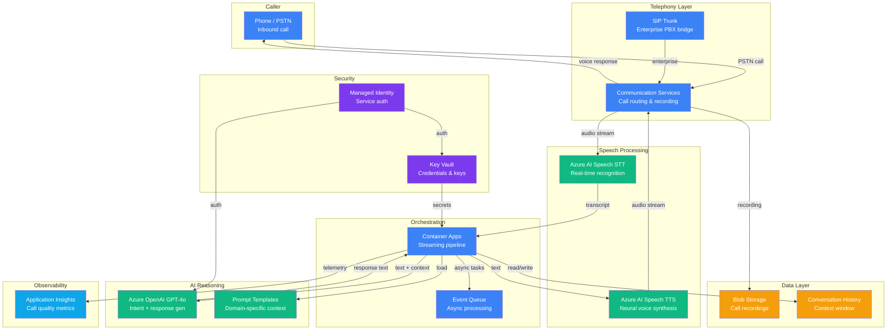

# Play 04 — Call Center Voice AI 📞

> Voice-enabled customer service with real-time STT→LLM→TTS streaming.

Build a phone-answering AI agent. Azure Communication Services handles the call, Speech Service converts audio to text, GPT-4o processes intent and generates a response, then TTS speaks it back — all streaming in real time.

## Quick Start
```bash
cd solution-plays/04-call-center-voice-ai
az deployment group create -g $RG -f infra/main.bicep -p infra/parameters.json
code .  # Use @builder for voice pipeline, @reviewer for latency audit, @tuner for cost
```

## Key Metrics
- Intent accuracy: ≥95% · Response latency: <2s · Resolution rate: ≥70%

## DevKit
| Primitive | What It Does |
|-----------|-------------|
| 3 agents | Builder (STT/TTS pipelines), Reviewer (latency/compliance), Tuner (response time/cost) |
| 3 skills | Deploy (107 lines), Evaluate (102 lines), Tune (114 lines) |

## Architecture



> 📐 [Full architecture details](architecture.md) — data flow, security architecture, scaling guide

## Cost Estimate

| Service | Dev/PoC | Production | Enterprise |
|---------|---------|-----------|------------|
| Communication Services | $15 (PAYG) | $150 (PAYG) | $600 (PAYG) |
| Azure AI Speech | $0 (Free) | $120 (Standard) | $450 (Custom Neural Voice) |
| Azure OpenAI | $30 (PAYG) | $200 (PAYG) | $800 (PTU Reserved) |
| Container Apps | $10 (Consumption) | $100 (Dedicated) | $300 (Dedicated HA) |
| Blob Storage | $2 (Hot LRS) | $20 (Hot LRS) | $80 (Hot GRS) |
| Key Vault | $1 (Standard) | $3 (Standard) | $10 (Premium HSM) |
| Application Insights | $0 (Free) | $30 (Pay-per-GB) | $100 (Pay-per-GB) |
| **Total** | **$58/mo** | **$623/mo** | **$2,340/mo** |

> 💰 [Full cost breakdown](cost.json) — per-service SKUs, usage assumptions, optimization tips

📖 [Full docs](spec/README.md) · 🌐 [frootai.dev/solution-plays/04-call-center-voice-ai](https://frootai.dev/solution-plays/04-call-center-voice-ai)


## FAI Manifest

| Field | Value |
|-------|-------|
| Play | `04-call-center-voice-ai` |
| Version | `1.0.0` |
| Knowledge | F1-GenAI-Foundations, R2-RAG-Architecture |
| WAF Pillars | security, reliability, cost-optimization, responsible-ai |
| Groundedness | ≥ 85% |
| Safety | 0 violations max |
