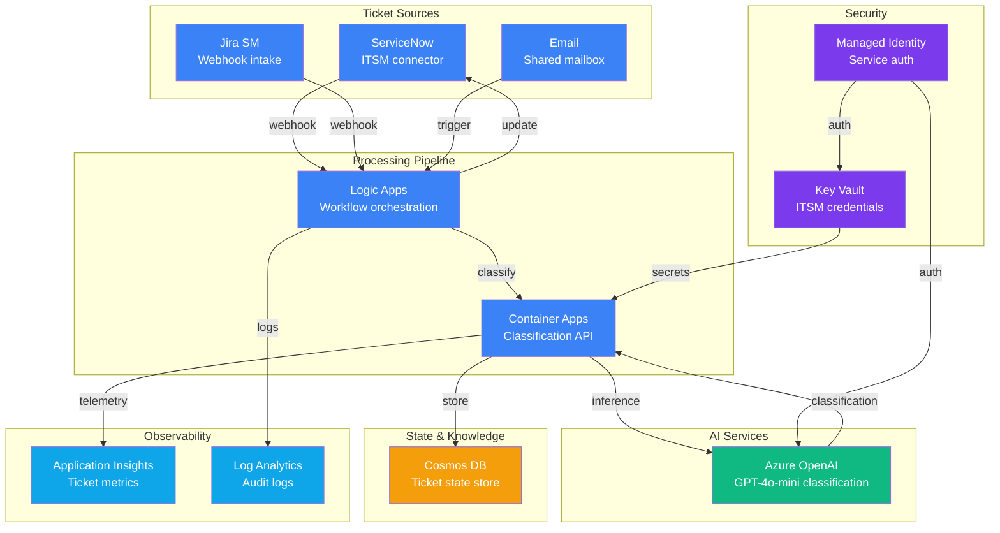

# Play 05 — IT Ticket Resolution 🎫

> Auto-classify, route, and resolve IT tickets with event-driven AI.

Incoming tickets hit classification via GPT-4o-mini, the agent routes to the right team or auto-resolves known issues from knowledge base. ServiceNow integration syncs state bidirectionally.

## Quick Start
```bash
cd solution-plays/05-it-ticket-resolution
az deployment group create -g $RG -f infra/main.bicep -p infra/parameters.json
code .  # Use @builder for classification, @reviewer for SLA audit, @tuner for routing
```

## Key Metrics
- Classification accuracy: ≥92% · Auto-resolution: ≥60% · SLA compliance: ≥95%

## DevKit
| Primitive | What It Does |
|-----------|-------------|
| 3 agents | Builder (classification/routing), Reviewer (SLA/PII audit), Tuner (thresholds/cost) |
| 3 skills | Deploy (106 lines), Evaluate (109 lines), Tune (104 lines) |

## Architecture



> 📐 [Full architecture details](architecture.md) — data flow, security architecture, scaling guide

## Cost Estimate

| Service | Dev/PoC | Production | Enterprise |
|---------|---------|-----------|------------|
| Azure OpenAI | $30 (PAYG) | $180 (PAYG) | $700 (PTU Reserved) |
| Container Apps | $10 (Consumption) | $80 (Dedicated) | $250 (Dedicated HA) |
| Logic Apps | $5 (Consumption) | $40 (Consumption) | $150 (Standard) |
| Cosmos DB | $5 (Serverless) | $50 (Autoscale) | $200 (Autoscale) |
| Key Vault | $1 (Standard) | $3 (Standard) | $10 (Premium HSM) |
| Application Insights | $0 (Free) | $25 (Pay-per-GB) | $80 (Pay-per-GB) |
| Log Analytics | $0 (Free) | $15 (Pay-per-GB) | $50 (Commitment) |
| **Total** | **$51/mo** | **$393/mo** | **$1,440/mo** |

> 💰 [Full cost breakdown](cost.json) — per-service SKUs, usage assumptions, optimization tips

📖 [Full docs](spec/README.md) · 🌐 [frootai.dev/solution-plays/05-it-ticket-resolution](https://frootai.dev/solution-plays/05-it-ticket-resolution)


## FAI Manifest

| Field | Value |
|-------|-------|
| Play | `05-it-ticket-resolution` |
| Version | `1.0.0` |
| Knowledge | R2-RAG-Architecture, O1-Semantic-Kernel |
| WAF Pillars | security, reliability, cost-optimization |
| Groundedness | ≥ 85% |
| Safety | 0 violations max |
