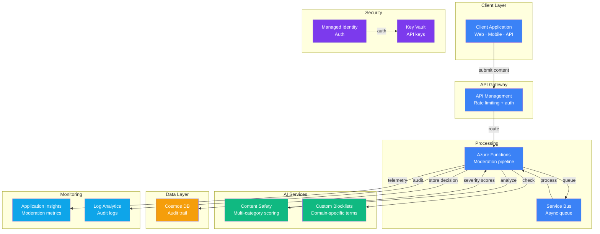

# Play 10 — Content Moderation 🛡️

> Filter harmful content with Azure Content Safety, custom blocklists, and severity scoring.

Every AI response passes through Azure Content Safety for severity scoring across hate, violence, self-harm, and sexual categories. Custom blocklists catch domain-specific terms. Dual moderation on both input and output.

## Quick Start
```bash
cd solution-plays/10-content-moderation
az deployment group create -g $RG -f infra/main.bicep -p infra/parameters.json
code .  # Use @builder for pipeline, @reviewer for threshold audit, @tuner for false positives
```

## Key Metrics
- True positive rate: ≥95% · False positive rate: <5% · Moderation latency: <200ms

## DevKit
| Primitive | What It Does |
|-----------|-------------|
| 3 agents | Builder (pipeline/blocklists), Reviewer (threshold/compliance audit), Tuner (FP reduction/cost) |
| 3 skills | Deploy (121 lines), Evaluate (101 lines), Tune (120 lines) |

## Architecture



> 📐 [Full architecture details](architecture.md) — data flow, security architecture, scaling guide

## Cost Estimate

| Service | Dev/PoC | Production | Enterprise |
|---------|---------|-----------|------------|
| Content Safety | $0 (Free) | $75 (Standard) | $300 (Standard) |
| API Management | $5 (Consumption) | $150 (Standard) | $700 (Premium) |
| Azure Functions | $0 (Consumption) | $20 (Consumption) | $100 (Premium EP1) |
| Cosmos DB | $3 (Serverless) | $45 (Provisioned) | $200 (Provisioned) |
| Service Bus | $5 (Basic) | $20 (Standard) | $80 (Premium) |
| Key Vault | $1 (Standard) | $3 (Standard) | $10 (Premium HSM) |
| Application Insights | $0 (Free) | $20 (Pay-per-GB) | $80 (Pay-per-GB) |
| Log Analytics | $0 (Free) | $15 (Pay-per-GB) | $50 (Commitment) |
| **Total** | **$14/mo** | **$348/mo** | **$1,520/mo** |

> 💰 [Full cost breakdown](cost.json) — per-service SKUs, usage assumptions, optimization tips

📖 [Full docs](spec/README.md) · 🌐 [frootai.dev/solution-plays/10-content-moderation](https://frootai.dev/solution-plays/10-content-moderation)


## FAI Manifest

| Field | Value |
|-------|-------|
| Play | `10-content-moderation` |
| Version | `1.0.0` |
| Knowledge | T2-Responsible-AI, F1-GenAI-Foundations |
| WAF Pillars | security, responsible-ai, reliability |
| Groundedness | ≥ 85% |
| Safety | 0 violations max |
