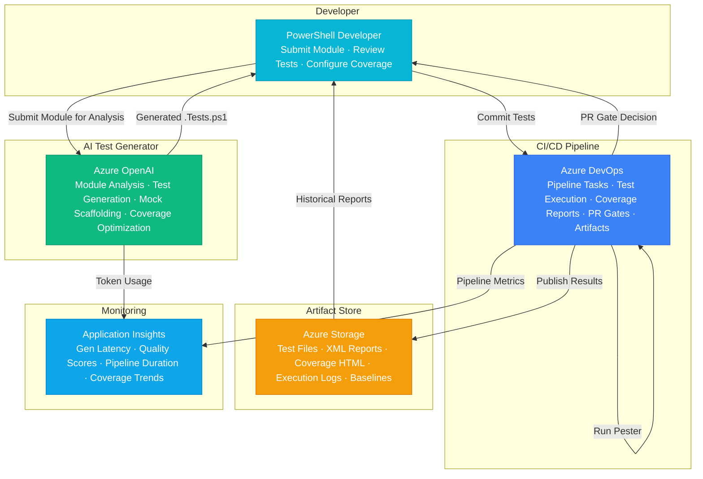

# Play 101 — Pester Test Development 🧪

> The golden template — AI-powered Pester 5.x test generation for PowerShell, AST-driven analysis, comprehensive mocking, >90% code coverage.

Build production-grade Pester test suites from PowerShell code. AST analysis identifies testable functions, the builder generates Describe/Context/It blocks with proper mocking, the reviewer validates assertion quality and coverage gaps, and the tuner eliminates flaky tests and optimizes CI/CD integration.

## Quick Start
```bash
cd solution-plays/101-pester-test-development
code .
# Use @builder to generate tests, @reviewer to audit, @tuner to optimize
```

## Architecture



📐 [Full architecture details](architecture.md)

| Component | Purpose |
|-----------|---------|
| PowerShell AST | Parse source code to identify testable functions |
| Pester 5.x | Test framework with Describe/Context/It blocks |
| Mock System | InModuleScope, Mock, Should assertions |
| Code Coverage | Invoke-Pester with -CodeCoverage for >90% target |

## Pre-Tuned Defaults
- Coverage: >90% target · function-level · branch analysis
- Mocking: InModuleScope for module functions · Mock external deps
- CI/CD: GitHub Actions + Azure DevOps pipeline templates
- Quality: No flaky tests · deterministic assertions · proper teardown

## DevKit (AI-Assisted Development)
| Primitive | What It Does |
|-----------|-------------|
| `agent.md` | Root orchestrator with builder→reviewer→tuner handoffs |
| `copilot-instructions.md` | Pester domain (AST, mocking, coverage, CI/CD patterns) |
| 3 agents | Builder (gpt-4o), Reviewer (gpt-4o-mini), Tuner (gpt-4o-mini) |
| 4 skills | Deploy (149 lines), Evaluate (173 lines), Generate Tests (180 lines), Tune (221 lines) |
| 4 prompts | `/deploy`, `/test`, `/review`, `/evaluate` with agent routing |

## The Golden Template
Play 101 is special — it was the **first v2 play** and established the patterns used by all 100 other plays:
- builder→reviewer→tuner handoff chain
- Model differentiation (gpt-4o for builder, gpt-4o-mini for reviewer/tuner)
- 4 agent-routed prompts
- Skills with 100+ lines of domain procedures

## Cost Estimate
| Service | Dev/mo | Prod/mo | Enterprise/mo |
|---------|--------|---------|---------------|
| Azure OpenAI | $15 (PAYG) | $150 (PAYG) | $400 (PAYG) |
| Azure DevOps | $0 (Free tier) | $40 (Basic) | $120 (Basic + Hosted) |
| Azure Storage | $1 (LRS Hot) | $10 (LRS Hot) | $30 (ZRS Hot) |
| Application Insights | $0 (Free) | $15 (Pay-per-GB) | $40 (Pay-per-GB) |
| **Total** | **$16** | **$215** | **$590** |

💰 [Full cost breakdown](cost.json)

📖 [Full documentation](spec/README.md) · 🌐 [frootai.dev/solution-plays/101-pester-test-development](https://frootai.dev/solution-plays/101-pester-test-development) · 📦 [FAI Protocol](spec/fai-manifest.json)


## FAI Manifest

| Field | Value |
|-------|-------|
| Play | `101-pester-test-development` |
| Version | `1.0.0` |
| Knowledge | T3-Production-Patterns, O3-MCP-Tools |
| WAF Pillars | reliability, operational-excellence, security |
