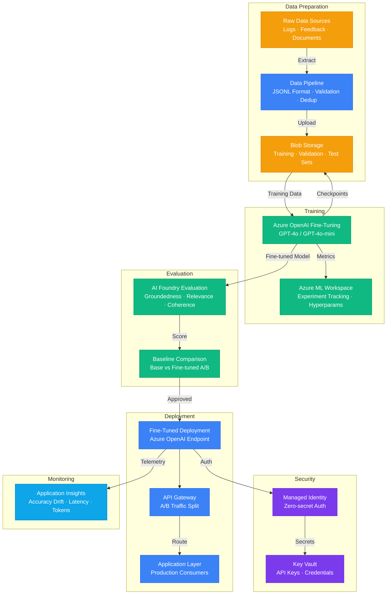

# Play 13 — Fine-Tuning Workflow 🔬

> End-to-end fine-tuning with data prep, LoRA training, evaluation, and deployment.

Curate training data, configure LoRA parameters, train on Azure ML or Azure OpenAI, evaluate with automated metrics, then deploy the fine-tuned model. MLflow tracks experiments. Handles data validation, train/val splitting, hyperparameter sweeps, and model versioning.

## Quick Start
```bash
cd solution-plays/13-fine-tuning-workflow

# Provision Azure ML workspace
az ml workspace create --name $WORKSPACE --resource-group $RG

# Prepare and validate training data
python scripts/validate_data.py --input data/training.jsonl

code .  # Use @builder for data prep/training, @reviewer for quality audit, @tuner for hyperparams
```

## Architecture



> 📐 [Full architecture details](architecture.md)

| Service | Purpose |
|---------|---------|
| Azure ML Workspace | Experiment tracking, compute management |
| GPU Compute (NC/ND series) | LoRA training compute |
| Azure OpenAI | Fine-tuning API (gpt-4o-mini, gpt-4o) |
| MLflow | Experiment tracking, model versioning |
| Azure Storage | Training data, model artifacts |

## Key Training Parameters
| Parameter | Default | Range |
|-----------|---------|-------|
| LoRA rank | 16 | 4-128 |
| Learning rate | 1e-4 | 1e-5 to 5e-4 |
| Epochs | 3 | 1-10 |
| Batch size | 4 | 1-32 |

## DevKit (ML Engineering-Focused)
| Primitive | What It Does |
|-----------|-------------|
| 3 agents | Builder (data prep + training), Reviewer (overfitting + quality), Tuner (hyperparams + cost) |
| 3 skills | Deploy (111 lines), Evaluate (100 lines), Tune (120 lines) |
| 4 prompts | `/deploy` (ML workspace), `/test` (pipeline), `/review` (data quality), `/evaluate` (base vs fine-tuned) |

**Note:** This is an MLOps/training play. TuneKit covers LoRA hyperparameters, data quality optimization, compute selection (GPU sizing), and cost per training run — not inference-time parameters.

## Cost Estimate

| Service | Dev/PoC | Production | Enterprise |
|---------|---------|------------|------------|
| Azure OpenAI Fine-Tuning | $80/mo | $400/mo | $1,500/mo |
| Azure OpenAI Inference | $30/mo | $250/mo | $900/mo |
| Azure Machine Learning | $0/mo | $100/mo | $300/mo |
| Blob Storage | $3/mo | $20/mo | $60/mo |
| Azure AI Foundry | $0/mo | $50/mo | $150/mo |
| Key Vault | $1/mo | $3/mo | $10/mo |
| Application Insights | $0/mo | $25/mo | $80/mo |
| **Total** | **$114/mo** | **$848/mo** | **$3,000/mo** |

> 💰 [Full cost breakdown](cost.json)

📖 [Full docs](spec/README.md) · 🌐 [frootai.dev/solution-plays/13-fine-tuning-workflow](https://frootai.dev/solution-plays/13-fine-tuning-workflow)


## FAI Manifest

| Field | Value |
|-------|-------|
| Play | `13-fine-tuning-workflow` |
| Version | `1.0.0` |
| Knowledge | T1-Fine-Tuning-MLOps, F1-GenAI-Foundations |
| WAF Pillars | security, cost-optimization, operational-excellence |
| Groundedness | ≥ 85% |
| Safety | 0 violations max |
