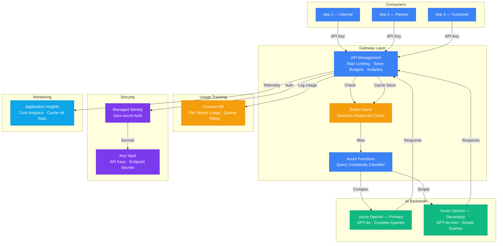

# Play 14 — Cost-Optimized AI Gateway 🚪

> APIM-based AI gateway with semantic caching, token budgets, and multi-region load balancing.

Route AI requests through APIM with semantic caching (Redis stores embeddings of recent queries — similar questions get cached responses). Token budgets per tenant prevent runaway costs. Multi-region load balancing with failover ensures availability.

## Quick Start
```bash
cd solution-plays/14-cost-optimized-ai-gateway
az deployment group create -g $RG -f infra/main.bicep -p infra/parameters.json
code .  # Use @builder for APIM policies, @reviewer for security, @tuner for FinOps
```

## Architecture



> 📐 [Full architecture details](architecture.md)

| Service | Purpose |
|---------|---------|
| API Management | AI gateway with policies, routing, rate limiting |
| Azure Cache for Redis | Semantic caching (embedding-based similarity) |
| Azure OpenAI (multi-region) | Backend LLM endpoints with failover |
| Azure Monitor | Per-tenant cost tracking, usage analytics |

## Key FinOps Targets
- Cache hit rate: ≥30% · Cost savings: ≥25% vs direct · Gateway overhead: <50ms

## Budget Tiers
| Tier | Tokens/mo | Rate | Model Access |
|------|-----------|------|-------------|
| Free | 100K | 10/min | gpt-4o-mini |
| Standard | 1M | 60/min | mini + 4o |
| Enterprise | 10M | 300/min | All + priority |

## DevKit (FinOps-Focused)
| Primitive | What It Does |
|-----------|-------------|
| 3 agents | Builder (APIM/caching/routing), Reviewer (security/budget audit), Tuner (cache TTL/PTU/cost) |
| 3 skills | Deploy (120 lines), Evaluate (101 lines), Tune (116 lines) |
| 4 prompts | `/deploy` (APIM + Redis), `/test` (routing/caching), `/review` (security/budgets), `/evaluate` (cache + savings) |

**Note:** This is a FinOps/gateway play. TuneKit covers semantic cache parameters, PTU vs pay-as-you-go decisions, routing weights, budget tiers, and cost per 1K tokens — not AI model quality.

## Cost Estimate

| Service | Dev/PoC | Production | Enterprise |
|---------|---------|------------|------------|
| Azure API Management | $5/mo | $280/mo | $700/mo |
| Azure OpenAI (Primary) | $40/mo | $300/mo | $1,200/mo |
| Azure OpenAI (Secondary) | $10/mo | $80/mo | $250/mo |
| Azure Functions | $0/mo | $15/mo | $80/mo |
| Azure Cache for Redis | $15/mo | $50/mo | $200/mo |
| Cosmos DB | $5/mo | $60/mo | $250/mo |
| Key Vault | $1/mo | $3/mo | $10/mo |
| Application Insights | $0/mo | $25/mo | $80/mo |
| **Total** | **$76/mo** | **$813/mo** | **$2,770/mo** |

> 💰 [Full cost breakdown](cost.json)

📖 [Full docs](spec/README.md) · 🌐 [frootai.dev/solution-plays/14-cost-optimized-ai-gateway](https://frootai.dev/solution-plays/14-cost-optimized-ai-gateway)


## FAI Manifest

| Field | Value |
|-------|-------|
| Play | `14-cost-optimized-ai-gateway` |
| Version | `1.0.0` |
| Knowledge | T3-Production-Patterns, F2-LLM-Selection |
| WAF Pillars | cost-optimization, performance-efficiency, reliability, security |
| Groundedness | ≥ 85% |
| Safety | 0 violations max |
