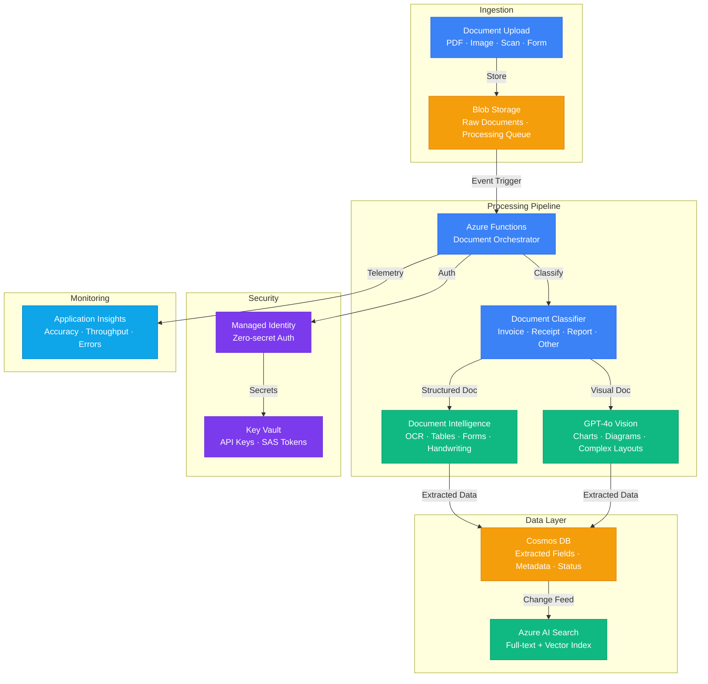

# Play 15 — Multi-Modal DocProc 🖼️

> Process documents with text + images using GPT-4o multi-modal vision.

GPT-4o's vision capability processes documents containing images, charts, tables, and text together. Document Intelligence handles OCR, then GPT-4o interprets visual elements like graphs, stamps, and signatures. Outputs structured JSON. Intelligent routing sends text pages to OCR (cheap) and visual pages to GPT-4o vision (accurate).

## Quick Start
```bash
cd solution-plays/15-multi-modal-docproc
az deployment group create -g $RG -f infra/main.bicep -p infra/parameters.json
code .  # Use @builder for vision pipeline, @reviewer for accuracy audit, @tuner for routing/cost
```

## Architecture



> 📐 [Full architecture details](architecture.md)

| Service | Purpose |
|---------|---------|
| Azure OpenAI (gpt-4o vision) | Chart/graph/stamp/signature interpretation |
| Document Intelligence | OCR text extraction + table recognition |
| Azure Functions | Page-level processing pipeline |
| Blob Storage | Document upload + page image cache |
| Cosmos DB | Structured extraction results |

## Page Routing (Key Differentiator from Play 06)
| Page Type | Processing Path | Cost |
|-----------|----------------|------|
| Text-only | Document Intelligence OCR | 1x (cheapest) |
| Table | Document Intelligence table extraction | 1x |
| Chart/graph | GPT-4o Vision | 10x |
| Photo/stamp | GPT-4o Vision | 10x |
| Mixed | OCR (text) + Vision (visual) | 5x |

## Key Metrics
- Text extraction: ≥95% · Chart data: ≥85% · Page classification: ≥95% · Processing: <15s/page

## DevKit (Multi-Modal Vision-Focused)
| Primitive | What It Does |
|-----------|-------------|
| 3 agents | Builder (vision+OCR pipeline), Reviewer (accuracy/PII in images), Tuner (routing/resolution/cost) |
| 3 skills | Deploy (124 lines), Evaluate (100 lines), Tune (112 lines) |
| 4 prompts | `/deploy` (GPT-4o vision + Doc Intel), `/test` (vision pipeline), `/review` (multi-modal quality), `/evaluate` (accuracy) |

## Cost Estimate

| Service | Dev/PoC | Production | Enterprise |
|---------|---------|------------|------------|
| Azure Document Intelligence | $0/mo | $150/mo | $500/mo |
| Azure OpenAI (GPT-4o) | $50/mo | $350/mo | $1,200/mo |
| Blob Storage | $3/mo | $25/mo | $80/mo |
| Azure Functions | $0/mo | $60/mo | $150/mo |
| Cosmos DB | $5/mo | $60/mo | $250/mo |
| Azure AI Search | $0/mo | $75/mo | $250/mo |
| Key Vault | $1/mo | $3/mo | $10/mo |
| Application Insights | $0/mo | $25/mo | $80/mo |
| **Total** | **$59/mo** | **$748/mo** | **$2,520/mo** |

> 💰 [Full cost breakdown](cost.json)

📖 [Full docs](spec/README.md) · 🌐 [frootai.dev/solution-plays/15-multi-modal-docproc](https://frootai.dev/solution-plays/15-multi-modal-docproc)


## FAI Manifest

| Field | Value |
|-------|-------|
| Play | `15-multi-modal-docproc` |
| Version | `1.0.0` |
| Knowledge | F1-GenAI-Foundations, R2-RAG-Architecture |
| WAF Pillars | security, reliability, responsible-ai |
| Groundedness | ≥ 85% |
| Safety | 0 violations max |
