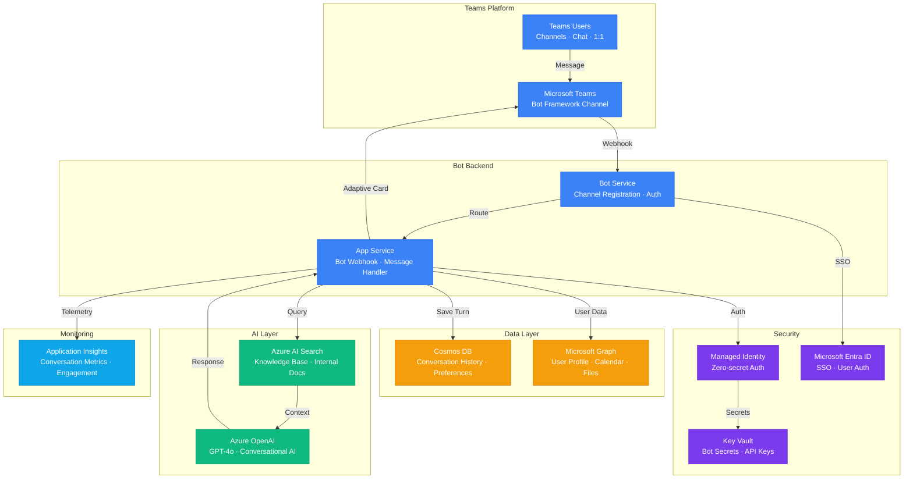

# Play 16 — Copilot Teams Extension 👥

> Build a Teams message extension with Adaptive Cards, Microsoft Graph, and SSO.

Deploy a Teams-native AI assistant. Message extensions appear in the compose box, Adaptive Cards display rich responses, Microsoft Graph provides organizational data, and SSO means zero login prompts. Publishes to Teams desktop, mobile, and web.

## Quick Start
```bash
cd solution-plays/16-copilot-teams-extension
teamsapp new --template ai-bot --name my-teams-ext
teamsapp deploy --env dev
teamsapp preview --env dev  # Opens in Teams for testing
code .  # Use @builder for Teams/Graph, @reviewer for SSO audit, @tuner for UX/perf
```

## Architecture



> 📐 [Full architecture details](architecture.md)

| Service | Purpose |
|---------|---------|
| Azure Bot Service | Teams bot registration and message routing |
| App Service (B1) | Bot runtime hosting |
| Azure AD / Entra ID | SSO authentication + Graph API consent |
| Microsoft Graph | User profile, files, calendar, email access |
| Azure OpenAI (gpt-4o-mini) | AI response generation |

## Key Metrics
- SSO success: ≥99% · Response latency: <3s · Card render: 100% cross-client · Error rate: <1%

## DevKit (Teams/M365-Focused)
| Primitive | What It Does |
|-----------|-------------|
| 3 agents | Builder (Teams extension/Graph/Adaptive Cards), Reviewer (SSO/permissions/throttling), Tuner (card layout/Graph batching/cost) |
| 3 skills | Deploy (119 lines), Evaluate (100 lines), Tune (112 lines) |
| 4 prompts | `/deploy` (Teams + Bot Service), `/test` (message extension), `/review` (security/manifest), `/evaluate` (SSO/quality) |

**Note:** This is a Teams/M365 platform play. TuneKit covers Adaptive Card design, Graph API batching/caching, SSO token management, and cost per interaction — not AI model parameters.

## Cost Estimate

| Service | Dev/PoC | Production | Enterprise |
|---------|---------|------------|------------|
| Azure Bot Service | $0/mo | $50/mo | $50/mo |
| Azure OpenAI | $30/mo | $250/mo | $900/mo |
| Azure App Service | $0/mo | $70/mo | $180/mo |
| Azure AI Search | $0/mo | $75/mo | $250/mo |
| Cosmos DB | $3/mo | $50/mo | $200/mo |
| Key Vault | $1/mo | $3/mo | $10/mo |
| Application Insights | $0/mo | $20/mo | $70/mo |
| **Total** | **$34/mo** | **$518/mo** | **$1,660/mo** |

> 💰 [Full cost breakdown](cost.json)

📖 [Full docs](spec/README.md) · 🌐 [frootai.dev/solution-plays/16-copilot-teams-extension](https://frootai.dev/solution-plays/16-copilot-teams-extension)


## FAI Manifest

| Field | Value |
|-------|-------|
| Play | `16-copilot-teams-extension` |
| Version | `1.0.0` |
| Knowledge | F4-GitHub-Agentic-OS, O6-Copilot-Extend, O3-MCP-Tools-Functions |
| WAF Pillars | security, reliability, operational-excellence |
| Groundedness | ≥ 85% |
| Safety | 0 violations max |
