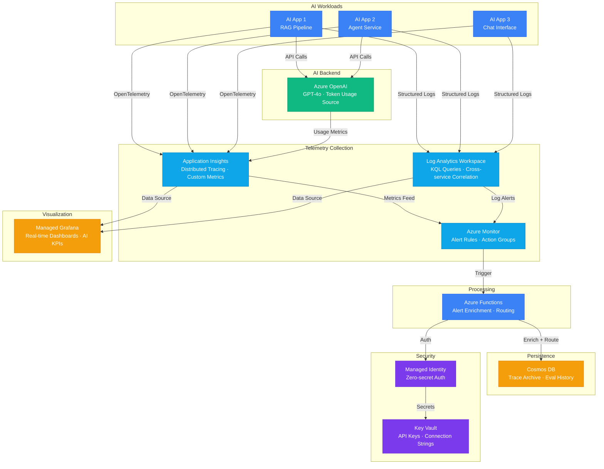

# Play 17 — AI Observability 📊

> End-to-end monitoring for AI workloads — tracing, metrics, dashboards, and intelligent alerts.

Instrument your AI pipeline with Application Insights, track token usage and cost per tenant with custom metrics, build KQL dashboards for real-time visibility, and configure alerts for latency spikes, quality drops, and budget overruns.

## Quick Start
```bash
cd solution-plays/17-ai-observability
az deployment group create -g $RG -f infra/main.bicep -p infra/parameters.json
code .  # Use @builder for instrumentation, @reviewer for telemetry audit, @tuner for cost
```

## Architecture



> 📐 [Full architecture details](architecture.md)

| Service | Purpose |
|---------|---------|
| Application Insights | Telemetry collection, distributed tracing |
| Log Analytics Workspace | KQL querying, data retention |
| Azure Monitor | Alert rules, action groups |
| Azure Dashboard | Shared workbooks with live metrics |

## AI-Specific Metrics Tracked
| Metric | Type | What It Shows |
|--------|------|-------------|
| `ai.tokens.cost` | Counter | Dollar cost per request |
| `ai.latency.ttft` | Histogram | Time to first token |
| `ai.quality.groundedness` | Gauge | RAG quality score |
| `ai.safety.blocked` | Counter | Content safety blocks |
| `ai.cache.hit` | Counter | Semantic cache effectiveness |

## DevKit (Observability-Focused)
| Primitive | What It Does |
|-----------|-------------|
| 3 agents | Builder (instrumentation/dashboards/alerts), Reviewer (telemetry audit/PII/coverage), Tuner (sampling/retention/cost) |
| 3 skills | Deploy (128 lines), Evaluate (110 lines), Tune (120 lines) |
| 4 prompts | `/deploy` (App Insights + dashboards), `/test` (tracing), `/review` (PII/retention), `/evaluate` (alert coverage) |

**Note:** This is an operational observability play. TuneKit covers sampling rates, alert thresholds, log retention tiers, KQL optimization, and Log Analytics cost — not AI model parameters.

## Cost Estimate

| Service | Dev/PoC | Production | Enterprise |
|---------|--------:|-----------:|-----------:|
| Application Insights | $0/mo | $50/mo | $200/mo |
| Log Analytics Workspace | $0/mo | $75/mo | $200/mo |
| Azure Monitor | $0/mo | $30/mo | $80/mo |
| Azure Managed Grafana | $0/mo | $15/mo | $30/mo |
| Azure OpenAI | $30/mo | $200/mo | $800/mo |
| Cosmos DB | $3/mo | $50/mo | $180/mo |
| Key Vault | $1/mo | $3/mo | $10/mo |
| Azure Functions | $0/mo | $10/mo | $75/mo |
| **Total** | **$34/mo** | **$433/mo** | **$1,575/mo** |

> 💰 [Full cost breakdown](cost.json)

📖 [Full docs](spec/README.md) · 🌐 [frootai.dev/solution-plays/17-ai-observability](https://frootai.dev/solution-plays/17-ai-observability)


## FAI Manifest

| Field | Value |
|-------|-------|
| Play | `17-ai-observability` |
| Version | `1.0.0` |
| Knowledge | T3-Production-Patterns, O5-GPU-Infra |
| WAF Pillars | operational-excellence, reliability, cost-optimization |
| Groundedness | ≥ 85% |
| Safety | 0 violations max |
