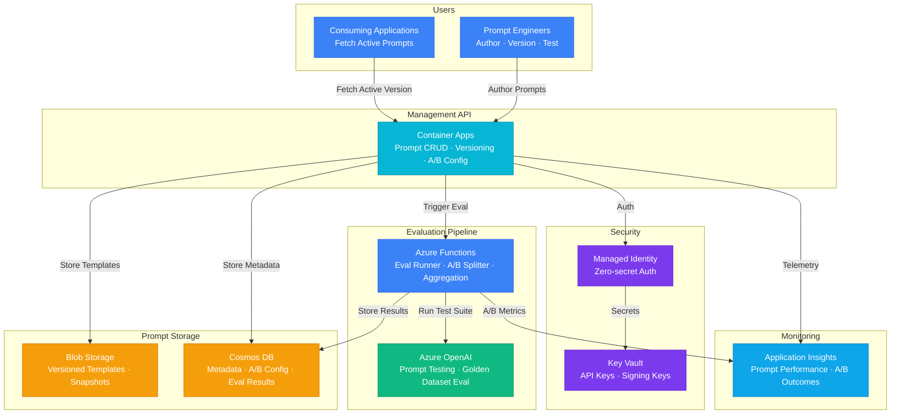

# Play 18 — Prompt Management 📝

> Versioned prompt registry with A/B testing, injection defense, and token optimization.

Manage prompts as first-class assets. Cosmos DB stores versioned templates, A/B testing compares variants with statistical significance, injection defense layers protect against prompt attacks, and analytics track usage across applications.

## Quick Start
```bash
cd solution-plays/18-prompt-management
az deployment group create -g $RG -f infra/main.bicep -p infra/parameters.json
code .  # Use @builder for registry/A-B, @reviewer for injection audit, @tuner for token optimization
```

## Architecture



> 📐 [Full architecture details](architecture.md)

| Service | Purpose |
|---------|---------|
| Cosmos DB | Prompt registry (versioned storage, per-env containers) |
| Azure Functions | Prompt serving API (get/create/activate/rollback) |
| Azure OpenAI | Prompt testing and A/B evaluation |
| Application Insights | Prompt usage analytics |

## Key Capabilities
| Feature | Details |
|---------|---------|
| Versioning | Semantic versioning with rollback |
| A/B Testing | Traffic splitting with statistical significance |
| Injection Defense | Input sanitization, prompt armor, output validation |
| Token Optimization | Template compression, dynamic few-shot |
| Analytics | Usage tracking per app, per prompt, per version |

## DevKit (Prompt Engineering-Focused)
| Primitive | What It Does |
|-----------|-------------|
| 3 agents | Builder (registry/A-B framework), Reviewer (injection/quality audit), Tuner (token/few-shot/caching) |
| 3 skills | Deploy (111 lines), Evaluate (101 lines), Tune (114 lines) |
| 4 prompts | `/deploy` (registry + A/B), `/test` (templates), `/review` (injection/compliance), `/evaluate` (quality) |

**Note:** This is a prompt engineering/MLOps play. TuneKit covers token budgets, A/B test configuration, few-shot selection strategies, template compression, and prompt caching — not infrastructure sizing.

## Cost Estimate

| Service | Dev/PoC | Production | Enterprise |
|---------|--------:|-----------:|-----------:|
| Blob Storage | $1/mo | $5/mo | $15/mo |
| Container Apps | $5/mo | $60/mo | $200/mo |
| Cosmos DB | $3/mo | $50/mo | $180/mo |
| Azure OpenAI | $20/mo | $100/mo | $350/mo |
| Azure Functions | $0/mo | $8/mo | $75/mo |
| Key Vault | $1/mo | $3/mo | $10/mo |
| Application Insights | $0/mo | $15/mo | $50/mo |
| **Total** | **$30/mo** | **$241/mo** | **$880/mo** |

> 💰 [Full cost breakdown](cost.json)

📖 [Full docs](spec/README.md) · 🌐 [frootai.dev/solution-plays/18-prompt-management](https://frootai.dev/solution-plays/18-prompt-management)


## FAI Manifest

| Field | Value |
|-------|-------|
| Play | `18-prompt-management` |
| Version | `1.0.0` |
| Knowledge | R1-Prompt-Patterns, O1-Semantic-Kernel |
| WAF Pillars | security, cost-optimization, operational-excellence |
| Groundedness | ≥ 85% |
| Safety | 0 violations max |
