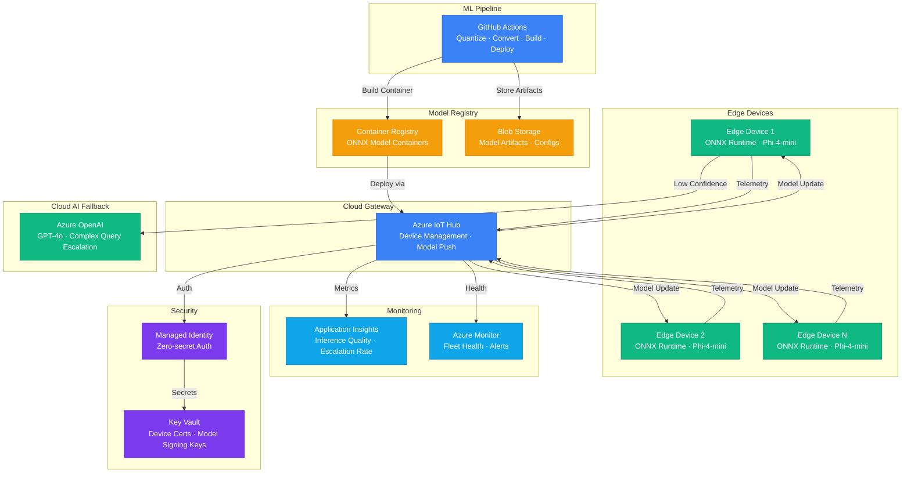

# Play 19 — Edge AI Phi-4 📱

> On-device inference with Phi-4 SLM, ONNX Runtime quantization, and IoT Hub sync.

Run AI locally on edge devices — no cloud dependency for inference. Phi-4 is converted to ONNX, quantized to INT4/INT8 for memory-constrained devices, and served via ONNX Runtime. IoT Hub handles model updates and telemetry sync. Hybrid routing sends simple queries to edge (free) and complex ones to cloud (quality).

## Quick Start
```bash
cd solution-plays/19-edge-ai-phi4

# Download and quantize Phi-4
python scripts/download_model.py --model microsoft/phi-4
python scripts/quantize.py --model models/phi4-onnx/ --output models/phi4-int4/ --bits 4

code .  # Use @builder for ONNX/IoT, @reviewer for memory/privacy audit, @tuner for quantization
```

## Architecture



> 📐 [Full architecture details](architecture.md)

| Component | Purpose |
|-----------|---------|
| Phi-4 (ONNX) | Small language model for on-device inference |
| ONNX Runtime | Cross-platform inference engine |
| Azure IoT Hub | Model updates + telemetry sync to cloud |
| Hybrid Router | Edge for simple queries, cloud fallback for complex |

## Device Compatibility
| Device | RAM | Recommended Quant | Inference Speed |
|--------|-----|-------------------|----------------|
| Raspberry Pi 5 | 8 GB | INT4 (AWQ) | ~5 tok/s |
| NVIDIA Jetson | 4 GB | INT4 only | ~10 tok/s (GPU) |
| Laptop (16GB) | 16 GB | INT8 or FP16 | ~20 tok/s |

## Key Metrics
- Inference: <2s on edge · Quality: ≥85% of cloud · Offline: 100% success · Memory: <80% device RAM

## DevKit (Edge AI-Focused)
| Primitive | What It Does |
|-----------|-------------|
| 3 agents | Builder (ONNX/quantization/IoT), Reviewer (memory/privacy/offline), Tuner (quant level/threads/sync) |
| 3 skills | Deploy (115 lines), Evaluate (100 lines), Tune (112 lines) |
| 4 prompts | `/deploy` (ONNX + device), `/test` (on-device inference), `/review` (memory/privacy), `/evaluate` (speed vs cloud) |

**Note:** This is an edge/on-device AI play — no cloud inference costs during operation. TuneKit covers quantization selection, ONNX Runtime threads, prompt compression for small context windows, IoT Hub sync frequency, and hybrid routing (70% cost reduction from edge-first).

## Cost Estimate

| Service | Dev/PoC | Production | Enterprise |
|---------|--------:|-----------:|-----------:|
| Azure Container Registry | $5/mo | $20/mo | $50/mo |
| Azure IoT Hub | $0/mo | $25/mo | $250/mo |
| Azure OpenAI | $15/mo | $80/mo | $300/mo |
| Blob Storage | $2/mo | $8/mo | $25/mo |
| Azure Monitor | $0/mo | $20/mo | $60/mo |
| Application Insights | $0/mo | $20/mo | $70/mo |
| Key Vault | $1/mo | $3/mo | $10/mo |
| Azure DevOps / GitHub Actions | $0/mo | $15/mo | $40/mo |
| **Total** | **$23/mo** | **$191/mo** | **$805/mo** |

> 💰 [Full cost breakdown](cost.json)

📖 [Full docs](spec/README.md) · 🌐 [frootai.dev/solution-plays/19-edge-ai-phi4](https://frootai.dev/solution-plays/19-edge-ai-phi4)


## FAI Manifest

| Field | Value |
|-------|-------|
| Play | `19-edge-ai-phi4` |
| Version | `1.0.0` |
| Knowledge | F2-LLM-Selection, T1-Fine-Tuning-MLOps |
| WAF Pillars | cost-optimization, performance-efficiency, security |
| Groundedness | ≥ 85% |
| Safety | 0 violations max |
