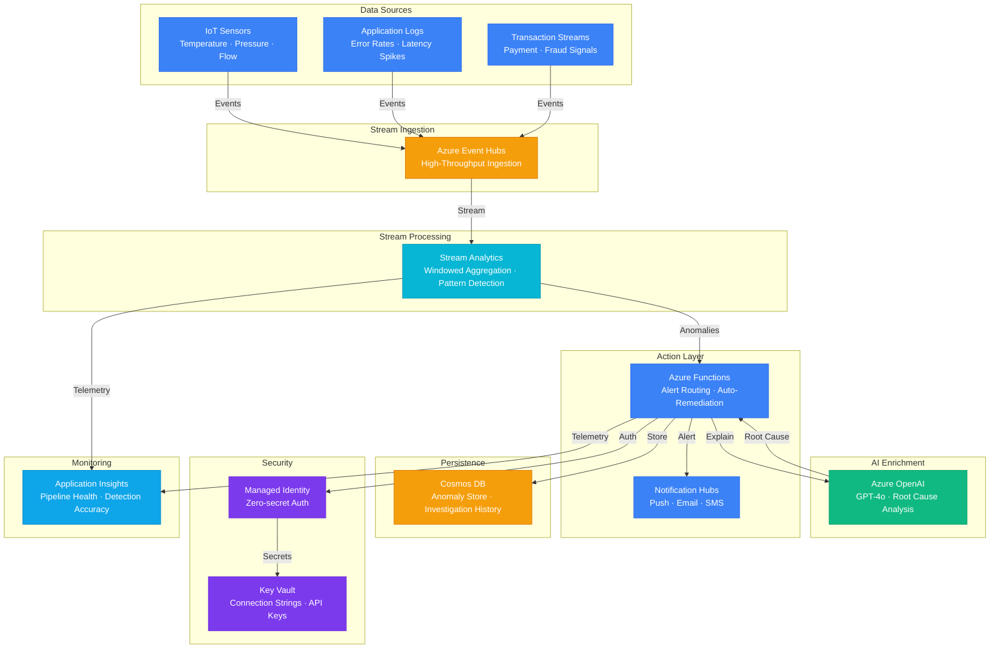

# Play 20 — Anomaly Detection 🚨

> AI-powered anomaly detection with LLM root cause analysis and intelligent alerting.

Detect anomalies in time-series metrics using statistical methods and Azure Anomaly Detector, then use GPT-4o to automatically analyze root causes and suggest remediation. Intelligent alerting with suppression rules reduces alert fatigue while catching real incidents.

## Quick Start
```bash
cd solution-plays/20-anomaly-detection
az deployment group create -g $RG -f infra/main.bicep -p infra/parameters.json
code .  # Use @builder for detection pipeline, @reviewer for sensitivity audit, @tuner for thresholds
```

## Architecture



> 📐 [Full architecture details](architecture.md)

| Service | Purpose |
|---------|---------|
| Azure Anomaly Detector | Multivariate time-series anomaly detection |
| Azure OpenAI (gpt-4o) | LLM-powered root cause analysis |
| Log Analytics | Metric storage + KQL anomaly queries |
| Azure Monitor | Alert rules + action groups |
| Azure Functions | Detection pipeline trigger |

## Detection Methods
| Method | Best For | Speed |
|--------|---------|-------|
| Statistical (Z-score) | Simple threshold-based | <1s |
| Azure Anomaly Detector | Multivariate patterns | 2-5s |
| LLM pattern recognition | Context-dependent analysis | 5-10s |

## Key Metrics
- Precision: ≥85% · Recall: ≥90% · Detection latency: <5min · False positive: <15%

## DevKit (AIOps-Focused)
| Primitive | What It Does |
|-----------|-------------|
| 3 agents | Builder (detection pipeline/alerting/root cause), Reviewer (sensitivity/FP audit), Tuner (thresholds/suppression/seasonal) |
| 3 skills | Deploy (103 lines), Evaluate (104 lines), Tune (110 lines) |
| 4 prompts | `/deploy` (pipeline + alerting), `/test` (detection accuracy), `/review` (sensitivity/routing), `/evaluate` (precision/recall) |

**Note:** This is an AIOps/anomaly detection play. TuneKit covers detection thresholds (σ levels per metric), time windows, suppression rules, seasonal baselines, and root cause prompt tuning — not AI model quality parameters.

## Cost Estimate

| Service | Dev/PoC | Production | Enterprise |
|---------|--------:|-----------:|-----------:|
| Azure Event Hubs | $11/mo | $90/mo | $500/mo |
| Azure Stream Analytics | $80/mo | $480/mo | $960/mo |
| Azure OpenAI | $20/mo | $150/mo | $600/mo |
| Cosmos DB | $5/mo | $60/mo | $250/mo |
| Azure Functions | $0/mo | $12/mo | $80/mo |
| Application Insights | $0/mo | $30/mo | $100/mo |
| Key Vault | $1/mo | $3/mo | $10/mo |
| Azure Notification Hubs | $0/mo | $10/mo | $50/mo |
| **Total** | **$117/mo** | **$835/mo** | **$2,550/mo** |

> 💰 [Full cost breakdown](cost.json)

📖 [Full docs](spec/README.md) · 🌐 [frootai.dev/solution-plays/20-anomaly-detection](https://frootai.dev/solution-plays/20-anomaly-detection)


## FAI Manifest

| Field | Value |
|-------|-------|
| Play | `20-anomaly-detection` |
| Version | `1.0.0` |
| Knowledge | T3-Production-Patterns, F1-GenAI-Foundations |
| WAF Pillars | reliability, security, operational-excellence |
| Groundedness | ≥ 85% |
| Safety | 0 violations max |
