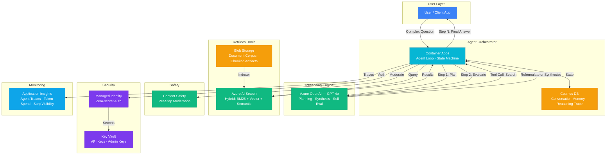

# Play 21 — Agentic RAG 🧠

> Autonomous retrieval — the agent decides when, what, and where to search.

Unlike standard RAG (Play 01) with a fixed pipeline, Agentic RAG gives the AI agent full control over retrieval. It decides IF search is needed, WHICH sources to query (AI Search, Bing, SQL, APIs), ITERATES on results if insufficient, and self-evaluates groundedness before responding.

## Quick Start
```bash
cd solution-plays/21-agentic-rag
az deployment group create -g $RG -f infra/main.bicep -p infra/parameters.json
code .  # Use @builder for retrieval agent, @reviewer for citation audit, @tuner for routing
```

## How It Differs from Standard RAG
| Aspect | Play 01 (Standard RAG) | Play 21 (Agentic RAG) |
|--------|----------------------|----------------------|
| Search decision | Always search | Agent decides IF needed |
| Source selection | Single fixed source | Agent picks from multiple |
| Iteration | One-shot retrieval | Agent iterates if insufficient |
| Self-evaluation | None | Agent checks groundedness |
| Multi-source | No | AI Search + Bing + SQL + APIs |
| Caching | No | Semantic cache (60% cost savings) |

## Architecture



> 📐 [Full architecture details](architecture.md)

| Service | Purpose |
|---------|---------|
| Azure OpenAI (gpt-4o) | Agent with tool-calling for autonomous retrieval |
| Azure AI Search | Primary knowledge base |
| Bing Web Search | Fallback for current/external info |
| Redis Cache | Semantic caching for repeated patterns |
| Container Apps | Agent hosting |

## Key Metrics
- Groundedness: ≥0.90 · Source accuracy: ≥90% · Avg hops: <2.0 · Cache hit: ≥40%

## DevKit (Agentic Retrieval-Focused)
| Primitive | What It Does |
|-----------|-------------|
| 3 agents | Builder (multi-source routing/iteration), Reviewer (citation/groundedness), Tuner (routing weights/cache/cost) |
| 3 skills | Deploy (110 lines), Evaluate (104 lines), Tune (104 lines) |
| 4 prompts | `/deploy`, `/test`, `/review`, `/evaluate` with agent routing |

## Cost Estimate

| Service | Dev/PoC | Production | Enterprise |
|---------|--------:|-----------:|-----------:|
| Azure OpenAI | $60/mo | $500/mo | $1,800/mo |
| Azure AI Search | $75/mo | $250/mo | $750/mo |
| Container Apps | $10/mo | $120/mo | $350/mo |
| Cosmos DB | $5/mo | $60/mo | $200/mo |
| Key Vault | $1/mo | $3/mo | $10/mo |
| Blob Storage | $2/mo | $15/mo | $50/mo |
| Application Insights | $0/mo | $30/mo | $100/mo |
| Content Safety | $0/mo | $20/mo | $75/mo |
| **Total** | **$153/mo** | **$998/mo** | **$3,335/mo** |

> 💰 [Full cost breakdown](cost.json)

📖 [Full docs](spec/README.md) · 🌐 [frootai.dev/solution-plays/21-agentic-rag](https://frootai.dev/solution-plays/21-agentic-rag)


## FAI Manifest

| Field | Value |
|-------|-------|
| Play | `21-agentic-rag` |
| Version | `1.0.0` |
| Knowledge | R2-RAG-Architecture, O2-AI-Agents, O3-MCP-Tools-Functions, T3-Production-Patterns |
| WAF Pillars | security, reliability, cost-optimization, performance-efficiency, responsible-ai |
| Groundedness | ≥ 95% |
| Safety | 0 violations max |
