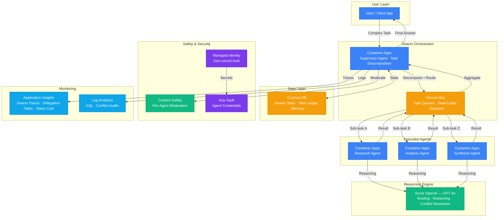

# Play 22 — Multi-Agent Swarm 🐝

> Decentralized agent teams with bidding, consensus voting, and parallel execution.

Unlike Play 07 (supervisor pattern), the swarm has no single coordinator. Agents bid for tasks competitively, execute in parallel, and vote on the best result through consensus. Self-healing: when an agent fails, the swarm redistributes work automatically.

## Quick Start
```bash
cd solution-plays/22-multi-agent-swarm
az deployment group create -g $RG -f infra/main.bicep -p infra/parameters.json
code .  # Use @builder for swarm topology, @reviewer for consensus audit, @tuner for swarm size
```

## How It Differs from Play 07 (Supervisor)
| Aspect | Play 07 (Supervisor) | Play 22 (Swarm) |
|--------|---------------------|------------------|
| Coordination | Central supervisor | Agents bid and vote |
| Task assignment | Top-down delegation | Competitive bidding |
| Quality control | Supervisor aggregates | Consensus voting |
| Failure handling | Supervisor reassigns | Self-healing |
| Single point of failure | Yes (supervisor) | No |

## Architecture

> 📐 See [architecture.md](architecture.md) for full data flow, service roles, security architecture, and scaling tables.



## Key Metrics
- Consensus: ≥80% · Bidding accuracy: ≥85% · Parallel speedup: ≥2x · Cost/task: <$0.15

## DevKit (Swarm-Focused)
| Primitive | What It Does |
|-----------|-------------|
| 3 agents | Builder (swarm topology/bidding/consensus), Reviewer (vote quality/dedup), Tuner (swarm size/model mix/cost) |
| 3 skills | Deploy (106 lines), Evaluate (103 lines), Tune (102 lines) |
| 4 prompts | `/deploy` (swarm infra), `/test` (parallel execution), `/review` (consensus audit), `/evaluate` (swarm efficiency) |

## Cost

> 💰 See [cost.json](cost.json) for full pricing breakdown with SKUs, notes, and optimization tips.

| Service | Purpose | Dev | Prod | Enterprise |
|---------|---------|-----|------|------------|
| Azure OpenAI | Swarm supervisor routing + specialist reasoning | $100 | $600 | $2,200 |
| Container Apps | Supervisor + specialist agent containers | $20 | $200 | $600 |
| Service Bus | Agent-to-agent async messaging + dead-letter | $10 | $50 | $200 |
| Cosmos DB | Swarm state, task ledger, conversation memory | $8 | $80 | $400 |
| Key Vault | Agent credentials, API keys | $1 | $3 | $10 |
| App Insights | Distributed tracing across swarm | $0 | $35 | $140 |
| Log Analytics | Centralized logging, conflict audits | $0 | $25 | $80 |
| Content Safety | Per-agent output moderation | $0 | $25 | $80 |
| **Total** | | **$139** | **$1,018** | **$3,710** |

📖 [Full docs](spec/README.md) · 🌐 [frootai.dev/solution-plays/22-multi-agent-swarm](https://frootai.dev/solution-plays/22-multi-agent-swarm)


## FAI Manifest

| Field | Value |
|-------|-------|
| Play | `22-multi-agent-swarm` |
| Version | `1.0.0` |
| Knowledge | O2-AI-Agents, O1-Semantic-Kernel, O3-MCP-Tools-Functions, T3-Production-Patterns |
| WAF Pillars | security, reliability, cost-optimization, performance-efficiency, operational-excellence |
| Groundedness | ≥ 90% |
| Safety | 0 violations max |
