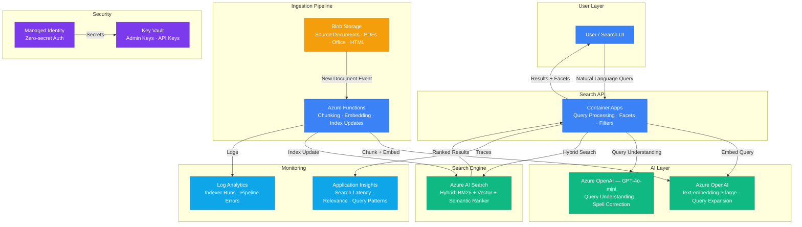

# Play 26 — Semantic Search Engine 🔎

> Backend search-as-a-service with embedding pipeline, query expansion, and personalization.

A semantic search engine consumed as an API by other services. Embedding pipeline indexes documents into vector + keyword fields, hybrid search combines BM25 + vector + semantic reranking, query expansion handles synonyms and spelling, and personalization re-ranks based on user profiles.

## Quick Start
```bash
cd solution-plays/26-semantic-search-engine
az deployment group create -g $RG -f infra/main.bicep -p infra/parameters.json
code .  # Use @builder for index/embeddings, @reviewer for relevance audit, @tuner for scoring
```

## How It Differs from Play 09 (Search Portal)
| Aspect | Play 09 (Portal) | Play 26 (Engine) |
|--------|-----------------|------------------|
| Focus | End-user UI with facets | Backend API for other services |
| UI | Autocomplete, filters | API-only (JSON in, JSON out) |
| Personalization | Basic | User profile-based re-ranking |
| Query expansion | None | Synonym + LLM-based |
| Multi-tenant | No | Tenant-isolated indices |

## Architecture

> 📐 See [architecture.md](architecture.md) for full data flow, service roles, security architecture, and scaling tables.



## Key Metrics
- NDCG@10: ≥0.75 · Zero-result: <3% · Latency p95: <400ms · Personalization lift: ≥10%

## DevKit (Search Engine-Focused)
| Primitive | What It Does |
|-----------|-------------|
| 3 agents | Builder (index/embedding/scoring), Reviewer (relevance/access/freshness), Tuner (scoring/expansion/personalization/cost) |
| 3 skills | Deploy (107 lines), Evaluate (105 lines), Tune (103 lines) |
| 4 prompts | `/deploy` (index + pipeline), `/test` (query quality), `/review` (relevance), `/evaluate` (NDCG/MRR) |

## Cost

> 💰 See [cost.json](cost.json) for full pricing breakdown with SKUs, notes, and optimization tips.

| Service | Purpose | Dev | Prod | Enterprise |
|---------|---------|-----|------|------------|
| Azure AI Search | Hybrid index (BM25 + vector + semantic ranker) | $75 | $250 | $750 |
| Azure OpenAI | Embedding generation + query understanding | $30 | $150 | $600 |
| Blob Storage | Source documents (PDFs, Office, HTML) | $2 | $20 | $60 |
| Container Apps | Search API gateway, query processing | $10 | $80 | $250 |
| Azure Functions | Document processing pipeline, index updates | $0 | $15 | $75 |
| Key Vault | AI Search admin keys, OpenAI API keys | $1 | $3 | $10 |
| App Insights | Search latency, relevance, query patterns | $0 | $25 | $100 |
| Log Analytics | Indexer runs, pipeline errors | $0 | $15 | $50 |
| **Total** | | **$118** | **$558** | **$1,895** |

📖 [Full docs](spec/README.md) · 🌐 [frootai.dev/solution-plays/26-semantic-search-engine](https://frootai.dev/solution-plays/26-semantic-search-engine)


## FAI Manifest

| Field | Value |
|-------|-------|
| Play | `26-semantic-search-engine` |
| Version | `1.0.0` |
| Knowledge | R2-RAG-Architecture, F1-GenAI-Foundations, T3-Production-Patterns |
| WAF Pillars | security, reliability, performance-efficiency, cost-optimization |
| Groundedness | ≥ 85% |
| Safety | 0 violations max |
