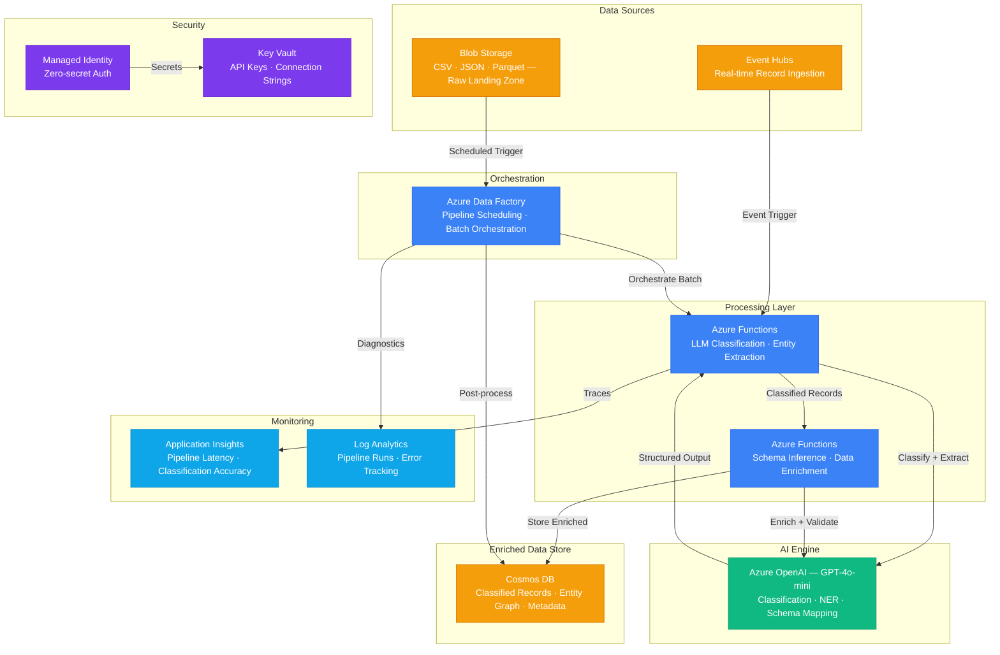

# Play 27 — AI Data Pipeline 📊

> ETL/ELT with LLM enrichment — classify, extract, and summarize at scale.

Ingest raw data, clean and validate, then enrich with GPT-4o-mini for classification, entity extraction, and summarization. Data Factory orchestrates the pipeline, data flows through lake zones (raw → staging → enriched → serving), with data quality checks and PII detection at every stage.

## Quick Start
```bash
cd solution-plays/27-ai-data-pipeline
az deployment group create -g $RG -f infra/main.bicep -p infra/parameters.json
code .  # Use @builder for ETL/enrichment, @reviewer for data quality audit, @tuner for cost
```

## Architecture

> 📐 See [architecture.md](architecture.md) for full data flow, service roles, security architecture, and scaling tables.



## Enrichment Types
| Type | Model | Cost/1K Records |
|------|-------|----------------|
| Classification | gpt-4o-mini | ~$0.15 |
| Entity extraction | gpt-4o-mini | ~$0.20 |
| Summarization | gpt-4o-mini | ~$0.30 |
| Sentiment | gpt-4o-mini | ~$0.10 |

## Key Metrics
- Enrichment accuracy: ≥90% · Data quality: ≥95% · Throughput: ≥10K records/hr · PII recall: ≥99%

## DevKit (Data Engineering-Focused)
| Primitive | What It Does |
|-----------|-------------|
| 3 agents | Builder (ETL/enrichment/ADF), Reviewer (quality/idempotency/PII), Tuner (batch/parallelism/cost) |
| 3 skills | Deploy (104 lines), Evaluate (105 lines), Tune (103 lines) |
| 4 prompts | `/deploy` (ETL pipeline), `/test` (execution), `/review` (data quality), `/evaluate` (enrichment accuracy) |

## Cost

> 💰 See [cost.json](cost.json) for full pricing breakdown with SKUs, notes, and optimization tips.

| Service | Purpose | Dev | Prod | Enterprise |
|---------|---------|-----|------|------------|
| Azure OpenAI | GPT-4o-mini for classification + entity extraction | $40 | $250 | $900 |
| Data Factory | Pipeline orchestration and scheduling | $15 | $120 | $400 |
| Cosmos DB | Enriched records, entity graphs, metadata | $5 | $80 | $400 |
| Event Hubs | Real-time streaming ingestion | $12 | $75 | $300 |
| Azure Functions | Event-triggered classification + enrichment | $0 | $25 | $150 |
| Blob Storage | Raw data landing zone (CSV, JSON, Parquet) | $2 | $25 | $80 |
| Key Vault | API keys, connection secrets | $1 | $3 | $10 |
| App Insights | Pipeline latency, classification accuracy | $0 | $25 | $100 |
| Log Analytics | Pipeline run history, error diagnostics | $0 | $15 | $50 |
| **Total** | | **$75** | **$618** | **$2,390** |

📖 [Full docs](spec/README.md) · 🌐 [frootai.dev/solution-plays/27-ai-data-pipeline](https://frootai.dev/solution-plays/27-ai-data-pipeline)


## FAI Manifest

| Field | Value |
|-------|-------|
| Play | `27-ai-data-pipeline` |
| Version | `1.0.0` |
| Knowledge | T1-Fine-Tuning-MLOps, T3-Production-Patterns, R2-RAG-Architecture |
| WAF Pillars | security, reliability, cost-optimization, operational-excellence, responsible-ai |
| Groundedness | ≥ 85% |
| Safety | 0 violations max |
