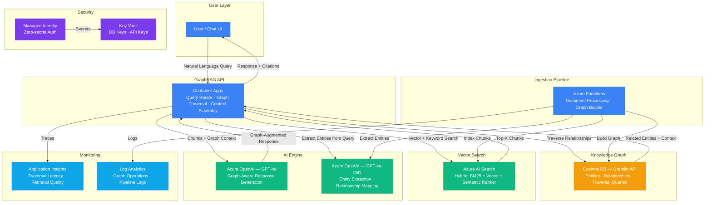

# Play 28 — Knowledge Graph RAG 🕸️

> Graph-based RAG with entity extraction, relationship mapping, and multi-hop traversal.

Instead of vector similarity (Play 01) or agent-controlled search (Play 21), Knowledge Graph RAG builds a graph of entities and relationships, then traverses the graph to find context for multi-hop reasoning queries like "Who does Alice's manager report to?"

## Quick Start
```bash
cd solution-plays/28-knowledge-graph-rag
az deployment group create -g $RG -f infra/main.bicep -p infra/parameters.json
code .  # Use @builder for graph construction, @reviewer for entity audit, @tuner for traversal
```

## How It Differs from Other RAG Plays
| Aspect | Play 01 (Vector) | Play 21 (Agentic) | Play 28 (Graph) |
|--------|-----------------|-------------------|----------------|
| Retrieval | Similarity search | Agent-controlled multi-source | Graph traversal |
| Best for | "Find similar" | "Search and iterate" | "Who/what connects to X?" |
| Data model | Flat chunks | Flat + sources | Entities + relationships |
| Multi-hop | No | Limited | Native (2-3 hops) |

## Architecture

> 📐 See [architecture.md](architecture.md) for full data flow, service roles, security architecture, and scaling tables.



## Key Metrics
- Entity F1: ≥0.85 · Relationship precision: ≥0.80 · Multi-hop: ≥75% · Graph vs vector lift: ≥15%

## DevKit (Graph RAG-Focused)
| Primitive | What It Does |
|-----------|-------------|
| 3 agents | Builder (entity extraction/graph/traversal), Reviewer (graph quality/entity resolution), Tuner (depth/hybrid weights/cost) |
| 3 skills | Deploy (103 lines), Evaluate (105 lines), Tune (101 lines) |
| 4 prompts | `/deploy` (graph + extraction), `/test` (traversal), `/review` (entity accuracy), `/evaluate` (multi-hop quality) |

## Cost

> 💰 See [cost.json](cost.json) for full pricing breakdown with SKUs, notes, and optimization tips.

| Service | Purpose | Dev | Prod | Enterprise |
|---------|---------|-----|------|------------|
| Azure OpenAI | Entity extraction, graph-aware response generation | $60 | $400 | $1,400 |
| Cosmos DB (Gremlin) | Knowledge graph — entities + relationships | $8 | $160 | $650 |
| Azure AI Search | Vector + keyword search over document chunks | $75 | $250 | $750 |
| Container Apps | GraphRAG API, query routing, traversal | $10 | $100 | $300 |
| Azure Functions | Graph ingestion, entity extraction pipeline | $0 | $20 | $75 |
| Key Vault | Cosmos DB keys, API keys | $1 | $3 | $10 |
| App Insights | Traversal latency, retrieval quality | $0 | $25 | $100 |
| Log Analytics | Graph operations, pipeline diagnostics | $0 | $15 | $50 |
| **Total** | | **$154** | **$973** | **$3,335** |

📖 [Full docs](spec/README.md) · 🌐 [frootai.dev/solution-plays/28-knowledge-graph-rag](https://frootai.dev/solution-plays/28-knowledge-graph-rag)


## FAI Manifest

| Field | Value |
|-------|-------|
| Play | `28-knowledge-graph-rag` |
| Version | `1.0.0` |
| Knowledge | R2-RAG-Architecture, F1-GenAI-Foundations, O2-Agent-Coding, R3-Deterministic-AI |
| WAF Pillars | security, reliability, performance-efficiency, cost-optimization, responsible-ai |
| Groundedness | ≥ 85% |
| Safety | 0 violations max |
