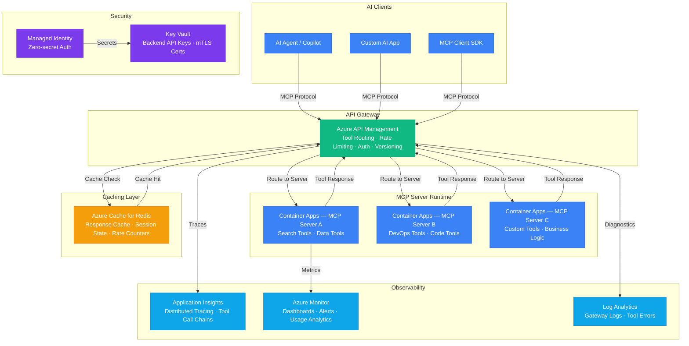

# Play 29 — MCP Gateway 🔌

> Build a Model Context Protocol server that exposes your APIs as AI-callable tools.

Create an MCP server that wraps your existing APIs, databases, and services as tools that any AI agent can invoke. Define tool schemas with input validation, expose resources for context, and deploy via stdio (local) or HTTP (remote).

## Quick Start
```bash
cd solution-plays/29-mcp-gateway
npm install @modelcontextprotocol/sdk
npx ts-node src/index.ts  # Start MCP server
code .  # Use @builder for tools/transport, @reviewer for security audit, @tuner for descriptions
```

## Architecture

> 📐 See [architecture.md](architecture.md) for full data flow, service roles, security architecture, and scaling tables.



## MCP Capabilities
| Capability | What It Provides |
|-----------|-----------------|
| **Tools** | Executable functions the AI agent can call |
| **Resources** | Read-only data attached to chat context |
| **Prompts** | Pre-configured prompt templates |

## Key Metrics
- Tool selection accuracy: ≥90% · Input validation: 100% · Response time: <500ms · Uptime: ≥99.9%

## DevKit (MCP Protocol-Focused)
| Primitive | What It Does |
|-----------|-------------|
| 3 agents | Builder (tools/resources/transport), Reviewer (security/validation/injection), Tuner (descriptions/schemas/caching) |
| 3 skills | Deploy (101 lines), Evaluate (103 lines), Tune (100 lines) |
| 4 prompts | `/deploy` (MCP server), `/test` (tool calling), `/review` (security), `/evaluate` (invocation accuracy) |

**Note:** This is a developer tooling/protocol play. TuneKit covers tool description optimization for LLM invocation accuracy, response schema design, transport configuration, caching strategy, and rate limiting — not AI model parameters.

## Cost

> 💰 See [cost.json](cost.json) for full pricing breakdown with SKUs, notes, and optimization tips.

| Service | Purpose | Dev | Prod | Enterprise |
|---------|---------|-----|------|------------|
| API Management | MCP gateway — routing, rate limiting, auth | $5 | $175 | $700 |
| Container Apps | MCP server runtime, tool registration | $10 | $80 | $250 |
| Azure Monitor | Centralized observability, dashboards | $0 | $40 | $150 |
| Redis Cache | Tool response cache, rate limit counters | $15 | $80 | $225 |
| Key Vault | Backend API keys, mTLS certificates | $1 | $3 | $10 |
| App Insights | Distributed tracing, tool call chains | $0 | $25 | $100 |
| Log Analytics | Gateway diagnostics, tool errors | $0 | $15 | $50 |
| **Total** | | **$31** | **$418** | **$1,485** |

📖 [Full docs](spec/README.md) · 🌐 [frootai.dev/solution-plays/29-mcp-gateway](https://frootai.dev/solution-plays/29-mcp-gateway)


## FAI Manifest

| Field | Value |
|-------|-------|
| Play | `29-mcp-gateway` |
| Version | `1.0.0` |
| Knowledge | O3-MCP-Tools-Functions, F4-GitHub-Agentic-OS, T3-Production-Patterns |
| WAF Pillars | security, reliability, cost-optimization, operational-excellence, performance-efficiency |
| Groundedness | ≥ 85% |
| Safety | 0 violations max |
