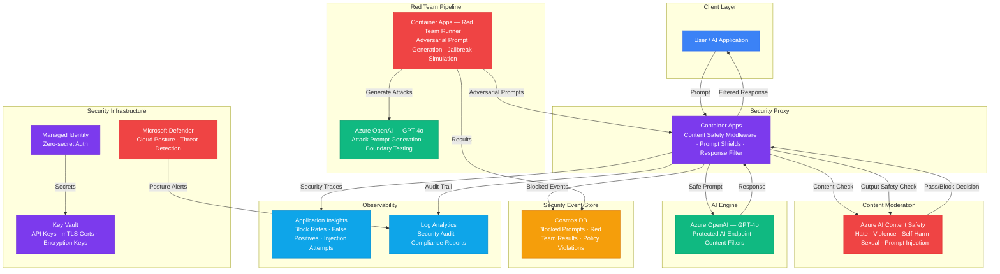

# Play 30 — AI Security Hardening 🔒

> Multi-layer defense against prompt injection, jailbreak, and data exfiltration.

Wrap any AI application with 8 security layers covering the full OWASP LLM Top 10. Input sanitization, prompt injection classifiers, content safety, PII masking, output validation, data exfiltration prevention, and audit logging — all in a composable middleware architecture.

## Quick Start
```bash
cd solution-plays/30-ai-security-hardening
az deployment group create -g $RG -f infra/main.bicep -p infra/parameters.json
code .  # Use @builder for defense layers, @reviewer for red-teaming, @tuner for FP reduction
```

## Defense Architecture (8 Layers)

> 📐 See [architecture.md](architecture.md) for full data flow, service roles, security architecture, and scaling tables.

```
Input → L1:Sanitize → L2:Injection → L3:ContentSafety → L4:PII → LLM → L5:Grounding → L6:Exfiltration → L7:Safety → L8:Audit → Output
```



## OWASP LLM Top 10 Coverage
| ID | Threat | Defense |
|----|--------|---------|
| LLM01 | Prompt Injection | Classifier + delimiter isolation |
| LLM02 | Insecure Output | Output validation + sanitization |
| LLM06 | Sensitive Disclosure | PII masking + output filtering |
| LLM07 | Insecure Plugin | Tool input validation |
| LLM08 | Excessive Agency | Action allowlists |

## Key Metrics
- Injection block: ≥95% · False positive: <5% · Data leakage: 0% · Overhead: <500ms

## Composability
Works as middleware for **any** FrootAI play:
- Play 01 + Play 30 = Secure RAG
- Play 04 + Play 30 = Secure Voice AI
- Play 07 + Play 30 = Secure Multi-Agent

## DevKit (AI Security-Focused)
| Primitive | What It Does |
|-----------|-------------|
| 3 agents | Builder (defense layers/injection/validation), Reviewer (red-team/OWASP/pen-test), Tuner (sensitivity/FP/patterns) |
| 3 skills | Deploy (104 lines), Evaluate (101 lines), Tune (101 lines) |
| 4 prompts | `/deploy` (defense layers), `/test` (attack vectors), `/review` (red-team), `/evaluate` (injection resilience) |

## Cost

> 💰 See [cost.json](cost.json) for full pricing breakdown with SKUs, notes, and optimization tips.

| Service | Purpose | Dev | Prod | Enterprise |
|---------|---------|-----|------|------------|
| Content Safety | Multi-category moderation + Prompt Shields | $0 | $75 | $300 |
| Azure OpenAI | Red team simulation, adversarial testing | $40 | $200 | $800 |
| Container Apps | Security proxy + red team runner | $10 | $100 | $300 |
| Cosmos DB | Security event store, audit log | $5 | $30 | $160 |
| Key Vault | API keys, mTLS certs, encryption keys | $1 | $5 | $15 |
| App Insights | Block rates, injection attempts, false positives | $0 | $30 | $120 |
| Log Analytics | Security audit logs, compliance reports | $0 | $20 | $75 |
| Defender for Cloud | Cloud security posture, threat detection | $0 | $15 | $40 |
| **Total** | | **$56** | **$475** | **$1,810** |

📖 [Full docs](spec/README.md) · 🌐 [frootai.dev/solution-plays/30-ai-security-hardening](https://frootai.dev/solution-plays/30-ai-security-hardening)


## FAI Manifest

| Field | Value |
|-------|-------|
| Play | `30-ai-security-hardening` |
| Version | `1.0.0` |
| Knowledge | T2-Responsible-AI, R3-Deterministic-AI, T3-Production-Patterns, F1-GenAI-Foundations |
| WAF Pillars | security, reliability, responsible-ai, operational-excellence |
| Groundedness | ≥ 85% |
| Safety | 0 violations max |
