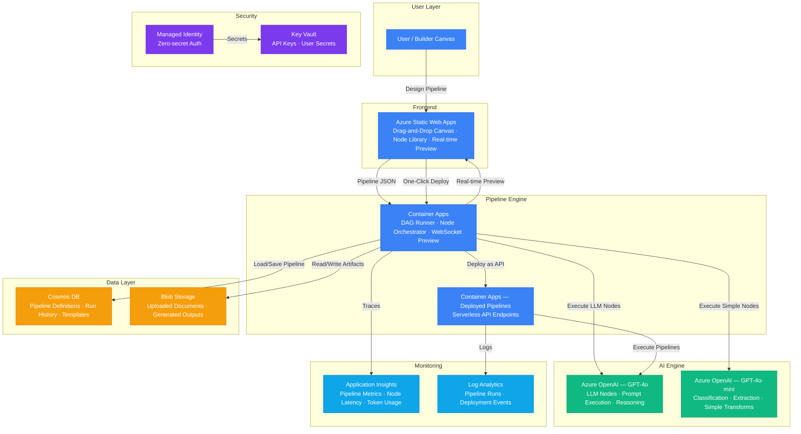

# Play 31 — Low-Code AI Builder 🧩

> Visual AI pipeline designer — drag-and-drop workflows, template library, one-click deploy.

Build AI pipelines without writing code. Drag nodes onto a canvas, connect them, configure properties, and deploy with one click. Pre-built templates for document classification, sentiment analysis, FAQ bots, email triage, and data enrichment. Citizen developers can ship AI in minutes.

## Quick Start
```bash
cd solution-plays/31-low-code-ai-builder
az deployment group create -g $RG -f infra/main.bicep -p infra/parameters.json
code .  # Use @builder for pipeline designer, @reviewer for validation audit, @tuner for performance
```

## Architecture

> 📐 See [architecture.md](architecture.md) for full data flow, service roles, security architecture, and scaling tables.



## Pre-Built Templates
| Template | Use Case |
|----------|----------|
| Document Classifier | Auto-sort incoming documents by type |
| Customer Sentiment | Real-time review/feedback scoring |
| FAQ Bot | Quick RAG chatbot from knowledge base |
| Email Triager | Auto-classify and route incoming email |
| Data Enricher | Batch LLM augmentation on records |

## Key Metrics
- Pipeline success: ≥95% · Deploy success: ≥90% · Time to first pipeline: <5min · Load: <3s

## DevKit (Low-Code Platform-Focused)
| Primitive | What It Does |
|-----------|-------------|
| 3 agents | Builder (designer/templates/connectors), Reviewer (validation/security), Tuner (execution speed/model routing/cost) |
| 3 skills | Deploy (105 lines), Evaluate (105 lines), Tune (101 lines) |
| 4 prompts | `/deploy` (builder platform), `/test` (pipeline execution), `/review` (validation), `/evaluate` (template quality) |

## Cost

> 💰 See [cost.json](cost.json) for full pricing breakdown with SKUs, notes, and optimization tips.

| Service | Purpose | Dev | Prod | Enterprise |
|---------|---------|-----|------|------------|
| Azure OpenAI | Pipeline AI node execution (GPT-4o + mini) | $50 | $300 | $1,000 |
| Container Apps | DAG engine, node orchestrator, deployed APIs | $10 | $100 | $300 |
| Cosmos DB | Pipeline definitions, run history, templates | $5 | $65 | $300 |
| Static Web Apps | Visual drag-and-drop builder UI | $0 | $9 | $9 |
| Blob Storage | Pipeline artifacts, uploaded documents | $2 | $15 | $50 |
| Key Vault | API keys, user secrets, pipeline encryption | $1 | $3 | $10 |
| App Insights | Pipeline metrics, node latency, token usage | $0 | $25 | $100 |
| Log Analytics | Pipeline runs, deployment events | $0 | $15 | $50 |
| **Total** | | **$68** | **$532** | **$1,819** |

📖 [Full docs](spec/README.md) · 🌐 [frootai.dev/solution-plays/31-low-code-ai-builder](https://frootai.dev/solution-plays/31-low-code-ai-builder)


## FAI Manifest

| Field | Value |
|-------|-------|
| Play | `31-low-code-ai-builder` |
| Version | `1.0.0` |
| Knowledge | O2-Agent-Coding, F1-GenAI-Foundations, T3-Production-Patterns |
| WAF Pillars | security, reliability, cost-optimization, operational-excellence |
| Groundedness | ≥ 85% |
| Safety | 0 violations max |
