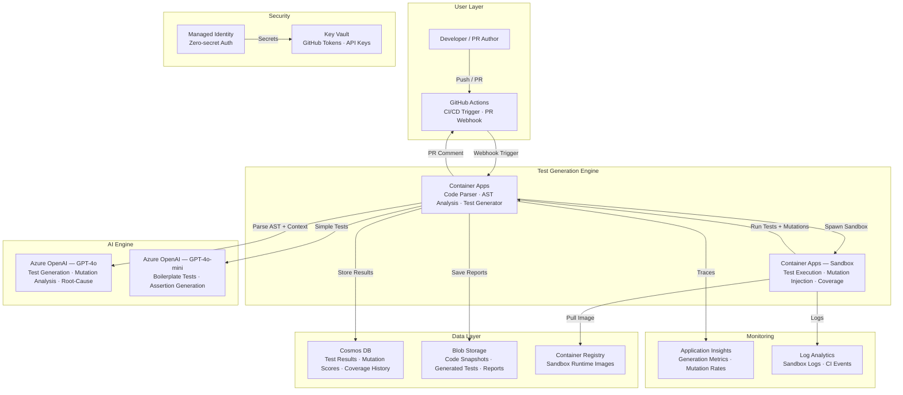

# Play 32 — AI-Powered Testing 🧪

> Generate tests from source code AST, mutation testing, and CI-integrated test automation.

LLM reads your source code, parses the AST, and generates comprehensive test suites — unit tests, edge cases, error handling, boundary conditions. Mutation testing validates test strength. CI integration runs generated tests on every PR. Flaky test detection quarantines unstable tests.

## Quick Start
```bash
cd solution-plays/32-ai-powered-testing
python scripts/generate_tests.py --source src/ --output tests/generated/
pytest tests/generated/ -v --cov
code .  # Use @builder for test gen, @reviewer for quality audit, @tuner for prioritization
```

## Architecture
| Component | Purpose |
|-----------|---------|
| AST Parser | Extract function signatures + logic from source |
| Azure OpenAI (gpt-4o) | Generate test cases from function context |
| Mutation Testing | Validate assertion strength by mutating source |
| CI Pipeline | Run generated tests on every PR |
| Flaky Detector | Flag non-deterministic tests for quarantine |



📐 [Full architecture details](architecture.md)

## Test Generation Pipeline
```
Source Code → AST Parse → Function Context → GPT-4o → Test File → Run → Coverage Report → Mutation Score
```

## Key Metrics
- Pass rate: ≥95% · Coverage lift: ≥15% · Mutation score: ≥70% · Flaky: <3%

## Language Support
| Language | AST Parser | Test Framework |
|----------|-----------|----------------|
| Python | ast module | pytest |
| TypeScript | ts-morph | Jest/Vitest |
| C# | Roslyn | xUnit |
| PowerShell | Parser API | Pester |

## DevKit (QA Engineering-Focused)
| Primitive | What It Does |
|-----------|-------------|
| 3 agents | Builder (AST/generation/mutation/CI), Reviewer (test quality/coverage/mocks), Tuner (prompts/prioritization/flaky) |
| 3 skills | Deploy (102 lines), Evaluate (104 lines), Tune (102 lines) |
| 4 prompts | `/deploy` (test framework), `/test` (generated execution), `/review` (quality audit), `/evaluate` (mutation score) |

**Note:** This is a QA/DevOps play. TuneKit covers generation prompts, test prioritization strategies, model routing per language, mutation testing scope, and flaky test reduction — not AI model quality.

## Cost
| Service | Dev | Prod | Enterprise |
|---------|-----|------|------------|
| Azure OpenAI | $40 (PAYG) | $250 (PAYG) | $800 (PTU) |
| Container Apps | $10 (Consumption) | $90 (Dedicated) | $280 (Dedicated HA) |
| Container Registry | $5 (Basic) | $20 (Standard) | $50 (Premium) |
| Cosmos DB | $5 (Serverless) | $50 (600 RU/s) | $250 (3000 RU/s) |
| Blob Storage | $2 (Hot LRS) | $12 (Hot LRS) | $40 (Hot GRS) |
| Key Vault | $1 (Standard) | $3 (Standard) | $10 (Premium HSM) |
| Application Insights | $0 (Free) | $20 (Pay-per-GB) | $80 (Pay-per-GB) |
| Log Analytics | $0 (Free) | $12 (Pay-per-GB) | $45 (Commitment) |
| **Total** | **$63/mo** | **$457/mo** | **$1,555/mo** |

💰 [Full cost breakdown](cost.json)

📖 [Full docs](spec/README.md) · 🌐 [frootai.dev/solution-plays/32-ai-powered-testing](https://frootai.dev/solution-plays/32-ai-powered-testing)


## FAI Manifest

| Field | Value |
|-------|-------|
| Play | `32-ai-powered-testing` |
| Version | `1.0.0` |
| Knowledge | O2-Agent-Coding, T3-Production-Patterns, F4-GitHub-Agentic-OS |
| WAF Pillars | security, reliability, operational-excellence, performance-efficiency |
| Groundedness | ≥ 85% |
| Safety | 0 violations max |
