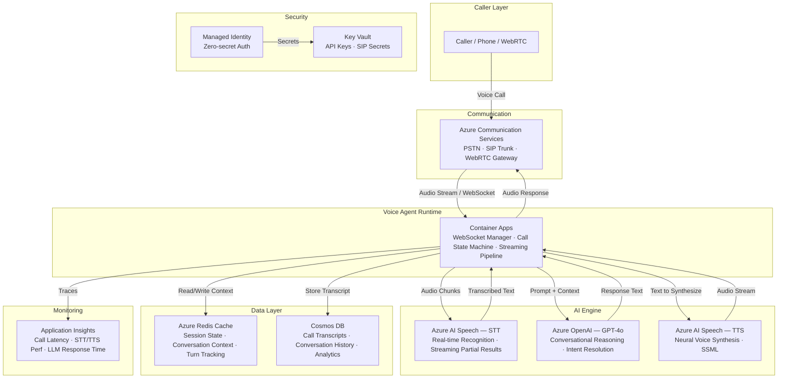

# Play 33 — Voice AI Agent 🎙️

> Autonomous voice agent with dialog state, multi-turn conversations, and proactive actions.

An AI voice agent that goes beyond Play 04's inbound call handling. Dialog state machine manages multi-turn conversations, intent detection with entity extraction enables complex requests, and proactive actions let the agent initiate (reminders, follow-ups, notifications) — not just respond.

## Quick Start
```bash
cd solution-plays/33-voice-ai-agent
az deployment group create -g $RG -f infra/main.bicep -p infra/parameters.json
code .  # Use @builder for dialog/voice, @reviewer for compliance audit, @tuner for prosody/speed
```

## How It Differs from Play 04 (Call Center)
| Aspect | Play 04 (Call Center) | Play 33 (Voice Agent) |
|--------|----------------------|----------------------|
| Mode | Inbound phone calls | Any interface (phone, web, IoT) |
| Conversation | Single-intent | Multi-turn stateful dialog |
| State | Stateless per call | Persistent state machine |
| Actions | Respond + escalate | Proactive (initiate tasks) |
| Memory | Current call only | Remembers past interactions |

## Architecture
| Service | Purpose |
|---------|---------|
| Azure Speech (STT + TTS) | Voice recognition + neural voice synthesis |
| Azure OpenAI (gpt-4o + mini) | Dialog intelligence + intent classification |
| Cosmos DB | Dialog state persistence across sessions |
| Container Apps | Voice agent runtime |



📐 [Full architecture details](architecture.md)

## Key Metrics
- Intent accuracy: ≥92% · Dialog completion: ≥80% · Latency: <2s · Voice MOS: ≥4.0/5.0

## DevKit (Voice Agent-Focused)
| Primitive | What It Does |
|-----------|-------------|
| 3 agents | Builder (dialog state/intent/voice loop), Reviewer (compliance/latency/UX), Tuner (prosody/flow/cost) |
| 3 skills | Deploy (109 lines), Evaluate (107 lines), Tune (106 lines) |
| 4 prompts | `/deploy` (dialog + voice), `/test` (interaction loop), `/review` (compliance), `/evaluate` (intent/quality) |

## Cost
| Service | Dev | Prod | Enterprise |
|---------|-----|------|------------|
| Azure AI Speech | $5 (Free+overflow) | $200 (Standard S0) | $800 (S0+Custom Voice) |
| Azure OpenAI | $45 (PAYG) | $350 (PAYG) | $1,200 (PTU) |
| Communication Services | $15 (PAYG) | $150 (PAYG) | $500 (Direct Routing) |
| Container Apps | $15 (Consumption) | $120 (Dedicated) | $350 (Dedicated HA) |
| Redis Cache | $15 (Basic C0) | $55 (Standard C1) | $200 (Premium P1) |
| Cosmos DB | $5 (Serverless) | $65 (800 RU/s) | $300 (4000 RU/s) |
| Key Vault | $1 (Standard) | $3 (Standard) | $10 (Premium HSM) |
| Application Insights | $0 (Free) | $30 (Pay-per-GB) | $120 (Pay-per-GB) |
| **Total** | **$101/mo** | **$973/mo** | **$3,480/mo** |

💰 [Full cost breakdown](cost.json)

📖 [Full docs](spec/README.md) · 🌐 [frootai.dev/solution-plays/33-voice-ai-agent](https://frootai.dev/solution-plays/33-voice-ai-agent)


## FAI Manifest

| Field | Value |
|-------|-------|
| Play | `33-voice-ai-agent` |
| Version | `1.0.0` |
| Knowledge | F1-GenAI-Foundations, R2-RAG-Architecture, T2-Responsible-AI |
| WAF Pillars | security, reliability, cost-optimization, responsible-ai |
| Groundedness | ≥ 85% |
| Safety | 0 violations max |
