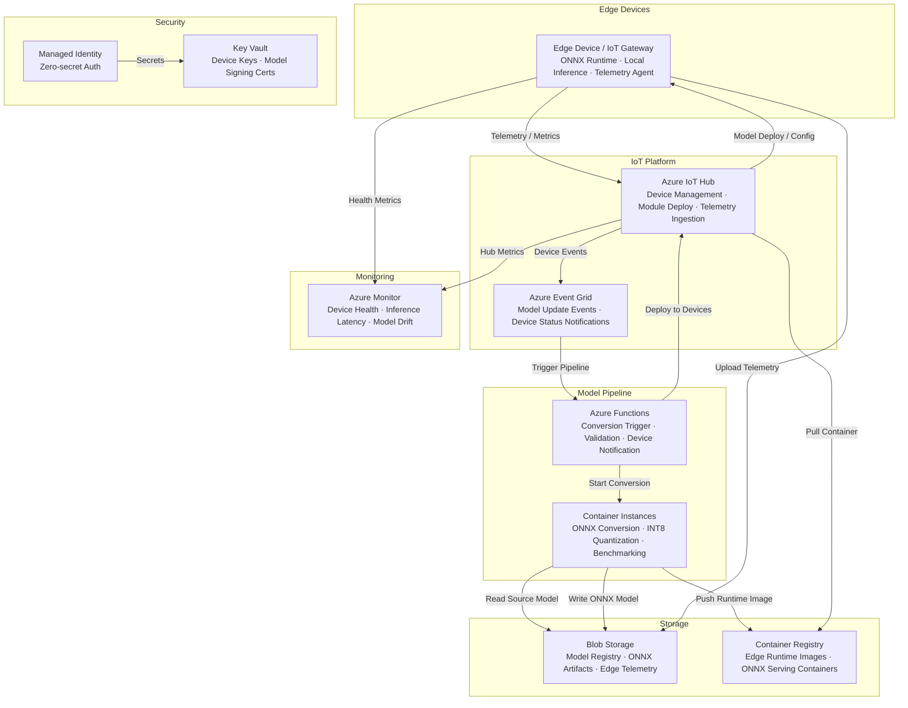

# Play 34 — Edge AI Deployment 🚀📦

> Package, deploy, and manage AI models across a fleet of edge devices via IoT Hub.

Deploy any AI model as a container to hundreds of edge devices. IoT Hub manages the fleet, staged rollouts (canary → 25% → 50% → 100%) prevent bad deployments, layered deployments separate base runtime from model from config, and offline mode keeps inference running when disconnected.

## Quick Start
```bash
cd solution-plays/34-edge-ai-deployment
# Package model as container
docker build -t $ACR.azurecr.io/edge-ai-module:v1 .
docker push $ACR.azurecr.io/edge-ai-module:v1
# Deploy to fleet
az iot edge deployment create --hub-name $HUB --content deployment.json
code .  # Use @builder for packaging/IoT, @reviewer for device audit, @tuner for rollout
```

## How It Differs from Play 19 (Phi-4 Edge)
| Aspect | Play 19 (Phi-4) | Play 34 (Edge Deploy) |
|--------|----------------|----------------------|
| Focus | One model (ONNX) | Any model, fleet deployment |
| Scope | Single device | Fleet (100s-1000s) |
| Updates | Simple push | Canary → staged rollouts |
| Runtime | ONNX Runtime only | Docker containers (any) |

## Architecture
| Service | Purpose |
|---------|---------|
| Azure IoT Hub | Fleet management, deployment orchestration |
| Azure Container Registry | Edge module image storage |
| IoT Edge Runtime | On-device container execution |
| Azure Monitor | Fleet health, telemetry collection |



📐 [Full architecture details](architecture.md)

## Rollout Strategy
| Phase | % of Fleet | Duration | Gate |
|-------|-----------|----------|------|
| Canary | 5% | 24h | Error rate = 0% |
| Ring 1 | 25% | 12h | < 0.1% errors |
| Ring 2 | 50% | 6h | < 0.5% errors |
| Full | 100% | — | Previous healthy |

## Key Metrics
- Deploy success: ≥98% · Rollback: 100% · Offline: 100% · Fleet health: ≥98%

## DevKit (Edge Deployment-Focused)
| Primitive | What It Does |
|-----------|-------------|
| 3 agents | Builder (container/IoT Edge/rollout), Reviewer (size/rollback/offline), Tuner (container size/strategy/cost) |
| 3 skills | Deploy (109 lines), Evaluate (106 lines), Tune (104 lines) |
| 4 prompts | `/deploy` (fleet rollout), `/test` (container + offline), `/review` (security/rollback), `/evaluate` (fleet health) |

## Cost
| Service | Dev | Prod | Enterprise |
|---------|-----|------|------------|
| Azure IoT Hub | $0 (Free) | $25 (Standard S1) | $250 (Standard S3) |
| Container Instances | $20 (Standard) | $80 (Standard) | $350 (Standard GPU) |
| Container Registry | $5 (Basic) | $20 (Standard) | $50 (Premium) |
| Blob Storage | $3 (Hot LRS) | $20 (Hot LRS) | $80 (Hot GRS) |
| Event Grid | $0 (Free) | $5 (Standard) | $25 (Standard) |
| Azure Monitor | $0 (Free) | $25 (Pay-per-GB) | $100 (Pay-per-GB) |
| Key Vault | $1 (Standard) | $3 (Standard) | $10 (Premium HSM) |
| Azure Functions | $0 (Consumption) | $5 (Consumption) | $75 (Premium EP1) |
| **Total** | **$29/mo** | **$183/mo** | **$940/mo** |

💰 [Full cost breakdown](cost.json)

📖 [Full docs](spec/README.md) · 🌐 [frootai.dev/solution-plays/34-edge-ai-deployment](https://frootai.dev/solution-plays/34-edge-ai-deployment)


## FAI Manifest

| Field | Value |
|-------|-------|
| Play | `34-edge-ai-deployment` |
| Version | `1.0.0` |
| Knowledge | F2-LLM-Selection, T1-Fine-Tuning-MLOps, T3-Production-Patterns |
| WAF Pillars | security, reliability, cost-optimization, performance-efficiency |
| Groundedness | ≥ 85% |
| Safety | 0 violations max |
