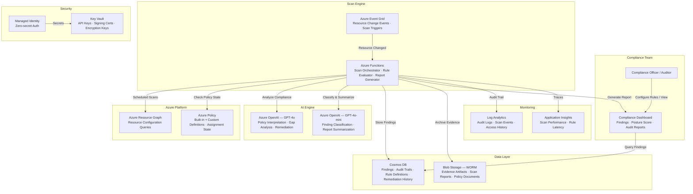

# Play 35 — AI Compliance Engine ⚖️

> Automated compliance checking against GDPR, HIPAA, EU AI Act, and SOC 2.

Deploy an AI-powered compliance engine that automatically assesses your AI systems against regulatory frameworks. LLM-based analysis evaluates evidence, assigns risk scores, generates audit-ready reports, and tracks remediation. Covers all major frameworks with 200+ automated checks.

## Quick Start
```bash
cd solution-plays/35-ai-compliance-engine
az deployment group create -g $RG -f infra/main.bicep -p infra/parameters.json
code .  # Use @builder for checks/audit, @reviewer for coverage audit, @tuner for FP reduction
```

## Architecture
| Service | Purpose |
|---------|---------|
| Azure OpenAI (gpt-4o) | Compliance analysis, evidence assessment, risk scoring |
| Cosmos DB | Compliance evidence store, audit trail |
| Azure Storage | Reports, evidence snapshots, archives |
| Azure Functions | Scheduled compliance check execution |



📐 [Full architecture details](architecture.md)

## Supported Frameworks
| Framework | Checks | Focus |
|-----------|--------|-------|
| GDPR | 45 | Data subject rights, consent, breach notification |
| HIPAA | 38 | PHI protection, access controls, encryption |
| EU AI Act | 52 | Risk classification, transparency, testing |
| SOC 2 | 64 | Security, availability, processing integrity |
| ISO 27001 | 114 | ISMS, risk management, controls |

## Key Metrics
- Check accuracy: ≥90% · False negative: <5% · Framework coverage: 100% · Risk calibration: ±1 of expert

## DevKit (Compliance-Focused)
| Primitive | What It Does |
|-----------|-------------|
| 3 agents | Builder (checks/audit trail/risk scoring), Reviewer (coverage/evidence/gaps), Tuner (frequency/FP/weights) |
| 3 skills | Deploy (100 lines), Evaluate (105 lines), Tune (105 lines) |
| 4 prompts | `/deploy` (compliance engine), `/test` (check execution), `/review` (coverage audit), `/evaluate` (accuracy) |

**Note:** This is a regulatory compliance play. TuneKit covers check frequency per risk level, false positive reduction, risk scoring weight calibration, evidence retention policies, and framework-specific tuning — not AI model parameters.

## Cost
| Service | Dev | Prod | Enterprise |
|---------|-----|------|------------|
| Azure OpenAI | $50 (PAYG) | $300 (PAYG) | $1,000 (PTU) |
| Cosmos DB | $5 (Serverless) | $80 (1000 RU/s) | $400 (5000 RU/s) |
| Azure Functions | $0 (Consumption) | $15 (Consumption) | $120 (Premium EP1) |
| Event Grid | $0 (Free) | $5 (Standard) | $30 (Standard) |
| Key Vault | $1 (Standard) | $5 (Standard) | $15 (Premium HSM) |
| Blob Storage | $2 (Hot LRS) | $20 (Hot LRS+WORM) | $75 (Hot GRS+WORM) |
| Log Analytics | $0 (Free) | $20 (Pay-per-GB) | $80 (Commitment) |
| Application Insights | $0 (Free) | $20 (Pay-per-GB) | $80 (Pay-per-GB) |
| **Total** | **$58/mo** | **$465/mo** | **$1,800/mo** |

💰 [Full cost breakdown](cost.json)

📖 [Full docs](spec/README.md) · 🌐 [frootai.dev/solution-plays/35-ai-compliance-engine](https://frootai.dev/solution-plays/35-ai-compliance-engine)


## FAI Manifest

| Field | Value |
|-------|-------|
| Play | `35-ai-compliance-engine` |
| Version | `1.0.0` |
| Knowledge | T2-Responsible-AI, T3-Production-Patterns, R3-Deterministic-AI |
| WAF Pillars | security, reliability, responsible-ai, operational-excellence |
| Groundedness | ≥ 85% |
| Safety | 0 violations max |
