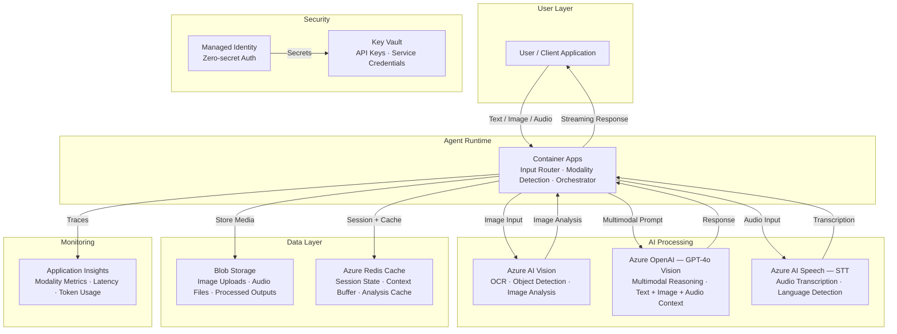

# Play 36 — Multimodal Agent 🎨🎤📝

> Unified agent that processes text + images + audio with cross-modal synthesis.

A general-purpose multimodal AI agent that handles any combination of text, images, and audio input. GPT-4o vision analyzes images, Azure Speech transcribes audio, and the agent synthesizes information across modalities to produce coherent responses. Content safety covers all input and output modalities.

## Quick Start
```bash
cd solution-plays/36-multimodal-agent
az deployment group create -g $RG -f infra/main.bicep -p infra/parameters.json
code .  # Use @builder for multimodal pipeline, @reviewer for safety audit, @tuner for cost
```

## How It Differs from Play 15 (DocProc)
| Aspect | Play 15 (DocProc) | Play 36 (Multimodal Agent) |
|--------|------------------|--------------------------|
| Focus | Document processing | Any modality combination |
| Input | PDFs/images (documents) | Text + images + audio + video |
| Output | Structured JSON extraction | Conversational responses |
| Agent type | Batch pipeline | Interactive conversational |

## Architecture
| Service | Purpose |
|---------|---------|
| Azure OpenAI (gpt-4o) | Vision analysis, text generation, cross-modal |
| Azure Speech Service | Audio transcription (STT) + voice output (TTS) |
| Content Safety | Per-modality content filtering |
| Container Apps | Multimodal agent runtime |



📐 [Full architecture details](architecture.md)

## Key Metrics
- Image accuracy: ≥85% · Audio WER: <10% · Cross-modal: ≥80% · Safety: 100%

## DevKit (Multimodal-Focused)
| Primitive | What It Does |
|-----------|-------------|
| 3 agents | Builder (modality routing/vision/synthesis), Reviewer (safety across modalities), Tuner (detail level/parallel/cost) |
| 3 skills | Deploy (103 lines), Evaluate (104 lines), Tune (107 lines) |
| 4 prompts | `/deploy` (multimodal pipeline), `/test` (cross-modal), `/review` (per-modality safety), `/evaluate` (accuracy) |

## Cost
| Service | Dev | Prod | Enterprise |
|---------|-----|------|------------|
| Azure OpenAI | $60 (PAYG) | $400 (PAYG) | $1,200 (PTU) |
| Azure AI Vision | $0 (Free) | $50 (Standard S1) | $150 (Standard S1) |
| Container Apps | $10 (Consumption) | $100 (Dedicated) | $300 (Dedicated HA) |
| Azure AI Speech | $0 (Free) | $40 (Standard S0) | $120 (Standard S0) |
| Blob Storage | $3 (Hot LRS) | $25 (Hot LRS) | $80 (Hot GRS) |
| Redis Cache | $15 (Basic C0) | $55 (Standard C1) | $200 (Premium P1) |
| Key Vault | $1 (Standard) | $3 (Standard) | $10 (Premium HSM) |
| Application Insights | $0 (Free) | $25 (Pay-per-GB) | $100 (Pay-per-GB) |
| **Total** | **$89/mo** | **$698/mo** | **$2,160/mo** |

💰 [Full cost breakdown](cost.json)

📖 [Full docs](spec/README.md) · 🌐 [frootai.dev/solution-plays/36-multimodal-agent](https://frootai.dev/solution-plays/36-multimodal-agent)


## FAI Manifest

| Field | Value |
|-------|-------|
| Play | `36-multimodal-agent` |
| Version | `1.0.0` |
| Knowledge | F1-GenAI-Foundations, O2-Agent-Coding, R2-RAG-Architecture |
| WAF Pillars | security, reliability, cost-optimization, responsible-ai |
| Groundedness | ≥ 85% |
| Safety | 0 violations max |
