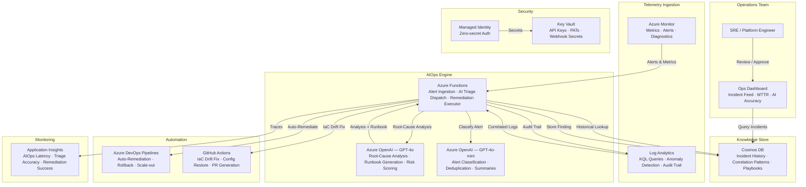

# Play 37 — AI-Powered DevOps 🔧🤖

> AI incident management with risk scoring, auto-remediation, and alert correlation.

AI enhances your DevOps operations: deployment risk scoring prevents bad deploys, alert correlation reduces noise by 90%, LLM root cause analysis finds issues in minutes not hours, and auto-remediation fixes safe issues automatically. Post-incident reports generate themselves.

## Quick Start
```bash
cd solution-plays/37-ai-powered-devops
az deployment group create -g $RG -f infra/main.bicep -p infra/parameters.json
code .  # Use @builder for incident pipeline, @reviewer for safety audit, @tuner for calibration
```

## How It Differs from Related Plays
| Aspect | Play 17 (Observability) | Play 20 (Anomaly) | Play 37 (DevOps) |
|--------|----------------------|-------------------|------------------|
| Focus | Monitoring | Detection | Response + prevention |
| Output | Dashboards | Anomaly flags | Remediation actions |
| Actions | None | Alert only | Auto-fix + risk gate |

## Architecture
| Service | Purpose |
|---------|---------|
| Azure Monitor | Alert source, log data |
| Azure OpenAI (gpt-4o) | Root cause analysis, risk scoring |
| Azure DevOps / GitHub | CI/CD pipeline integration |
| Azure Functions | Incident pipeline execution |



📐 [Full architecture details](architecture.md)

## Capabilities
| Capability | Description |
|-----------|-------------|
| **Risk Scoring** | Pre-deploy assessment (change size, blast radius, author exp) |
| **Alert Correlation** | Group 50+ alerts into 1 incident (90% noise reduction) |
| **Root Cause Analysis** | LLM diagnoses from logs + metrics + deploy history |
| **Auto-Remediation** | Safe fixes: restart, scale, rotate certs (with approval gates) |
| **Post-Incident Reports** | Auto-generated timeline + cause + remediation |

## Key Metrics
- Root cause accuracy: ≥75% · MTTR reduction: ≥40% · Auto-fix success: ≥95% · Risk calibration: ±1

## DevKit (AIOps-Focused)
| Primitive | What It Does |
|-----------|-------------|
| 3 agents | Builder (incident pipeline/risk/auto-fix), Reviewer (safety/blast radius), Tuner (correlation/weights/confidence) |
| 3 skills | Deploy (108 lines), Evaluate (107 lines), Tune (103 lines) |
| 4 prompts | `/deploy` (AIOps pipeline), `/test` (incident sim), `/review` (remediation safety), `/evaluate` (accuracy) |

## Cost
| Service | Dev | Prod | Enterprise |
|---------|-----|------|------------|
| Azure OpenAI | $40 (PAYG) | $250 (PAYG) | $900 (PTU) |
| Azure Monitor | $0 (Free) | $80 (Pay-per-GB) | $300 (Commitment) |
| Azure DevOps | $0 (Basic) | $40 (Hosted Agents) | $120 (Self-hosted) |
| Azure Functions | $0 (Consumption) | $15 (Consumption) | $120 (Premium EP1) |
| Cosmos DB | $5 (Serverless) | $60 (800 RU/s) | $350 (4000 RU/s) |
| Log Analytics | $0 (Free) | $40 (Pay-per-GB) | $150 (Commitment) |
| Key Vault | $1 (Standard) | $3 (Standard) | $10 (Premium HSM) |
| Application Insights | $0 (Free) | $20 (Pay-per-GB) | $80 (Pay-per-GB) |
| **Total** | **$46/mo** | **$508/mo** | **$2,030/mo** |

💰 [Full cost breakdown](cost.json)

📖 [Full docs](spec/README.md) · 🌐 [frootai.dev/solution-plays/37-ai-powered-devops](https://frootai.dev/solution-plays/37-ai-powered-devops)


## FAI Manifest

| Field | Value |
|-------|-------|
| Play | `37-ai-powered-devops` |
| Version | `1.0.0` |
| Knowledge | T3-Production-Patterns, O2-Agent-Coding, F4-GitHub-Agentic-OS |
| WAF Pillars | security, reliability, operational-excellence, cost-optimization |
| Groundedness | ≥ 85% |
| Safety | 0 violations max |
