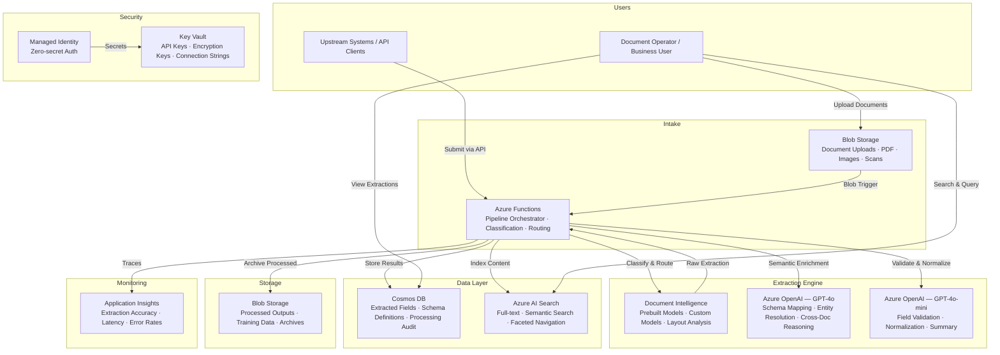

# Play 38 — Document Understanding V2 📑🔍

> Advanced document processing with layout-aware extraction, cross-doc comparison, and auto-classification.

Beyond Play 06's basic OCR: auto-classify documents by type, extract fields while preserving layout structure (sections, tables, columns), compare document versions to find changes, and route through automated workflows. Document intelligence meets AI reasoning.

## Quick Start
```bash
cd solution-plays/38-document-understanding-v2
az deployment group create -g $RG -f infra/main.bicep -p infra/parameters.json
code .  # Use @builder for extraction/classification, @reviewer for accuracy audit, @tuner for model routing
```

## How It Differs from Play 06 and Play 15
| Aspect | Play 06 (Doc Intel) | Play 15 (Multi-Modal) | Play 38 (Understanding V2) |
|--------|--------------------|-----------------------|---------------------------|
| Classification | Manual model | Page-type routing | Auto-classify any doc |
| Comparison | None | None | Cross-doc diff + risk |
| Layout | Basic fields | Page-level visual | Section/table-aware |
| Workflow | Extract only | Extract only | Classify → extract → route → archive |

## Architecture
| Service | Purpose |
|---------|---------|
| Document Intelligence | Layout + prebuilt extraction |
| Azure OpenAI (gpt-4o) | Classification, comparison analysis |
| Cosmos DB | Classification results, comparison logs |
| Azure Functions | Workflow orchestration |



📐 [Full architecture details](architecture.md)

## Key Metrics
- Classification: ≥92% · Layout F1: ≥88% · Comparison: ≥85% · PII recall: ≥99%

## DevKit (Advanced Document-Focused)
| Primitive | What It Does |
|-----------|-------------|
| 3 agents | Builder (layout/comparison/classification), Reviewer (accuracy/PII/consistency), Tuner (models/thresholds/cost) |
| 3 skills | Deploy (106 lines), Evaluate (107 lines), Tune (103 lines) |
| 4 prompts | `/deploy` (understanding pipeline), `/test` (extraction/workflow), `/review` (PII/accuracy), `/evaluate` (classification) |

## Cost
| Service | Dev | Prod | Enterprise |
|---------|-----|------|------------|
| Document Intelligence | $0 (Free) | $150 (Standard S0) | $600 (Standard S0) |
| Azure OpenAI | $50 (PAYG) | $350 (PAYG) | $1,100 (PTU) |
| Cosmos DB | $5 (Serverless) | $80 (1000 RU/s) | $400 (5000 RU/s) |
| Azure Functions | $0 (Consumption) | $120 (Premium EP1) | $240 (Premium EP2) |
| Blob Storage | $3 (Hot LRS) | $30 (Hot LRS) | $100 (Hot GRS+WORM) |
| Azure AI Search | $0 (Free) | $250 (Standard S1) | $500 (Standard S2) |
| Key Vault | $1 (Standard) | $5 (Standard) | $15 (Premium HSM) |
| Application Insights | $0 (Free) | $25 (Pay-per-GB) | $100 (Pay-per-GB) |
| **Total** | **$59/mo** | **$1,010/mo** | **$3,055/mo** |

💰 [Full cost breakdown](cost.json)

📖 [Full docs](spec/README.md) · 🌐 [frootai.dev/solution-plays/38-document-understanding-v2](https://frootai.dev/solution-plays/38-document-understanding-v2)


## FAI Manifest

| Field | Value |
|-------|-------|
| Play | `38-document-understanding-v2` |
| Version | `1.0.0` |
| Knowledge | F1-GenAI-Foundations, R2-RAG-Architecture, T3-Production-Patterns |
| WAF Pillars | security, reliability, responsible-ai, performance-efficiency |
| Groundedness | ≥ 85% |
| Safety | 0 violations max |
