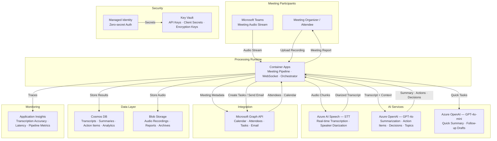

# Play 39 — AI Meeting Assistant

Real-time meeting transcription, speaker diarization, action item extraction, summary generation, and follow-up scheduling integrated with Microsoft Teams/Outlook.

## Architecture

| Component | Azure Service | Purpose |
|-----------|--------------|---------|
| Transcription | Azure AI Speech | Real-time speech-to-text with continuous recognition |
| Diarization | Azure AI Speech (Conversation Transcription) | Speaker identification (up to 36 speakers) |
| Summarization | Azure OpenAI (GPT-4o) | Executive summary, key decisions, topic segmentation |
| Action Items | Azure OpenAI (GPT-4o-mini) | Structured extraction: owner + task + deadline + priority |
| Integration | Microsoft Graph API | Teams bot, Outlook summary, Planner tasks, Calendar follow-ups |
| Hosting | Azure Container Apps | Scalable meeting processing runtime |
| Secrets | Azure Key Vault | Speech key, OpenAI key, Graph credentials |



📐 [Full architecture details](architecture.md)

## How It Differs from Related Plays

| Aspect | Play 04 (Call Center Voice) | Play 33 (Voice Agent) | **Play 39 (Meeting Assistant)** |
|--------|---------------------------|----------------------|-------------------------------|
| Focus | Customer support calls | Conversational voice bot | Multi-party meeting intelligence |
| Speakers | 2 (agent + customer) | 2 (user + bot) | 2-36 (meeting participants) |
| Diarization | Optional | N/A | Core feature (who said what) |
| Output | Sentiment + resolution | Spoken response | Summary + action items + follow-ups |
| Integration | CRM, ticketing | Voice UI | Teams, Outlook, Planner |

## DevKit Structure

```
39-ai-meeting-assistant/
├── agent.md                              # Root orchestrator with handoffs
├── .github/
│   ├── copilot-instructions.md           # Domain knowledge (<150 lines)
│   ├── agents/
│   │   ├── builder.agent.md              # Transcription + diarization + extraction
│   │   ├── reviewer.agent.md             # PII, consent, summary quality
│   │   └── tuner.agent.md                # Accuracy, cost, integration tuning
│   ├── prompts/
│   │   ├── deploy.prompt.md              # Deploy meeting assistant
│   │   ├── test.prompt.md                # Test transcription pipeline
│   │   ├── review.prompt.md              # Audit PII + consent
│   │   └── evaluate.prompt.md            # Measure extraction accuracy
│   ├── skills/
│   │   ├── deploy-ai-meeting-assistant/  # Full deployment procedure
│   │   ├── evaluate-ai-meeting-assistant/ # WER, DER, action item F1, summary scoring
│   │   └── tune-ai-meeting-assistant/    # Diarization, summarization, cost tuning
│   └── instructions/
│       └── ai-meeting-assistant-patterns.instructions.md
├── config/                               # TuneKit
│   ├── openai.json                       # Summarization model settings
│   ├── guardrails.json                   # PII, consent, quality thresholds
│   └── agents.json                       # Teams/Outlook/Planner integration
├── infra/                                # Bicep IaC
│   ├── main.bicep
│   └── parameters.json
└── spec/                                 # SpecKit
    └── fai-manifest.json
```

## Quick Start

```bash
# 1. Deploy infrastructure
/deploy

# 2. Test with sample meeting audio
/test

# 3. Review PII handling and consent
/review

# 4. Evaluate transcription + extraction quality
/evaluate
```

## Cost

| Service | Dev | Prod | Enterprise |
|---------|-----|------|------------|
| Azure AI Speech | $0 (Free) | $80 (Standard S0) | $300 (Standard S0) |
| Azure OpenAI | $40 (PAYG) | $280 (PAYG) | $900 (PTU) |
| Microsoft Graph API | $0 (Included) | $0 (Included) | $0 (Included) |
| Container Apps | $10 (Consumption) | $120 (Dedicated) | $350 (Dedicated HA) |
| Cosmos DB | $5 (Serverless) | $60 (800 RU/s) | $350 (4000 RU/s) |
| Blob Storage | $2 (Hot LRS) | $20 (Hot LRS) | $60 (Hot GRS) |
| Key Vault | $1 (Standard) | $3 (Standard) | $10 (Premium HSM) |
| Application Insights | $0 (Free) | $20 (Pay-per-GB) | $80 (Pay-per-GB) |
| **Total** | **$58/mo** | **$583/mo** | **$2,050/mo** |

💰 [Full cost breakdown](cost.json)

## Key Metrics

| Metric | Target | Description |
|--------|--------|-------------|
| WER | < 10% | Word Error Rate for transcription |
| DER | < 15% | Diarization Error Rate |
| Action Item F1 | > 82% | Precision + recall of extracted actions |
| Summary Faithfulness | > 4.5/5.0 | No hallucinated facts in summary |
| Groundedness | > 0.85 | FAI guardrail threshold |
| Cost per meeting hour | < $1.00 | Speech + LLM costs combined |

## WAF Alignment

| Pillar | Implementation |
|--------|---------------|
| **Reliability** | Continuous recognition with auto-reconnect, fallback to batch transcription |
| **Security** | Managed Identity for Key Vault, PII redaction, recording consent enforcement |
| **Cost Optimization** | GPT-4o-mini for extraction, batch mode for recorded meetings |
| **Operational Excellence** | Structured logging, per-meeting metrics, evaluation pipeline |
| **Performance Efficiency** | Real-time streaming (<500ms latency), chunked summarization |
| **Responsible AI** | PII detection, consent prompts, confidential content filtering |


## FAI Manifest

| Field | Value |
|-------|-------|
| Play | `39-ai-meeting-assistant` |
| Version | `1.0.0` |
| Knowledge | F1-GenAI-Foundations, O2-Agent-Coding, T2-Responsible-AI |
| WAF Pillars | security, reliability, responsible-ai, cost-optimization |
| Groundedness | ≥ 85% |
| Safety | 0 violations max |
