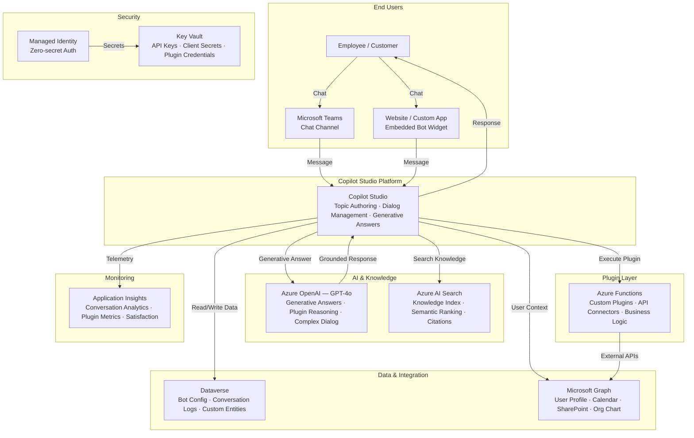

# Play 40 — Copilot Studio Advanced

Production-grade Microsoft Copilot Studio solution with declarative agents, TypeSpec API plugins, Graph API data grounding, SSO/OAuth2, adaptive card responses, Power Automate integration, and enterprise admin controls.

## Architecture

| Component | Service | Purpose |
|-----------|---------|---------|
| Bot Platform | Microsoft Copilot Studio (Premium) | Declarative agent runtime, topic routing, conversation management |
| API Plugins | TypeSpec → OpenAPI 3.0 | Custom backend operations (incidents, projects, tasks) |
| Data Grounding | Microsoft Graph Connectors | SharePoint, Outlook, Teams, Planner data access |
| Authentication | Entra ID SSO/OAuth2 | Single sign-on, token exchange, permission scoping |
| Orchestration | Azure OpenAI (GPT-4o) | Intent classification, response generation, plugin routing |
| Workflows | Power Automate | Escalation flows, approval chains, notifications |
| Responses | Adaptive Cards v1.5 | Rich interactive cards in Teams with actions/deep links |
| Secrets | Azure Key Vault | Graph credentials, OpenAI key, plugin auth |



📐 [Full architecture details](architecture.md)

## How It Differs from Play 08 (Copilot Studio Bot)

| Aspect | Play 08 (Basic) | **Play 40 (Advanced)** |
|--------|----------------|----------------------|
| Agent type | Standard topics | Declarative agents with `$[file]()` instructions |
| Plugins | Basic connectors | TypeSpec API plugins with OAuth2 |
| Grounding | FAQ knowledge base | Graph Connectors (SharePoint, Outlook, Teams) |
| Auth | Basic auth | SSO with token exchange, permission scoping |
| Responses | Text + basic cards | Adaptive Cards v1.5 with actions |
| Workflows | Simple flows | Power Automate with multi-stage approvals |
| Admin | Basic settings | Enterprise admin controls, audit logging, data retention |
| Multi-turn | Limited context | 10-turn context with summarization |

## DevKit Structure

```
40-copilot-studio-advanced/
├── agent.md                                  # Root orchestrator with handoffs
├── .github/
│   ├── copilot-instructions.md               # Domain knowledge (<150 lines)
│   ├── agents/
│   │   ├── builder.agent.md                  # Declarative agents + plugins + Graph
│   │   ├── reviewer.agent.md                 # SSO/OAuth2, permissions, safety
│   │   └── tuner.agent.md                    # Plugin latency, context, cost
│   ├── prompts/
│   │   ├── deploy.prompt.md                  # Deploy bot + plugins + connectors
│   │   ├── test.prompt.md                    # Test plugin routing + context
│   │   ├── review.prompt.md                  # Audit SSO + permissions
│   │   └── evaluate.prompt.md               # Measure routing accuracy + grounding
│   ├── skills/
│   │   ├── deploy-copilot-studio-advanced/   # Full deployment with TypeSpec + Graph
│   │   ├── evaluate-copilot-studio-advanced/ # Plugin accuracy, grounding, conversation
│   │   └── tune-copilot-studio-advanced/     # Instructions, plugin, Graph, cost tuning
│   └── instructions/
│       └── copilot-studio-advanced-patterns.instructions.md
├── config/                                   # TuneKit
│   ├── openai.json                           # Model + conversation context settings
│   ├── guardrails.json                       # Safety, admin controls, performance
│   └── agents.json                           # Plugin config, routing thresholds
├── infra/                                    # Bicep IaC
│   ├── main.bicep
│   └── parameters.json
└── spec/                                     # SpecKit
    └── fai-manifest.json
```

## Quick Start

```bash
# 1. Deploy backend + register bot + configure Graph connectors
/deploy

# 2. Test plugin routing and conversation context
/test

# 3. Review SSO scoping and permission boundaries
/review

# 4. Evaluate plugin accuracy and grounding quality
/evaluate
```

## Cost

| Service | Dev | Prod | Enterprise |
|---------|-----|------|------------|
| Copilot Studio | $0 (Trial) | $200 (Per-session) | $600 (Capacity Pack) |
| Azure OpenAI | $40 (PAYG) | $300 (PAYG) | $1,000 (PTU) |
| Dataverse | $0 (Included) | $40 (Included+Capacity) | $120 (Capacity Pack) |
| Microsoft Graph API | $0 (Included) | $0 (Included) | $0 (Included) |
| Azure AI Search | $0 (Free) | $75 (Basic) | $250 (Standard S1) |
| Azure Functions | $0 (Consumption) | $15 (Consumption) | $120 (Premium EP1) |
| Key Vault | $1 (Standard) | $3 (Standard) | $10 (Premium HSM) |
| Application Insights | $0 (Free) | $20 (Pay-per-GB) | $80 (Pay-per-GB) |
| **Total** | **$41/mo** | **$653/mo** | **$2,180/mo** |

💰 [Full cost breakdown](cost.json)

## Key Metrics

| Metric | Target | Description |
|--------|--------|-------------|
| Plugin Routing Accuracy | > 92% | Correct function called for user intent |
| Groundedness | > 0.85 | Response grounded in Graph data |
| Context Retention | > 90% | Remembers 5+ turns of context |
| SSO Success Rate | > 95% | Silent token acquisition |
| Adaptive Card Rendering | > 99% | Cards display without errors |
| Cost per Conversation | < $0.25 | 5-15 turns average |

## WAF Alignment

| Pillar | Implementation |
|--------|---------------|
| **Reliability** | Plugin retry with exponential backoff, Graph connector health checks |
| **Security** | SSO/OAuth2 with least-privilege scoping, PII blocking, audit logging |
| **Cost Optimization** | gpt-4o-mini for routing, Graph result caching, conversation summarization |
| **Operational Excellence** | Power Automate for escalation, admin portal, data retention policies |
| **Performance Efficiency** | Plugin response caching, batched Graph calls, adaptive card pre-rendering |
| **Responsible AI** | Content safety filters, groundedness enforcement, source attribution |


## FAI Manifest

| Field | Value |
|-------|-------|
| Play | `40-copilot-studio-advanced` |
| Version | `1.0.0` |
| Knowledge | F4-GitHub-Agentic-OS, O6-Copilot-Extend, O3-MCP-Tools-Functions |
| WAF Pillars | security, reliability, operational-excellence, responsible-ai |
| Groundedness | ≥ 85% |
| Safety | 0 violations max |
