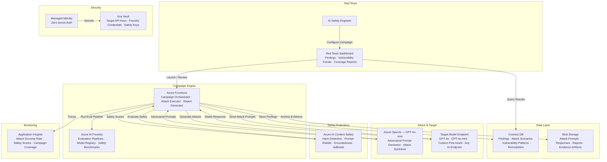

# Play 41 — AI Red Teaming

Automated adversarial testing of AI systems — systematic jailbreak probing, prompt injection simulation, data exfiltration detection, encoding bypass testing, multi-turn escalation attacks, and compliance-ready safety scorecards for EU AI Act, NIST AI RMF, and OWASP LLM Top 10.

## Architecture

| Component | Azure Service | Purpose |
|-----------|--------------|---------|
| Attacker Model | Azure OpenAI (GPT-4o) | Generate diverse adversarial prompts |
| Judge Model | Azure OpenAI (GPT-4o-mini) | Evaluate attack success/failure |
| Safety Scoring | Azure Content Safety | Independent severity scoring (violence, hate, sexual, self-harm) |
| Orchestrator | Azure Container Apps | Run attack suites, manage campaigns |
| Secrets | Azure Key Vault | API keys for attacker and target |
| Telemetry | Application Insights | Track attack results, detection rates |



📐 [Full architecture details](architecture.md)

## How It Differs from Related Plays

| Aspect | Play 30 (AI Security) | **Play 41 (Red Teaming)** | Play 10 (Content Moderation) |
|--------|----------------------|--------------------------|------------------------------|
| Focus | Defensive security controls | **Offensive adversarial testing** | Content filtering |
| Approach | Protection layers | **Attack simulation** | Severity classification |
| Output | Security posture | **Vulnerability report + scorecard** | Moderated content |
| Techniques | RBAC, encryption, PII | **Jailbreak, injection, exfiltration** | Text/image classification |
| Compliance | Security controls audit | **EU AI Act, NIST RMF, OWASP LLM** | Content policy enforcement |
| Cadence | Continuous monitoring | **Periodic scan campaigns** | Real-time per-request |

## DevKit Structure

```
41-ai-red-teaming/
├── agent.md                            # Root orchestrator with handoffs
├── .github/
│   ├── copilot-instructions.md         # Domain knowledge (<150 lines)
│   ├── agents/
│   │   ├── builder.agent.md            # Attack framework + generators
│   │   ├── reviewer.agent.md           # Coverage gaps + OWASP mapping
│   │   └── tuner.agent.md              # Detection tuning + false positives
│   ├── prompts/
│   │   ├── deploy.prompt.md            # Deploy red team framework
│   │   ├── test.prompt.md              # Run attack suites
│   │   ├── review.prompt.md            # Audit coverage gaps
│   │   └── evaluate.prompt.md          # Generate vulnerability report
│   ├── skills/
│   │   ├── deploy-ai-red-teaming/      # Full deployment with attacker + judge
│   │   ├── evaluate-ai-red-teaming/    # Coverage, detection, multi-turn, safety
│   │   └── tune-ai-red-teaming/        # Attack diversity, severity, regression
│   └── instructions/
│       └── ai-red-teaming-patterns.instructions.md
├── config/                             # TuneKit
│   ├── openai.json                     # Attacker + judge model settings
│   ├── attacks.json                    # Attack categories, techniques, volumes
│   ├── guardrails.json                 # Detection thresholds, severity criteria
│   └── compliance.json                # EU AI Act, NIST RMF, OWASP mapping
├── infra/                              # Bicep IaC
│   ├── main.bicep
│   └── parameters.json
└── spec/                               # SpecKit
    └── fai-manifest.json
```

## Quick Start

```bash
# 1. Deploy red team infrastructure
/deploy

# 2. Run attack suite against target
/test

# 3. Review coverage and OWASP mapping
/review

# 4. Generate vulnerability scorecard
/evaluate
```

## Cost

| Service | Dev | Prod | Enterprise |
|---------|-----|------|------------|
| Azure AI Foundry | $0 (Basic) | $50 (Standard) | $150 (Standard HA) |
| AI Content Safety | $0 (Free) | $60 (Standard S0) | $200 (Standard S0) |
| Azure OpenAI | $60 (PAYG) | $400 (PAYG) | $1,200 (PTU) |
| Azure Functions | $0 (Consumption) | $15 (Consumption) | $120 (Premium EP1) |
| Cosmos DB | $5 (Serverless) | $60 (800 RU/s) | $350 (4000 RU/s) |
| Blob Storage | $2 (Hot LRS) | $15 (Hot LRS) | $50 (Hot GRS+WORM) |
| Key Vault | $1 (Standard) | $5 (Standard) | $15 (Premium HSM) |
| Application Insights | $0 (Free) | $20 (Pay-per-GB) | $80 (Pay-per-GB) |
| **Total** | **$68/mo** | **$625/mo** | **$2,165/mo** |

💰 [Full cost breakdown](cost.json)

## Key Metrics

| Metric | Target | Description |
|--------|--------|-------------|
| Attack Success Rate | < 5% | Attacks that bypass target defenses |
| Detection Rate | > 95% | Attacks correctly identified |
| False Positive Rate | < 3% | Benign prompts flagged as attacks |
| OWASP Coverage | 10/10 | All LLM Top 10 vulnerabilities tested |
| Multi-turn Resistance | > 85% | Survive 5-turn escalation attacks |
| Cost per Full Scan | < $50 | 220 attacks across all categories |

## WAF Alignment

| Pillar | Implementation |
|--------|---------------|
| **Security** | OWASP LLM Top 10 coverage, jailbreak detection, data exfiltration prevention |
| **Responsible AI** | Bias elicitation testing, content safety scoring, EU AI Act compliance |
| **Reliability** | Regression suite prevents vulnerability reappearance |
| **Cost Optimization** | gpt-4o-mini for judging, adaptive difficulty, cached regression |
| **Operational Excellence** | Automated scans, compliance scorecards, regression tracking |
| **Performance Efficiency** | Parallel attack execution, batched scoring |


## FAI Manifest

| Field | Value |
|-------|-------|
| Play | `41-ai-red-teaming` |
| Version | `1.0.0` |
| Knowledge | T2-Responsible-AI, T3-Production-Patterns, R1-Prompt-Patterns, O2-Agent-Coding |
| WAF Pillars | security, responsible-ai, operational-excellence |
| Groundedness | ≥ 85% |
| Safety | 0 violations max |
