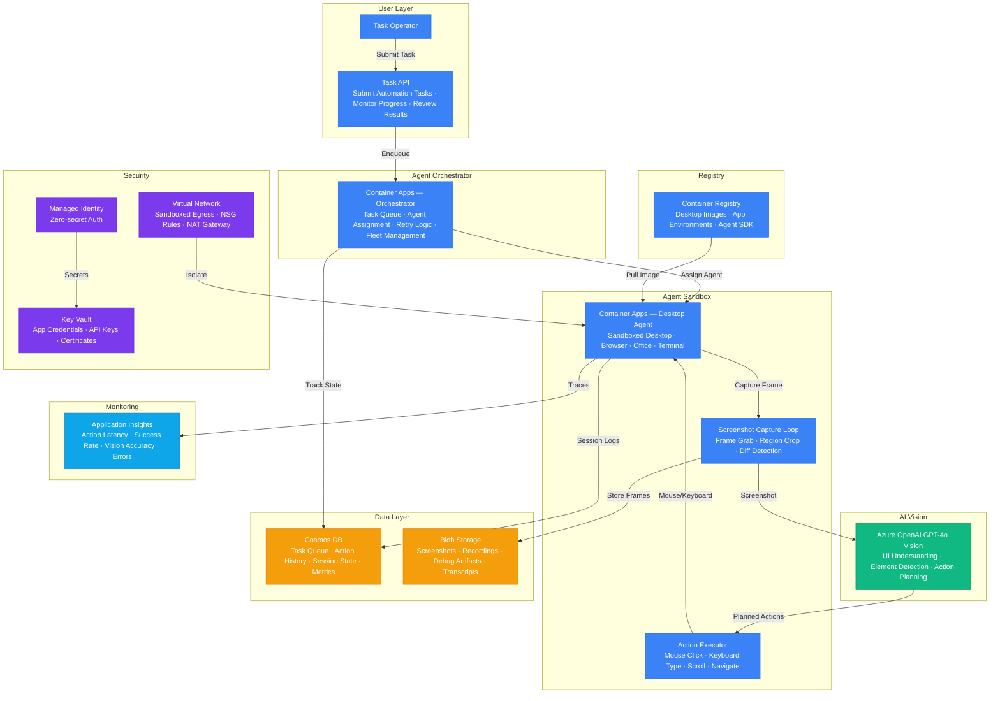

# Play 42 — Computer Use Agent

Vision-based desktop and web automation — AI agent that controls applications via screenshots and mouse/keyboard actions, replacing brittle RPA with intelligent screen understanding. Runs in a sandboxed VM with action replay, rollback, and full audit trail.

## Architecture

| Component | Azure Service | Purpose |
|-----------|--------------|---------|
| Vision Model | Azure OpenAI (GPT-4o Vision) | Screenshot analysis + action planning |
| Sandbox VM | Azure Virtual Machines | Isolated execution environment |
| Orchestrator | Azure Container Apps | Task queue, step coordination, replay |
| Storage | Azure Blob Storage | Screenshots, action replays, recordings |
| Secrets | Azure Key Vault | API keys, VM credentials |
| Telemetry | Application Insights | Step tracking, cost monitoring |



📐 [Full architecture details](architecture.md)

## How It Differs from Related Plays

| Aspect | Play 23 (Browser Automation) | **Play 42 (Computer Use)** | Play 36 (Multimodal) |
|--------|---------------------------|--------------------------|---------------------|
| Scope | Web browsers only | **Desktop + web + any GUI application** | Image/text analysis |
| Method | DOM selectors, Playwright | **Screenshots + vision + accessibility API** | Vision API on images |
| Target | Web apps with API/DOM | **Legacy apps, no-API systems** | Documents, diagrams |
| Actions | Click, navigate, fill forms | **Mouse, keyboard, hotkeys, scroll, waits** | Read, classify, reason |
| Safety | Browser sandbox | **VM sandbox, action whitelist, rollback** | Content safety |
| Output | Extracted data, test results | **Task completion + full recording** | Structured analysis |

## DevKit Structure

```
42-computer-use-agent/
├── agent.md                              # Root orchestrator with handoffs
├── .github/
│   ├── copilot-instructions.md           # Domain knowledge (<150 lines)
│   ├── agents/
│   │   ├── builder.agent.md              # Screenshot loop + action executor
│   │   ├── reviewer.agent.md             # Sandbox safety + credential guards
│   │   └── tuner.agent.md                # Resolution, timing, cost tuning
│   ├── prompts/
│   │   ├── deploy.prompt.md              # Deploy agent + sandbox VM
│   │   ├── test.prompt.md                # Run automation workflows
│   │   ├── review.prompt.md              # Audit safety controls
│   │   └── evaluate.prompt.md            # Measure task completion
│   ├── skills/
│   │   ├── deploy-computer-use-agent/    # Full deployment with VM + vision
│   │   ├── evaluate-computer-use-agent/  # Completion, accuracy, safety, cost
│   │   └── tune-computer-use-agent/      # Resolution, timing, loops, cost
│   └── instructions/
│       └── computer-use-agent-patterns.instructions.md
├── config/                               # TuneKit
│   ├── openai.json                       # Vision model + detail level
│   ├── guardrails.json                   # Max steps, blocked actions, sandbox
│   └── agents.json                       # Screenshot config, timing, loops
├── infra/                                # Bicep IaC
│   ├── main.bicep
│   └── parameters.json
└── spec/                                 # SpecKit
    └── fai-manifest.json
```

## Quick Start

```bash
# 1. Deploy sandbox VM + vision model
/deploy

# 2. Run automation task in sandbox
/test

# 3. Audit safety controls
/review

# 4. Measure task completion rate
/evaluate
```

## Key Metrics

| Metric | Target | Description |
|--------|--------|-------------|
| Task Completion Rate | > 85% | Tasks fully completed correctly |
| Click Accuracy | > 90% | Clicked correct UI element |
| Step Efficiency | > 70% | Optimal steps / actual steps |
| Safety Compliance | 100% | Blocked actions correctly rejected |
| Loop Detection | > 95% | Stuck loops detected and exited |
| Cost per Task | < $0.50 | Vision API + VM runtime |

## Estimated Cost

| Service | Dev/mo | Prod/mo | Enterprise/mo |
|---------|--------|---------|---------------|
| Azure OpenAI (GPT-4o Vision) | $80 | $600 | $2,000 |
| Azure Container Apps | $25 | $200 | $800 |
| Blob Storage | $3 | $30 | $80 |
| Azure Container Registry | $5 | $20 | $50 |
| Cosmos DB | $5 | $60 | $300 |
| Key Vault | $1 | $5 | $15 |
| Virtual Network | $0 | $35 | $150 |
| Application Insights | $0 | $25 | $80 |
| **Total** | **$119** | **$975** | **$3,475** |

> Estimates based on Azure retail pricing. Actual costs vary by region, usage, and enterprise agreements.

💰 [Full cost breakdown](cost.json)

## WAF Alignment

| Pillar | Implementation |
|--------|---------------|
| **Security** | VM sandbox isolation, action whitelisting, credential entry blocked, no internet |
| **Reliability** | VM snapshot before each run, auto-rollback on failure, loop detection |
| **Cost Optimization** | Low-detail screenshots for navigation, accessibility API when possible, VM auto-deallocate |
| **Operational Excellence** | Full action replay recording, step-by-step audit trail, 30-day retention |
| **Performance Efficiency** | Hybrid accessibility+vision approach, adaptive detail level, multi-step planning |
| **Responsible AI** | Destructive action confirmation, blocked credential entry, sandbox containment |


## FAI Manifest

| Field | Value |
|-------|-------|
| Play | `42-computer-use-agent` |
| Version | `1.0.0` |
| Knowledge | O2-Agent-Coding, O3-MCP-Tools-Functions, F2-LLM-Selection, T3-Production-Patterns, R3-Deterministic-AI |
| WAF Pillars | security, reliability, cost-optimization, operational-excellence |
| Groundedness | ≥ 85% |
| Safety | 0 violations max |
