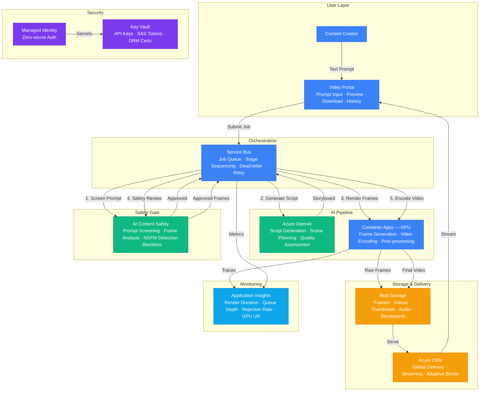

# Play 43 — AI Video Generation

AI-powered video generation and editing — text-to-video, image-to-video, async batch processing with priority queues, C2PA watermarking, prompt and frame content safety, and cost-controlled preview-first workflow.

## Architecture

| Component | Azure Service | Purpose |
|-----------|--------------|---------|
| Generation Model | Azure OpenAI (video endpoint) | Text-to-video and image-to-video generation |
| Prompt Enhancement | Azure OpenAI (GPT-4o-mini) | Enhance prompts with cinematic details |
| Content Safety | Azure Content Safety | Prompt moderation + frame-by-frame video check |
| Job Queue | Azure Service Bus | Batch processing with priority queues |
| Video Storage | Azure Blob Storage (Cool tier) | Generated video output with 30-day retention |
| Orchestrator | Azure Container Apps | Async generation, polling, watermarking |
| Secrets | Azure Key Vault | API keys, connection strings |



📐 [Full architecture details](architecture.md)

## How It Differs from Related Plays

| Aspect | Play 36 (Multimodal Agent) | **Play 43 (Video Generation)** | Play 49 (Creative AI) |
|--------|--------------------------|-------------------------------|----------------------|
| Input | Images + text for analysis | **Text/image prompts for generation** | Multi-modal content brief |
| Output | Structured analysis | **Generated video files (.mp4)** | Creative assets (images, copy) |
| Processing | Real-time inference | **Async (30-120s per video)** | Near real-time |
| Safety | Image content safety | **Frame-by-frame video safety + C2PA** | Brand safety + content policy |
| Queuing | N/A | **Service Bus with priority** | N/A |
| Cost | ~$0.01/request | **$0.06-1.50/video** | ~$0.05/asset |

## DevKit Structure

```
43-ai-video-generation/
├── agent.md                              # Root orchestrator with handoffs
├── .github/
│   ├── copilot-instructions.md           # Domain knowledge (<150 lines)
│   ├── agents/
│   │   ├── builder.agent.md              # Pipeline + batch queue + watermark
│   │   ├── reviewer.agent.md             # Content safety + copyright + C2PA
│   │   └── tuner.agent.md                # Quality/cost + resolution + queue
│   ├── prompts/
│   │   ├── deploy.prompt.md              # Deploy pipeline + queue + safety
│   │   ├── test.prompt.md                # Generate test videos
│   │   ├── review.prompt.md              # Audit safety + copyright
│   │   └── evaluate.prompt.md            # Measure quality + cost
│   ├── skills/
│   │   ├── deploy-ai-video-generation/   # Full deploy with Service Bus + safety
│   │   ├── evaluate-ai-video-generation/ # Quality, safety, performance, cost
│   │   └── tune-ai-video-generation/     # Presets, prompts, queue, cost tuning
│   └── instructions/
│       └── ai-video-generation-patterns.instructions.md
├── config/                               # TuneKit
│   ├── openai.json                       # Resolution presets, prompt enhancement
│   ├── guardrails.json                   # Content safety, cost controls, C2PA
│   └── agents.json                       # Queue config, rate limits, storage
├── infra/                                # Bicep IaC
│   ├── main.bicep
│   └── parameters.json
└── spec/                                 # SpecKit
    └── fai-manifest.json
```

## Quick Start

```bash
# 1. Deploy video generation pipeline
/deploy

# 2. Generate test videos
/test

# 3. Audit content safety and copyright
/review

# 4. Measure video quality and cost
/evaluate
```

## Key Metrics

| Metric | Target | Description |
|--------|--------|-------------|
| Prompt Adherence | > 4.0/5.0 | Video matches prompt description |
| Content Safety | > 99% | Frames pass Content Safety check |
| C2PA Watermark | 100% | AI-generated metadata embedded |
| Generation Latency (5s) | < 60s | Time from request to video ready |
| Cost per 5s/1080p | < $0.50 | API + safety + storage |
| Queue Throughput | > 20/hr | Videos generated per hour |

## Estimated Cost

| Service | Dev/mo | Prod/mo | Enterprise/mo |
|---------|--------|---------|---------------|
| Azure OpenAI | $50 | $350 | $1,200 |
| Azure Container Apps (GPU) | $60 | $500 | $1,800 |
| Blob Storage | $5 | $60 | $200 |
| Azure AI Content Safety | $0 | $80 | $250 |
| Service Bus | $0 | $10 | $80 |
| Azure CDN | $5 | $40 | $150 |
| Key Vault | $1 | $5 | $15 |
| Application Insights | $0 | $25 | $80 |
| **Total** | **$121** | **$1,070** | **$3,775** |

> Estimates based on Azure retail pricing. Actual costs vary by region, usage, and enterprise agreements.

💰 [Full cost breakdown](cost.json)

## WAF Alignment

| Pillar | Implementation |
|--------|---------------|
| **Responsible AI** | C2PA watermarking, frame-by-frame safety, copyright filtering |
| **Security** | Content Safety on prompts and output, Key Vault for secrets |
| **Cost Optimization** | Preview-first workflow, resolution presets, Cool storage tier |
| **Reliability** | Service Bus with retry, dead letter queue, 3-attempt retry |
| **Performance Efficiency** | Async generation, priority queues, concurrent processing |
| **Operational Excellence** | Job tracking, cost estimation, rate limiting, daily budget caps |


## FAI Manifest

| Field | Value |
|-------|-------|
| Play | `43-ai-video-generation` |
| Version | `1.0.0` |
| Knowledge | F1-GenAI-Foundations, F2-LLM-Selection, T2-Responsible-AI, T3-Production-Patterns, R1-Prompt-Patterns |
| WAF Pillars | cost-optimization, responsible-ai, performance-efficiency, reliability |
| Groundedness | ≥ 85% |
| Safety | 0 violations max |
