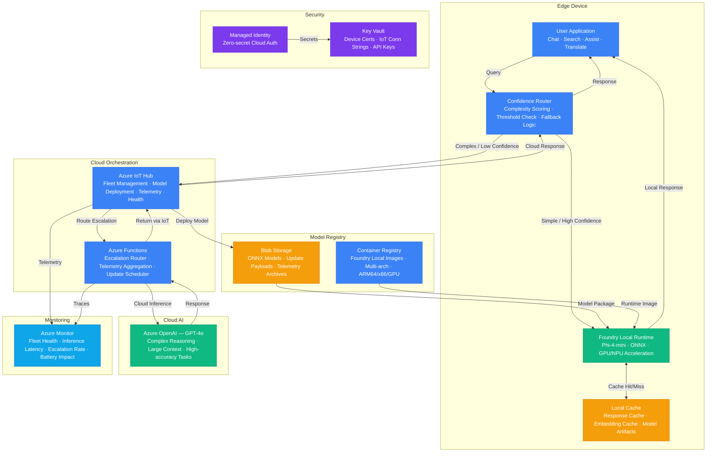

# Play 44 — Foundry Local On-Device

On-device AI inference with Azure AI Foundry Local SDK — hardware-aware model selection, hybrid cloud/local routing, offline caching, complexity-based query classification, and cost optimization through local-first inference.

## Architecture

| Component | Technology | Purpose |
|-----------|-----------|---------|
| Local Inference | Foundry Local SDK | On-device model loading and inference |
| Local Models | Phi-4, Phi-4-mini, Phi-3-mini | SLMs optimized for device hardware |
| Cloud Fallback | Azure OpenAI (GPT-4o) | Complex queries beyond local capability |
| Complexity Router | Python classifier | Route simple→local, complex→cloud |
| Model Cache | Local disk (~2-8GB) | Cached models for instant offline inference |
| Telemetry | Local JSONL logs | Track local vs cloud usage and costs |



📐 [Full architecture details](architecture.md)

## How It Differs from Related Plays

| Aspect | Play 19 (Edge AI) | **Play 44 (Foundry Local)** | Play 34 (Edge Deployment) |
|--------|-------------------|---------------------------|--------------------------|
| Runtime | Custom ONNX container | **Foundry Local SDK** | IoT Hub + ONNX Runtime |
| Devices | IoT/edge devices | **Developer PCs + laptops** | IoT fleet (sensors, gateways) |
| Model Source | Custom fine-tuned | **Foundry model catalog** | Custom ONNX models |
| Management | IoT Hub fleet mgmt | **Single-device self-managed** | IoT Hub device twin |
| Network | Can be intermittent | **Local-first, cloud optional** | Cloud sync required |
| Use Case | Industrial/IoT | **Developer productivity, privacy** | Manufacturing, retail |

## DevKit Structure

```
44-foundry-local-on-device/
├── agent.md                                # Root orchestrator with handoffs
├── .github/
│   ├── copilot-instructions.md             # Domain knowledge (<150 lines)
│   ├── agents/
│   │   ├── builder.agent.md                # SDK setup + hybrid router
│   │   ├── reviewer.agent.md               # Hardware compat + offline
│   │   └── tuner.agent.md                  # Model selection + cost
│   ├── prompts/
│   │   ├── deploy.prompt.md                # Configure local models
│   │   ├── test.prompt.md                  # Test local + fallback
│   │   ├── review.prompt.md                # Audit hardware + offline
│   │   └── evaluate.prompt.md              # Compare local vs cloud
│   ├── skills/
│   │   ├── deploy-foundry-local-on-device/ # SDK setup + model download + router
│   │   ├── evaluate-foundry-local-on-device/ # Quality, latency, cost, offline
│   │   └── tune-foundry-local-on-device/   # Model profiles, router, prompts, cost
│   └── instructions/
│       └── foundry-local-on-device-patterns.instructions.md
├── config/                                 # TuneKit
│   ├── openai.json                         # Model profiles, cloud fallback
│   ├── guardrails.json                     # Offline mode, hardware limits
│   └── agents.json                         # Routing rules, fallback config
├── infra/                                  # Bicep IaC (cloud fallback only)
│   ├── main.bicep
│   └── parameters.json
└── spec/                                   # SpecKit
    └── fai-manifest.json
```

## Quick Start

```bash
# 1. Install SDK and download models
/deploy

# 2. Test local inference and offline mode
/test

# 3. Audit hardware compatibility
/review

# 4. Compare local vs cloud quality and cost
/evaluate
```

## Key Metrics

| Metric | Target | Description |
|--------|--------|-------------|
| Local Accuracy | > 80% | Response correctness for simple queries |
| Quality Parity | > 0.75 | Local quality / cloud quality ratio |
| Local Inference Rate | > 60% | Queries handled locally (free) |
| Offline Success | > 95% | Queries answered without network |
| Routing Accuracy | > 85% | Correct source for query complexity |
| Cost Savings | > 50% | Reduction vs cloud-only inference |

## Estimated Cost

| Service | Dev/mo | Prod/mo | Enterprise/mo |
|---------|--------|---------|---------------|
| Azure OpenAI | $30 | $200 | $800 |
| Azure IoT Hub | $0 | $25 | $250 |
| Azure Monitor | $0 | $30 | $100 |
| Blob Storage | $2 | $15 | $50 |
| Azure Container Registry | $5 | $20 | $50 |
| Key Vault | $1 | $5 | $15 |
| Azure Functions | $0 | $10 | $120 |
| **Total** | **$38** | **$305** | **$1,385** |

> Estimates based on Azure retail pricing. Actual costs vary by region, usage, and enterprise agreements.

💰 [Full cost breakdown](cost.json)

## WAF Alignment

| Pillar | Implementation |
|--------|---------------|
| **Cost Optimization** | Local inference = $0 API cost, target 60%+ local rate |
| **Performance Efficiency** | Hardware-aware model selection, INT4/INT8/FP16 quantization |
| **Reliability** | Offline capability, graceful degradation, cloud fallback |
| **Security** | Data stays on device for local queries, no network exposure |
| **Operational Excellence** | Telemetry logging, model cache management, auto warmup |
| **Responsible AI** | Same quality standards for local and cloud responses |


## FAI Manifest

| Field | Value |
|-------|-------|
| Play | `44-foundry-local-on-device` |
| Version | `1.0.0` |
| Knowledge | O5-GPU-Infra, F2-LLM-Selection, T3-Production-Patterns, R3-Deterministic-AI, F1-GenAI-Foundations |
| WAF Pillars | security, reliability, performance-efficiency, cost-optimization |
| Groundedness | ≥ 85% |
| Safety | 0 violations max |
