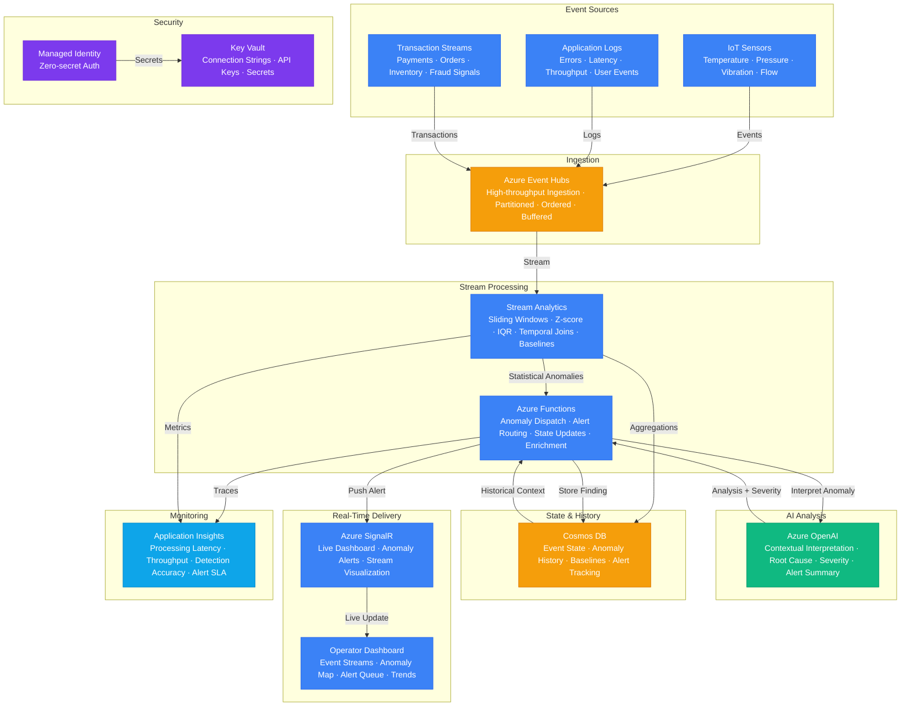

# Play 45 — Real-Time Event AI

Real-time event-driven AI processing — streaming ingestion via Event Hubs, rule-based + LLM batch enrichment, adaptive anomaly detection with rolling Z-score, pattern matching, deduplication, checkpointing, dead letter queues, and multi-channel alerting.

## Architecture

| Component | Azure Service | Purpose |
|-----------|--------------|---------|
| Event Ingestion | Azure Event Hubs (8 partitions) | High-throughput event streaming |
| Event Consumers | Azure Container Apps (2-8 replicas) | Parallel partition processing |
| AI Enrichment | Azure OpenAI (GPT-4o-mini) | Batch classification for unknown events |
| Anomaly Detection | Custom (rolling Z-score) | Adaptive threshold anomaly scoring |
| Checkpointing | Azure Blob Storage | Consumer position tracking |
| Dead Letter Queue | Event Hubs (DLQ) | Failed event retention + retry |
| Alerting | Teams/Email/PagerDuty | Multi-channel anomaly notifications |
| Secrets | Azure Key Vault | Connection strings, API keys |



📐 [Full architecture details](../45-real-time-event-ai/architecture.md)

## How It Differs from Related Plays

| Aspect | Play 20 (AIOps) | **Play 45 (Event AI)** | Play 37 (AI DevOps) |
|--------|-----------------|----------------------|---------------------|
| Input | Infrastructure metrics | **Any event stream (IoT, clickstream, txn)** | CI/CD + incidents |
| Processing | Batch analytics | **Real-time streaming (<100ms P50)** | Incident-triggered |
| AI Method | Log analysis | **Rule→LLM hybrid, batch enrichment** | Incident triage |
| Detection | Log anomalies | **Adaptive Z-score anomaly detection** | Deployment risk |
| Scale | Thousands of metrics | **Millions of events/day** | Incidents/day |
| Output | Dashboard + alerts | **Enriched events + anomaly alerts** | Runbook execution |

## DevKit Structure

```
45-realtime-event-ai/
├── agent.md                              # Root orchestrator with handoffs
├── .github/
│   ├── copilot-instructions.md           # Domain knowledge (<150 lines)
│   ├── agents/
│   │   ├── builder.agent.md              # Pipeline + anomaly + patterns
│   │   ├── reviewer.agent.md             # Throughput + checkpoints + dedup
│   │   └── tuner.agent.md                # Batch size + thresholds + cost
│   ├── prompts/
│   │   ├── deploy.prompt.md              # Deploy pipeline
│   │   ├── test.prompt.md                # Simulate event streams
│   │   ├── review.prompt.md              # Audit processing
│   │   └── evaluate.prompt.md            # Measure throughput + accuracy
│   ├── skills/
│   │   ├── deploy-realtime-event-ai/     # Full deploy with Event Hubs + consumers
│   │   ├── evaluate-realtime-event-ai/   # Throughput, anomaly, enrichment, alerts
│   │   └── tune-realtime-event-ai/       # Batch, thresholds, LLM ratio, cost
│   └── instructions/
│       └── realtime-event-ai-patterns.instructions.md
├── config/                               # TuneKit
│   ├── openai.json                       # LLM enrichment model + batch config
│   ├── guardrails.json                   # Anomaly thresholds, detection params
│   └── agents.json                       # Consumer scaling, checkpoint, DLQ
├── infra/                                # Bicep IaC
│   ├── main.bicep
│   └── parameters.json
└── spec/                                 # SpecKit
    └── fai-manifest.json
```

## Quick Start

```bash
# 1. Deploy event pipeline
/deploy

# 2. Simulate event streams
/test

# 3. Audit processing reliability
/review

# 4. Measure throughput and anomaly detection
/evaluate
```

## Key Metrics

| Metric | Target | Description |
|--------|--------|-------------|
| Throughput | > 1000 evt/s | Sustained event processing rate |
| P95 Latency | < 500ms | Event-to-enrichment time |
| Anomaly F1 | > 85% | Detection precision + recall |
| Enrichment Accuracy | > 92% | Combined rule + LLM classification |
| LLM Usage Rate | < 10% | Events needing LLM (rest rule-based) |
| Alert Precision | > 85% | Actionable alerts vs total |

## Estimated Cost

| Service | Dev/mo | Prod/mo | Enterprise/mo |
|---------|--------|---------|---------------|
| Azure Event Hubs | $12 | $90 | $600 |
| Azure Functions | $0 | $120 | $350 |
| Azure OpenAI | $30 | $250 | $900 |
| Azure Cosmos DB | $5 | $140 | $700 |
| Azure SignalR Service | $0 | $50 | $250 |
| Azure Stream Analytics | $25 | $150 | $600 |
| Key Vault | $1 | $5 | $15 |
| Application Insights | $0 | $30 | $100 |
| **Total** | **$73** | **$835** | **$3,515** |

> Estimates based on Azure retail pricing. Actual costs vary by region, usage, and enterprise agreements.

💰 [Full cost breakdown](../45-real-time-event-ai/cost.json)

## WAF Alignment

| Pillar | Implementation |
|--------|---------------|
| **Reliability** | Checkpointing, deduplication, DLQ, at-least-once delivery |
| **Performance Efficiency** | 8-partition parallel processing, batch enrichment, auto-scaling |
| **Cost Optimization** | Rule-first/LLM-fallback, gpt-4o-mini, LLM result caching |
| **Operational Excellence** | Telemetry, alert aggregation, consumer lag monitoring |
| **Security** | Key Vault for connection strings, managed identity |
| **Responsible AI** | Adaptive thresholds reduce alert fatigue, transparent scoring |


## FAI Manifest

| Field | Value |
|-------|-------|
| Play | `45-realtime-event-ai` |
| Version | `1.0.0` |
| Knowledge | T3-Production-Patterns, O1-Semantic-Kernel, F1-GenAI-Foundations, R3-Deterministic-AI |
| WAF Pillars | performance-efficiency, reliability, cost-optimization, operational-excellence |
| Groundedness | ≥ 85% |
| Safety | 0 violations max |
