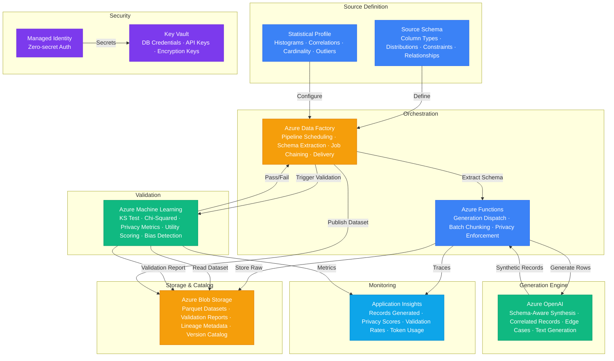

# Play 47 — Synthetic Data Factory

Privacy-safe synthetic data generation factory — LLM-based text generation, CTGAN statistical tabular data, differential privacy, schema-driven pipelines, distribution fidelity validation, PII marker enforcement, and downstream ML utility testing.

## Architecture

| Component | Technology | Purpose |
|-----------|-----------|---------|
| Text Generation | Azure OpenAI (GPT-4o) | Schema-driven synthetic text/records |
| Tabular Generation | CTGAN / SDV | Statistical synthetic tabular data |
| Differential Privacy | SDV + DP mechanisms | Mathematical privacy guarantees |
| Rule-Based | Faker + custom rules | Structured PII-like fields (names, addresses) |
| Validation | SciPy + Presidio | Distribution fidelity + PII leakage scan |
| Storage | Azure Blob Storage | Dataset output (CSV, Parquet, JSONL) |
| Orchestrator | Azure Container Apps | Generation pipeline hosting |



📐 [Full architecture details](architecture.md)

## How It Differs from Related Plays

| Aspect | Play 13 (Fine-Tuning) | **Play 47 (Synthetic Data)** | Play 46 (Healthcare AI) |
|--------|----------------------|------------------------------|--------------------------|
| Purpose | Train models on real data | **Generate privacy-safe training data** | Clinical decision support |
| Input | Real labeled dataset | **Schema + constraints (or real sample)** | Patient records (FHIR) |
| Output | Fine-tuned model | **Synthetic dataset (CSV/Parquet)** | Clinical recommendations |
| Privacy | Data access controls | **Formal privacy (DP, PII-free)** | HIPAA de-identification |
| Validation | Model eval metrics | **Distribution fidelity vs real data** | Clinical accuracy |
| Use Case | When real data exists | **When real data is sensitive/scarce** | Healthcare compliance |

## DevKit Structure

```
47-synthetic-data-factory/
├── agent.md                                # Root orchestrator with handoffs
├── .github/
│   ├── copilot-instructions.md             # Domain knowledge (<150 lines)
│   ├── agents/
│   │   ├── builder.agent.md                # LLM + CTGAN + validation pipelines
│   │   ├── reviewer.agent.md               # Privacy + PII + re-identification
│   │   └── tuner.agent.md                  # Diversity + fidelity + cost
│   ├── prompts/
│   │   ├── deploy.prompt.md                # Deploy generation pipelines
│   │   ├── test.prompt.md                  # Generate + validate sample
│   │   ├── review.prompt.md                # Privacy audit
│   │   └── evaluate.prompt.md              # Fidelity + utility metrics
│   ├── skills/
│   │   ├── deploy-synthetic-data-factory/  # LLM gen + CTGAN + validation
│   │   ├── evaluate-synthetic-data-factory/# Fidelity, privacy, diversity, utility
│   │   └── tune-synthetic-data-factory/    # Temperature, epochs, DP budget, cost
│   └── instructions/
│       └── synthetic-data-factory-patterns.instructions.md
├── config/                                 # TuneKit
│   ├── openai.json                         # Generation model, temperature, batching
│   ├── guardrails.json                     # Privacy controls, PII markers, DP budget
│   └── agents.json                         # Output format, storage, schema definitions
├── infra/                                  # Bicep IaC
│   ├── main.bicep
│   └── parameters.json
└── spec/                                   # SpecKit
    └── fai-manifest.json
```

## Quick Start

```bash
# 1. Deploy generation pipelines
/deploy

# 2. Generate sample dataset + validate
/test

# 3. Run privacy audit
/review

# 4. Measure fidelity + downstream utility
/evaluate
```

## Key Metrics

| Metric | Target | Description |
|--------|--------|-------------|
| KS Statistic | < 0.1 | Distribution similarity per column |
| PII Leakage | 0% | No real PII in synthetic output |
| Re-identification Risk | < 0.1% | Can't link synthetic to real records |
| Uniqueness Rate | > 95% | Low duplicate synthetic records |
| TSTR Accuracy Parity | > 85% | ML model trained on synthetic ≈ real-trained |
| Cost per 1K Records | < $0.30 | LLM generation + validation |

## Estimated Cost

| Service | Dev/mo | Prod/mo | Enterprise/mo |
|---------|--------|---------|---------------|
| Azure OpenAI | $60 | $500 | $1,800 |
| Azure Machine Learning | $0 | $200 | $800 |
| Azure Blob Storage | $5 | $40 | $150 |
| Azure Functions | $0 | $120 | $350 |
| Azure Data Factory | $10 | $100 | $300 |
| Key Vault | $1 | $5 | $15 |
| Application Insights | $0 | $25 | $80 |
| **Total** | **$76** | **$990** | **$3,495** |

> Estimates based on Azure retail pricing. Actual costs vary by region, usage, and enterprise agreements.

💰 [Full cost breakdown](cost.json)

## WAF Alignment

| Pillar | Implementation |
|--------|---------------|
| **Security** | PII markers, no real data in output, differential privacy |
| **Responsible AI** | Privacy-preserving generation, re-identification risk testing |
| **Reliability** | Statistical validation (KS test), downstream utility testing |
| **Cost Optimization** | CTGAN for tabular (free), gpt-4o-mini for simple schemas |
| **Performance Efficiency** | Batch generation, cached schemas, Faker for structured PII |
| **Operational Excellence** | Schema-driven pipelines, reproducible with seed, metadata audit |


## FAI Manifest

| Field | Value |
|-------|-------|
| Play | `47-synthetic-data-factory` |
| Version | `1.0.0` |
| Knowledge | F1-GenAI-Foundations, F2-LLM-Selection, T1-Fine-Tuning-MLOps, T2-Responsible-AI, T3-Production-Patterns |
| WAF Pillars | security, responsible-ai, cost-optimization, operational-excellence |
| Groundedness | ≥ 85% |
| Safety | 0 violations max |
