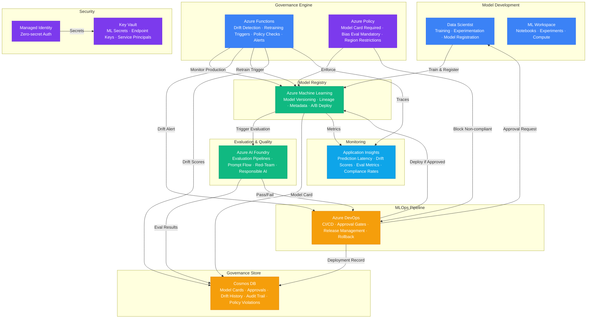

# Play 48 — AI Model Governance

AI model governance platform — centralized model registry with semantic versioning, multi-stage approval workflows (eval gate → bias testing → model card → human sign-off), A/B champion/challenger testing with statistical significance, progressive rollout (5%→25%→50%→100%), lineage tracking, drift monitoring (accuracy + data PSI), and instant rollback.

## Architecture

| Component | Azure Service | Purpose |
|-----------|--------------|---------|
| Model Registry | Azure ML Workspace | Versioned model storage + model cards |
| Governance API | Azure Container Apps | Approval workflows, A/B, rollout |
| Analytics | Azure OpenAI (GPT-4o-mini) | Model card validation, governance insights |
| Drift Monitoring | Custom (scheduled) | Accuracy drift + data PSI monitoring |
| Secrets | Azure Key Vault | ML workspace credentials, API keys |
| Telemetry | Application Insights | Workflow timing, approval SLA tracking |



📐 [Full architecture details](architecture.md)

## How It Differs from Related Plays

| Aspect | Play 13 (Fine-Tuning) | **Play 48 (Model Governance)** | Play 98 (Evaluation) |
|--------|----------------------|-------------------------------|---------------------|
| Focus | Train/fine-tune models | **Govern model lifecycle** | Benchmark models |
| Scope | Single model training | **All models across org** | Model comparison |
| Output | Trained model artifact | **Approved model + model card** | Eval scorecard |
| Process | Data → train → evaluate | **Register → review → approve → deploy** | Test → score → rank |
| A/B Testing | N/A | **Champion/challenger with traffic split** | N/A |
| Drift | N/A | **Continuous monitoring + alerts** | Point-in-time eval |
| Rollback | N/A | **Instant rollback to previous version** | N/A |

## DevKit Structure

```
48-ai-model-governance/
├── agent.md                              # Root orchestrator with handoffs
├── .github/
│   ├── copilot-instructions.md           # Domain knowledge (<150 lines)
│   ├── agents/
│   │   ├── builder.agent.md              # Registry + approval + A/B + rollout
│   │   ├── reviewer.agent.md             # Model cards + bias + compliance
│   │   └── tuner.agent.md                # A/B duration + drift + rollout
│   ├── prompts/
│   │   ├── deploy.prompt.md              # Deploy governance pipeline
│   │   ├── test.prompt.md                # Register + approve test model
│   │   ├── review.prompt.md              # Audit model cards + compliance
│   │   └── evaluate.prompt.md            # Measure workflow efficiency
│   ├── skills/
│   │   ├── deploy-ai-model-governance/   # Registry + workflow + A/B + drift
│   │   ├── evaluate-ai-model-governance/ # Workflow SLA, A/B, drift, rollout
│   │   └── tune-ai-model-governance/     # Thresholds, A/B config, drift, cost
│   └── instructions/
│       └── ai-model-governance-patterns.instructions.md
├── config/                               # TuneKit
│   ├── openai.json                       # Governance analysis model
│   ├── guardrails.json                   # Eval thresholds, bias, drift, model card
│   └── agents.json                       # A/B config, rollout stages, workflow
├── infra/                                # Bicep IaC
│   ├── main.bicep
│   └── parameters.json
└── spec/                                 # SpecKit
    └── fai-manifest.json
```

## Quick Start

```bash
# 1. Deploy governance infrastructure
/deploy

# 2. Register and approve a test model
/test

# 3. Audit model cards and compliance
/review

# 4. Measure governance efficiency
/evaluate
```

## Key Metrics

| Metric | Target | Description |
|--------|--------|-------------|
| Approval SLA | < 24 hours | Registration to approved |
| A/B Correct Decisions | > 90% | Right promote/keep choice |
| Drift Detection Rate | > 95% | Catch >5% accuracy drops |
| Rollback Speed | < 5 minutes | Detect → rollback time |
| Model Card Completeness | 100% | All required fields present |
| Governance Cost | < $50/month | Fixed infrastructure cost |

## Estimated Cost

| Service | Dev/mo | Prod/mo | Enterprise/mo |
|---------|--------|---------|---------------|
| Azure Machine Learning | $0 | $250 | $900 |
| Azure AI Foundry | $20 | $100 | $300 |
| Azure DevOps | $0 | $50 | $150 |
| Cosmos DB | $5 | $75 | $350 |
| Azure Policy | $0 | $0 | $0 |
| Azure Functions | $0 | $120 | $350 |
| Key Vault | $1 | $5 | $15 |
| Application Insights | $0 | $30 | $100 |
| **Total** | **$26** | **$630** | **$2,165** |

> Estimates based on Azure retail pricing. Actual costs vary by region, usage, and enterprise agreements.

💰 [Full cost breakdown](cost.json)

## WAF Alignment

| Pillar | Implementation |
|--------|---------------|
| **Responsible AI** | Bias testing across protected attributes, model cards, fairness gates |
| **Reliability** | Progressive rollout, instant rollback, drift monitoring |
| **Operational Excellence** | Multi-stage approval, lineage tracking, automated eval gates |
| **Security** | Approval chain, human sign-off, audit trail |
| **Cost Optimization** | gpt-4o-mini for validation, shared ML workspace |
| **Performance Efficiency** | A/B testing with statistical significance, staged deployment |


## FAI Manifest

| Field | Value |
|-------|-------|
| Play | `48-ai-model-governance` |
| Version | `1.0.0` |
| Knowledge | T3-Production-Patterns, T2-Responsible-AI, T1-Fine-Tuning-MLOps, O5-GPU-Infra |
| WAF Pillars | operational-excellence, security, responsible-ai, reliability, cost-optimization |
| Groundedness | ≥ 85% |
| Safety | 0 violations max |
