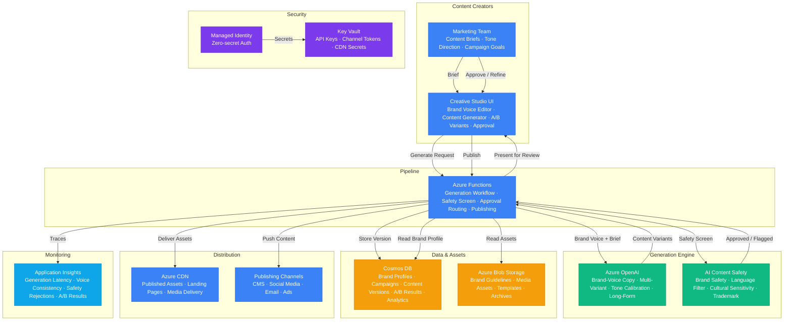

# Play 49 — Creative AI Studio

Multi-modal creative content generation platform — brand voice-consistent text, DALL-E image generation, cross-platform adaptation (LinkedIn/Twitter/Instagram/Blog/Email), content calendar automation, A/B variation testing, and content safety moderation.

## Architecture

| Component | Azure Service | Purpose |
|-----------|--------------|---------|
| Text Generation | Azure OpenAI (GPT-4o) | Headlines, copy, blog posts, social posts |
| Image Generation | Azure OpenAI (DALL-E 3) | Campaign visuals, social media images |
| Content Safety | Azure Content Safety | Image + text moderation, copyright check |
| Asset Storage | Azure Blob Storage | Generated images, content archives |
| Studio API | Azure Container Apps | Content pipeline orchestration |
| Secrets | Azure Key Vault | API keys, brand configs |



📐 [Full architecture details](architecture.md)

## How It Differs from Related Plays

| Aspect | Play 36 (Multimodal Agent) | **Play 49 (Creative AI Studio)** | Play 43 (Video Generation) |
|--------|--------------------------|-------------------------------|---------------------------|
| Input | Images for analysis | **Campaign briefs** | Text prompts for video |
| Output | Structured analysis | **Text + images + social posts** | Generated video files |
| Focus | Understanding content | **Creating content** | Video-specific generation |
| Brand | N/A | **Brand voice consistency** | N/A |
| Platforms | N/A | **Multi-platform adaptation** | N/A |
| Variations | Single output | **3-5 variations per asset** | Single video |
| Calendar | N/A | **Auto content calendar** | N/A |

## DevKit Structure

```
49-creative-ai-studio/
├── agent.md                              # Root orchestrator with handoffs
├── .github/
│   ├── copilot-instructions.md           # Domain knowledge (<150 lines)
│   ├── agents/
│   │   ├── builder.agent.md              # Pipeline + brand voice + platforms
│   │   ├── reviewer.agent.md             # Brand + safety + copyright
│   │   └── tuner.agent.md                # Temperature + diversity + cost
│   ├── prompts/
│   │   ├── deploy.prompt.md              # Deploy content studio
│   │   ├── test.prompt.md                # Generate sample campaign
│   │   ├── review.prompt.md              # Brand + safety audit
│   │   └── evaluate.prompt.md            # Measure content quality
│   ├── skills/
│   │   ├── deploy-creative-ai-studio/    # Pipeline + brand + DALL-E + platforms
│   │   ├── evaluate-creative-ai-studio/  # Brand fidelity, quality, diversity
│   │   └── tune-creative-ai-studio/      # Temperature, voice, platforms, cost
│   └── instructions/
│       └── creative-ai-studio-patterns.instructions.md
├── config/                               # TuneKit
│   ├── openai.json                       # Text + image model settings
│   ├── guardrails.json                   # Brand voice, forbidden words, safety
│   └── agents.json                       # Platform specs, calendar, A/B config
├── infra/                                # Bicep IaC
│   ├── main.bicep
│   └── parameters.json
└── spec/                                 # SpecKit
    └── fai-manifest.json
```

## Quick Start

```bash
# 1. Deploy creative studio
/deploy

# 2. Generate sample campaign with variations
/test

# 3. Audit brand voice and safety
/review

# 4. Measure content quality and diversity
/evaluate
```

## Key Metrics

| Metric | Target | Description |
|--------|--------|-------------|
| Brand Tone Consistency | > 4.0/5.0 | Content matches brand voice |
| Forbidden Word Compliance | 100% | No banned words in output |
| Content Readability | 60-80 FK | Accessible reading level |
| Variation Diversity | < 0.7 similarity | Meaningfully different variations |
| Platform Compliance | 100% | Character limits, hashtags, tone |
| Cost per Campaign | < $0.50 | Text + images + adaptation |

## Estimated Cost

| Service | Dev/mo | Prod/mo | Enterprise/mo |
|---------|--------|---------|---------------|
| Azure OpenAI | $50 | $400 | $1,500 |
| Azure Blob Storage | $5 | $30 | $100 |
| Azure AI Content Safety | $0 | $50 | $180 |
| Azure Functions | $0 | $120 | $350 |
| Azure CDN | $5 | $40 | $120 |
| Cosmos DB | $5 | $75 | $350 |
| Key Vault | $1 | $5 | $15 |
| Application Insights | $0 | $25 | $80 |
| **Total** | **$66** | **$745** | **$2,695** |

> Estimates based on Azure retail pricing. Actual costs vary by region, usage, and enterprise agreements.

💰 [Full cost breakdown](cost.json)

## WAF Alignment

| Pillar | Implementation |
|--------|---------------|
| **Responsible AI** | Content safety on all assets, copyright filtering, brand compliance |
| **Performance Efficiency** | gpt-4o-mini for adaptation, batch generation, cached patterns |
| **Cost Optimization** | DALL-E standard quality option, 3 variations default, mini for adaptation |
| **Reliability** | Brand voice templates, deterministic formatting, validation |
| **Operational Excellence** | Content calendar automation, A/B testing, platform tracking |
| **Security** | Content Safety API, Key Vault for secrets, no PII in campaigns |


## FAI Manifest

| Field | Value |
|-------|-------|
| Play | `49-creative-ai-studio` |
| Version | `1.0.0` |
| Knowledge | F1-GenAI-Foundations, F2-LLM-Selection, R1-Prompt-Patterns, T2-Responsible-AI, T3-Production-Patterns |
| WAF Pillars | cost-optimization, responsible-ai, performance-efficiency, reliability, operational-excellence |
| Groundedness | ≥ 85% |
| Safety | 0 violations max |
