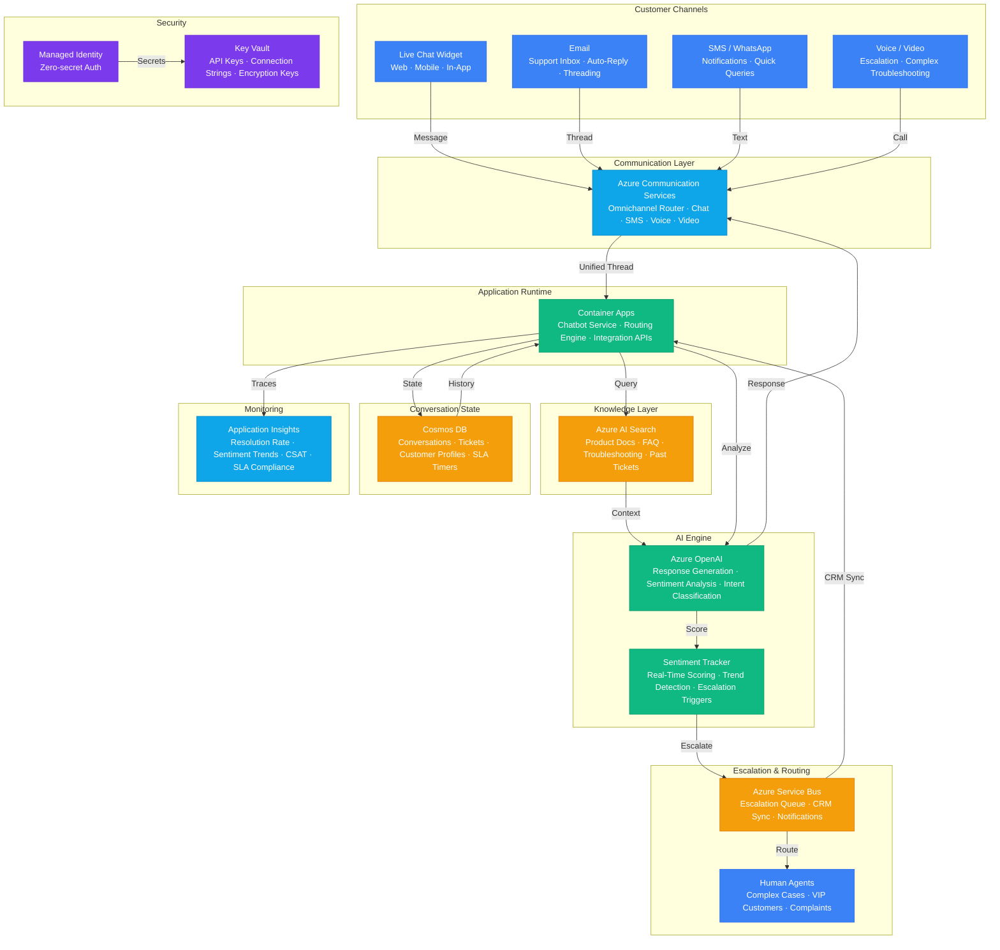

# Play 54 — AI Customer Support V2

Advanced AI customer support — multi-channel (chat, email, voice), intent classification with slot filling, knowledge-grounded responses via AI Search, sentiment-aware escalation with priority routing, session memory in Cosmos DB, CSAT tracking, and channel-specific formatting (markdown/HTML/SSML).

## Architecture



> Full architecture details: [`architecture.md`](./architecture.md)

## How It Differs from Related Plays

| Aspect | Play 05 (IT Ticket Resolution) | **Play 54 (Customer Support V2)** | Play 08 (Copilot Studio Bot) |
|--------|-------------------------------|----------------------------------|------------------------------|
| Audience | Internal IT staff | **External customers** | Internal/external |
| Channels | Ticketing system | **Chat + email + voice** | Teams/web |
| Intent | IT issue classification | **Customer intent + sentiment + slots** | Topic-based routing |
| Escalation | SLA-based routing | **Sentiment-aware + confidence-based** | Topic fallback |
| Grounding | IT knowledge base | **Product KB + policies + troubleshooting** | Copilot Studio topics |
| Metrics | MTTR, resolution rate | **CSAT, auto-resolution, first-contact** | User satisfaction |

## DevKit Structure

```
54-ai-customer-support-v2/
├── agent.md                                  # Root orchestrator with handoffs
├── .github/
│   ├── copilot-instructions.md               # Domain knowledge (<150 lines)
│   ├── agents/
│   │   ├── builder.agent.md                  # Multi-channel + intent + KB
│   │   ├── reviewer.agent.md                 # Response quality + escalation
│   │   └── tuner.agent.md                    # Intent + CSAT + cost
│   ├── prompts/ + skills/ + instructions/
├── config/                                   # TuneKit
│   ├── openai.json                           # Intent model + response model
│   ├── guardrails.json                       # Escalation rules, sentiment thresholds
│   └── agents.json                           # KB config, channel templates
├── infra/ + spec/
```

## Key Metrics

| Metric | Target | Description |
|--------|--------|-------------|
| Intent Accuracy | > 90% | Correct intent classification |
| Auto-Resolution | > 60% | Resolved without human agent |
| CSAT Score | > 4.0/5.0 | Customer satisfaction |
| Escalation Rate | 15-25% | Sweet spot: not too many, not too few |
| KB Grounding | > 95% | Responses from knowledge base only |
| Cost per Conversation | < $0.05 | ~3 turns average |

## Cost Estimate

| Service | Dev | Prod | Enterprise |
|---------|-----|------|------------|
| Azure OpenAI | $80 | $700 | $2,800 |
| Azure AI Search | $0 | $250 | $1,000 |
| Azure Communication Services | $10 | $80 | $300 |
| Cosmos DB | $5 | $75 | $350 |
| Container Apps | $10 | $100 | $400 |
| Azure Service Bus | $5 | $25 | $100 |
| Key Vault | $1 | $5 | $15 |
| Application Insights | $0 | $30 | $100 |
| **Total** | **$111** | **$1,265** | **$5,065** |

> Detailed breakdown with SKUs and optimization tips: [`cost.json`](./cost.json) · [Azure Pricing Calculator](https://azure.microsoft.com/pricing/calculator/)

## WAF Alignment

| Pillar | Implementation |
|--------|---------------|
| **Reliability** | Session memory, KB fallback, graceful "I don't know" |
| **Security** | PII handling, Key Vault, no customer data in logs |
| **Cost Optimization** | gpt-4o-mini for intent, gpt-4o for response, KB caching |
| **Operational Excellence** | CSAT tracking, escalation analytics, resolution rate |
| **Performance Efficiency** | <1s response time (chat), parallel intent+KB search |
| **Responsible AI** | Sentiment-aware tone, no hallucinated policies, human escalation |


## FAI Manifest

| Field | Value |
|-------|-------|
| Play | `54-ai-customer-support-v2` |
| Version | `1.0.0` |
| Knowledge | R2-RAG-Architecture, O2-Agent-Coding, T2-Responsible-AI, T3-Production-Patterns |
| WAF Pillars | security, reliability, cost-optimization, responsible-ai, performance-efficiency |
| Groundedness | ≥ 85% |
| Safety | 0 violations max |
