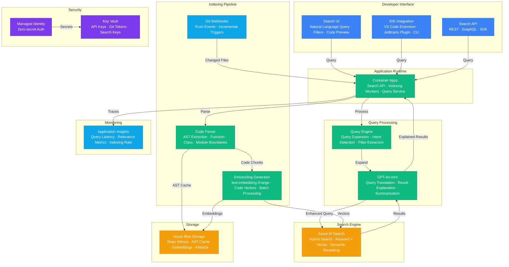

# Play 56 — Semantic Code Search

Vector-based code search engine — AST-aware function parsing (tree-sitter), multi-field embedding (signature + docstring + body), hybrid keyword+vector search with boost weights, semantic reranking, incremental re-indexing on git push, natural language→code queries, cross-repo search with access control.

## Architecture

> Full architecture details: [`architecture.md`](./architecture.md)

## How It Differs from Related Plays

| Aspect | Play 26 (Semantic Search) | **Play 56 (Code Search)** | Play 01 (Enterprise RAG) |
|--------|--------------------------|--------------------------|--------------------------|
| Content | General documents | **Source code specifically** | Corporate knowledge |
| Parsing | Text chunking | **AST-aware function extraction** | Semantic chunking |
| Embedding | Document vectors | **Signature + docstring + body vectors** | Document vectors |
| Query | NL → document | **NL → code snippet** | NL → knowledge |
| Freshness | Batch re-index | **Git push webhook (<60s)** | Scheduled re-index |
| Access | User auth | **Repo-level permissions** | Doc-level ACL |

## Key Metrics

| Metric | Target | Description |
|--------|--------|-------------|
| NDCG@5 | > 0.75 | Normalized Discounted Cumulative Gain |
| Recall@10 | > 85% | Relevant results in top 10 |
| P95 Latency | < 300ms | Search response time |
| Index Freshness | < 60s | Push to searchable |
| Access Control | 100% | No unauthorized repo access |

## Cost Estimate

| Service | Dev | Prod | Enterprise |
|---------|-----|------|------------|
| Azure OpenAI | $40 | $300 | $1,200 |
| Azure AI Search | $0 | $250 | $1,000 |
| Azure Blob Storage | $3 | $20 | $80 |
| Container Apps | $8 | $60 | $250 |
| Key Vault | $1 | $3 | $10 |
| Application Insights | $0 | $20 | $60 |
| **Total** | **$52** | **$653** | **$2,600** |

> Detailed breakdown with SKUs and optimization tips: [`cost.json`](./cost.json) · [Azure Pricing Calculator](https://azure.microsoft.com/pricing/calculator/)

## WAF Alignment

| Pillar | Implementation |
|--------|---------------|
| **Security** | Repo-level access control, permission caching, Key Vault |
| **Performance Efficiency** | HNSW vector index, hybrid search, semantic reranking |
| **Cost Optimization** | Incremental indexing (changed files only), embedding model choice |
| **Reliability** | Webhook retry on failure, weekly full reindex backup |
| **Operational Excellence** | NDCG tracking, latency monitoring, index health dashboard |
| **Responsible AI** | Access control prevents code leakage, no PII in code index |

## FAI Manifest

| Field | Value |
|-------|-------|
| Play | `56-semantic-code-search` |
| Version | `1.0.0` |
| Knowledge | R2-RAG-Architecture, F1-GenAI-Foundations, O3-MCP-Tools-Functions |
| WAF Pillars | security, performance-efficiency, reliability, operational-excellence |
| Groundedness | ≥ 85% |
| Safety | 0 violations max |
