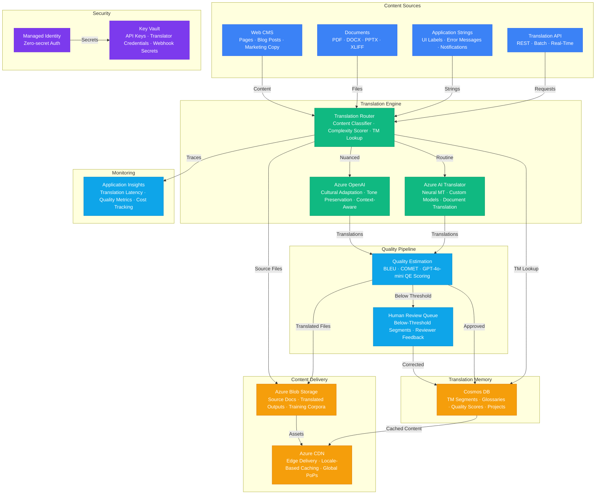

# Play 57 — AI Translation Engine

Enterprise translation engine — two-layer architecture: Azure Translator for bulk NMT (130+ languages, custom glossary enforcement) + GPT-4o LLM post-editing for nuanced content (marketing, legal, medical), quality scoring (BLEU/COMET + LLM judge), HTML/markdown preservation, batch document translation with progress tracking.

## Architecture

> Full architecture details: [`architecture.md`](./architecture.md)

## How It Differs from Related Plays

| Aspect | Play 49 (Creative AI) | **Play 57 (Translation Engine)** |
|--------|----------------------|--------------------------------|
| Input | Campaign brief (monolingual) | **Source text in any language** |
| Output | Creative content (1 language) | **Translated text in 130+ languages** |
| Quality | Brand adherence | **BLEU/COMET translation quality** |
| Glossary | Brand voice rules | **Domain terminology enforcement** |
| Cost model | Per campaign | **Per 1K words translated** |
| Bulk | N/A | **Batch document translation** |

## Key Metrics

| Metric | Target | Description |
|--------|--------|-------------|
| BLEU (general) | > 40 | N-gram overlap with reference |
| COMET | > 0.80 | Neural quality estimation |
| Glossary Compliance | > 95% | Terms translated per glossary |
| Product Name Preservation | 100% | Product names never translated |
| Markup Preservation | 100% | HTML/markdown tags intact |
| Cost per 1K Words | < $0.20 | NMT + LLM refinement |

## Cost Estimate

| Service | Dev | Prod | Enterprise |
|---------|-----|------|------------|
| Azure OpenAI | $60 | $500 | $2,000 |
| Azure AI Translator | $0 | $200 | $800 |
| Cosmos DB | $5 | $120 | $500 |
| Azure CDN | $5 | $50 | $200 |
| Azure Blob Storage | $3 | $25 | $80 |
| Key Vault | $1 | $3 | $10 |
| Application Insights | $0 | $25 | $80 |
| **Total** | **$74** | **$923** | **$3,670** |

> Detailed breakdown with SKUs and optimization tips: [`cost.json`](./cost.json) · [Azure Pricing Calculator](https://azure.microsoft.com/pricing/calculator/)

## WAF Alignment

| Pillar | Implementation |
|--------|---------------|
| **Reliability** | Azure Translator SLA, glossary enforcement, quality thresholds |
| **Cost Optimization** | NMT for bulk ($0.05/1K), LLM only for marketing/legal/medical |
| **Performance Efficiency** | >5000 wpm basic, batch document translation |
| **Operational Excellence** | BLEU/COMET tracking, glossary auto-update, batch checkpoints |
| **Security** | Key Vault for API keys, no PII in translation logs |
| **Responsible AI** | Quality scoring with human review triggers, cultural adaptation |

## FAI Manifest

| Field | Value |
|-------|-------|
| Play | `57-ai-translation-engine` |
| Version | `1.0.0` |
| Knowledge | F1-GenAI-Foundations, F2-LLM-Selection, T2-Responsible-AI, T3-Production-Patterns |
| WAF Pillars | performance-efficiency, cost-optimization, reliability, responsible-ai |
| Groundedness | ≥ 85% |
| Safety | 0 violations max |
