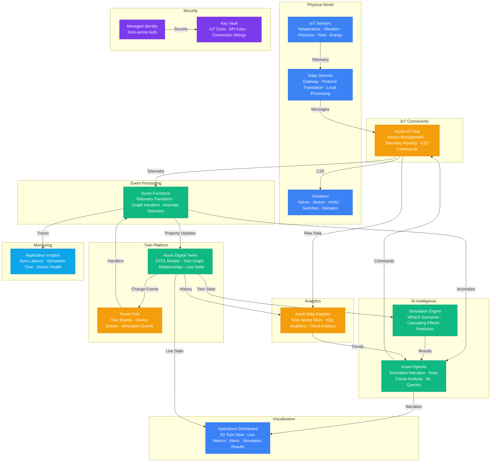

# Play 58 — Digital Twin Agent

AI-powered digital twin — Azure Digital Twins with DTDL models, IoT Hub sensor ingestion via Event Grid, natural language→DTDL query translation, predictive maintenance (Remaining Useful Life), twin graph relationship traversal, event-driven state synchronization, and telemetry archival in Azure Data Explorer.

## Architecture

> Full architecture details: [`architecture.md`](./architecture.md)

## How It Differs from Related Plays

| Aspect | Play 19 (Edge AI) | **Play 58 (Digital Twin)** | Play 34 (Edge Deployment) |
|--------|-------------------|--------------------------|--------------------------|
| Model | ONNX on device | **DTDL twin graph in cloud** | ONNX on IoT device |
| Scope | Single device inference | **Entire facility (building/factory)** | Device fleet |
| Query | N/A | **NL→DTDL ("overheating machines?")** | N/A |
| Prediction | Edge inference | **Cloud RUL prediction + LLM explanation** | Edge inference |
| Relationships | N/A | **Graph: locatedIn, feeds, controls** | N/A |
| Telemetry | On-device processing | **Streamed to cloud, archived in ADX** | Cloud sync |

## Key Metrics

| Metric | Target | Description |
|--------|--------|-------------|
| NL Query Accuracy | > 85% | Correct DTDL generated from natural language |
| RUL MAE | < 5 days | Maintenance prediction error margin |
| Critical Detection | > 90% | Failing machines flagged within 7 days |
| Sync Latency | < 5s | IoT message→twin property update |
| Telemetry Coverage | > 95% | Sensors actively reporting |

## Cost Estimate

| Service | Dev | Prod | Enterprise |
|---------|-----|------|------------|
| Azure OpenAI | $60 | $500 | $2,000 |
| Azure IoT Hub | $0 | $100 | $500 |
| Azure Digital Twins | $15 | $150 | $600 |
| Azure Functions | $0 | $30 | $250 |
| Azure Event Grid | $1 | $10 | $50 |
| Azure Data Explorer | $25 | $200 | $800 |
| Key Vault | $1 | $5 | $15 |
| Application Insights | $0 | $35 | $100 |
| **Total** | **$102** | **$1,030** | **$4,315** |

> Detailed breakdown with SKUs and optimization tips: [`cost.json`](./cost.json) · [Azure Pricing Calculator](https://azure.microsoft.com/pricing/calculator/)

## WAF Alignment

| Pillar | Implementation |
|--------|---------------|
| **Reliability** | Event-driven IoT→Twin sync, telemetry archival, twin lifecycle |
| **Security** | IoT device authentication, managed identity, Key Vault |
| **Cost Optimization** | ADX Dev tier, gpt-4o-mini for explanations, compressed telemetry |
| **Operational Excellence** | Twin graph visualization, threshold alerting, prediction dashboards |
| **Performance Efficiency** | Event-driven (not polling), ADX hot cache for recent queries |
| **Responsible AI** | Explainable RUL predictions, human review for maintenance decisions |

## FAI Manifest

| Field | Value |
|-------|-------|
| Play | `58-digital-twin-agent` |
| Version | `1.0.0` |
| Knowledge | T3-Production-Patterns, O2-Agent-Coding, F1-GenAI-Foundations |
| WAF Pillars | reliability, performance-efficiency, cost-optimization, operational-excellence |
| Groundedness | ≥ 85% |
| Safety | 0 violations max |
