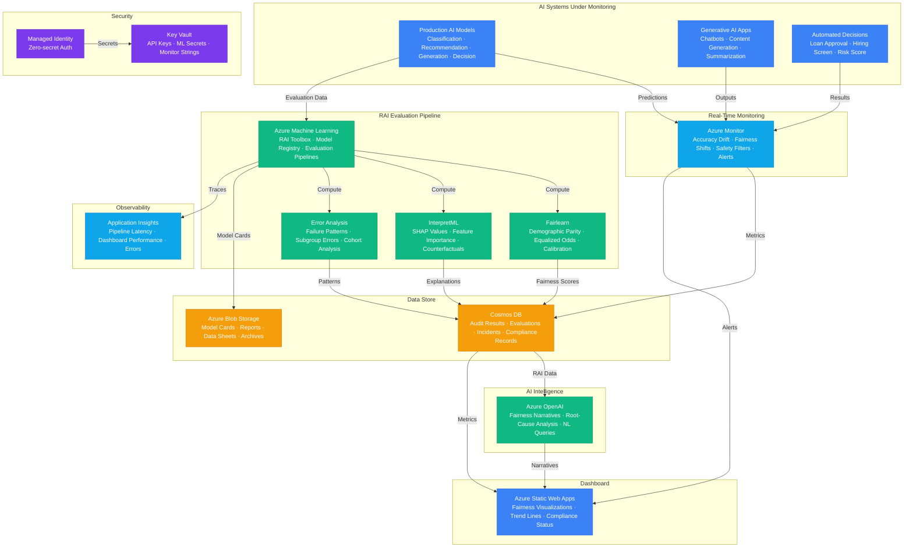

# Play 60 — Responsible AI Dashboard

Organization-wide responsible AI monitoring — centralized fairness scorecards (demographic parity, equalized odds, disparate impact, intersectional analysis), content safety incident tracking with severity classification, model card registry, compliance evidence hub (EU AI Act, EEOC, NIST RMF), and executive summaries with traffic-light system health.

## Architecture

> Full architecture details: [`architecture.md`](./architecture.md)

## How It Differs from Related Plays

| Aspect | Play 41 (Red Teaming) | **Play 60 (RAI Dashboard)** | Play 35 (Compliance Engine) |
|--------|----------------------|---------------------------|---------------------------|
| Scope | Single system testing | **All AI systems organization-wide** | Policy compliance |
| Focus | Adversarial attacks | **Fairness, safety, transparency** | Regulatory gaps |
| Frequency | Periodic campaigns | **Continuous monitoring** | Periodic audits |
| Output | Vulnerability report | **Executive scorecard + incident log** | Compliance report |
| Audience | Security team | **C-suite + compliance + ML teams** | Legal/compliance |
| Metrics | Attack success rate | **Fairness ratios + incident counts** | Gap counts |

## Key Metrics

| Metric | Target | Description |
|--------|--------|-------------|
| Systems Monitored | 100% | All production AI systems tracked |
| Fairness Metrics | 100% complete | All 4 metrics per system per cadence |
| Incident Capture | 100% | All safety events logged |
| Compliance Evidence | > 90% | Required docs per framework |
| Model Card Coverage | 100% | Every system has model card |
| Monthly Cost | < $100 | Org-wide monitoring |

## Cost Estimate

| Service | Dev | Prod | Enterprise |
|---------|-----|------|------------|
| Azure OpenAI | $50 | $400 | $1,600 |
| Azure Machine Learning | $40 | $250 | $1,000 |
| Azure Monitor | $0 | $80 | $250 |
| Cosmos DB | $5 | $120 | $400 |
| Azure Static Web Apps | $0 | $15 | $15 |
| Azure Blob Storage | $2 | $15 | $50 |
| Key Vault | $1 | $3 | $10 |
| Application Insights | $0 | $25 | $80 |
| **Total** | **$98** | **$908** | **$3,405** |

> Detailed breakdown with SKUs and optimization tips: [`cost.json`](./cost.json) · [Azure Pricing Calculator](https://azure.microsoft.com/pricing/calculator/)

## WAF Alignment

| Pillar | Implementation |
|--------|---------------|
| **Responsible AI** | Fairness monitoring, intersectional analysis, bias detection, model cards |
| **Operational Excellence** | Automated collection, incident tracking, compliance evidence |
| **Security** | Safety incident alerting, PagerDuty escalation chain |
| **Reliability** | Continuous monitoring, historical trends, threshold enforcement |
| **Cost Optimization** | gpt-4o-mini for analysis, serverless Cosmos DB, free SWA tier |
| **Performance Efficiency** | Batch collection, cached dashboards, API pagination |

## FAI Manifest

| Field | Value |
|-------|-------|
| Play | `60-responsible-ai-dashboard` |
| Version | `1.0.0` |
| Knowledge | T2-Responsible-AI, T3-Production-Patterns, F1-GenAI-Foundations, T1-Fine-Tuning-MLOps |
| WAF Pillars | responsible-ai, security, operational-excellence, reliability |
| Groundedness | ≥ 85% |
| Safety | 0 violations max |
