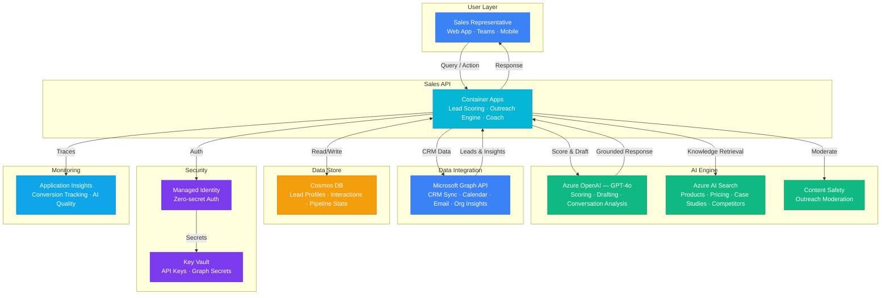

# Play 64 — AI Sales Assistant

AI-powered sales enablement — CRM-grounded lead scoring (ICP match + engagement signals), personalized email generation, call prep with talk tracks, competitive intelligence from win/loss data, deal stage coaching, and CRM integration (Salesforce, HubSpot, Dynamics 365). All emails are drafts — sales rep reviews before sending.

## Architecture

| Component | Azure Service | Purpose |
|-----------|--------------|---------|
| Scoring + Emails | Azure OpenAI (GPT-4o) | Lead scoring, email generation, talk tracks |
| Competitive Intel | Azure OpenAI (GPT-4o-mini) | Battle cards from win/loss data |
| CRM Integration | Salesforce/HubSpot/Dynamics API | Contact, company, activity, deal data |
| Deal State | Azure Cosmos DB | Lead pipeline, scoring history |
| Sales API | Azure Container Apps | Scoring + email + intel endpoint |
| Secrets | Azure Key Vault | CRM credentials, OpenAI key |

🏗️ [Full architecture details](architecture.md)

## How It Differs from Related Plays

| Aspect | Play 54 (Customer Support V2) | **Play 64 (Sales Assistant)** |
|--------|------------------------------|------------------------------|
| Audience | Existing customers | **Prospects and leads** |
| Goal | Resolve issues | **Close deals** |
| Data Source | KB + conversation | **CRM + engagement signals + win/loss** |
| Scoring | Sentiment (positive/negative) | **Lead temperature (hot/warm/cold)** |
| Output | Resolution response | **Email drafts + talk tracks + battle cards** |
| AI Role | Auto-respond or escalate | **Draft → rep reviews → sends** |

## Key Metrics

| Metric | Target | Description |
|--------|--------|-------------|
| Score-to-Close Correlation | > 0.6 | High scores predict closed deals |
| Email Response Rate | > 15% | AI-drafted emails get replies |
| CRM Grounding | 100% | No hallucinated company data |
| Talk Track Relevance | > 4.0/5.0 | Personalized, actionable |
| Cost per Lead | < $0.10 | Score + email + talk track |

## Cost Estimate

| Service | Dev | Prod | Enterprise |
|---------|-----|------|------------|
| Azure OpenAI | $30 | $200 | $800 |
| Cosmos DB | $3 | $50 | $200 |
| Microsoft Graph API | $0 | $15 | $50 |
| Azure AI Search | $75 | $250 | $750 |
| Container Apps | $10 | $80 | $200 |
| Key Vault | $1 | $3 | $10 |
| Application Insights | $0 | $20 | $80 |
| Content Safety | $0 | $10 | $30 |
| **Total** | **$119/mo** | **$628/mo** | **$2,120/mo** |

> Estimates based on Azure retail pricing. Actual costs vary by region, usage, and enterprise agreements.

💰 [Full cost breakdown](cost.json)

## WAF Alignment

| Pillar | Implementation |
|--------|---------------|
| **Reliability** | CRM-grounded scoring (no speculation), consistent scoring (temp=0) |
| **Security** | CRM credentials in Key Vault, no PII in logs |
| **Cost Optimization** | gpt-4o-mini for competitive intel, batch scoring, cached battle cards |
| **Operational Excellence** | CRM sync every 15 min, scoring history tracking |
| **Performance Efficiency** | Parallel CRM data fetch, cached company profiles |
| **Responsible AI** | Email review workflow (never auto-send), scoring fairness |

## FAI Manifest

| Field | Value |
|-------|-------|
| Play | `64-ai-sales-assistant` |
| Version | `1.0.0` |
| Knowledge | O2-Agent-Coding, R2-RAG-Architecture, T3-Production-Patterns, F1-GenAI-Foundations |
| WAF Pillars | security, reliability, cost-optimization, operational-excellence |
| Groundedness | ≥ 85% |
| Safety | 0 violations max |
