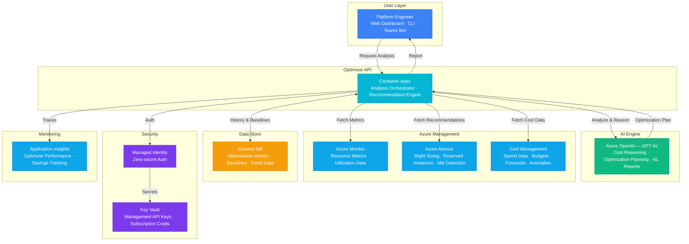

# Play 66 — AI Infrastructure Optimizer

FinOps for AI workloads — Azure Monitor metrics collection, GPU utilization analysis, SKU right-sizing engine with p95-based recommendations, cost anomaly detection with severity classification, auto-scaling advisor, and FinOps dashboard with monthly savings tracking.

## Architecture

| Component | Azure Service | Purpose |
|-----------|--------------|---------|
| Metrics Collection | Azure Monitor | CPU, GPU, memory, network utilization |
| Cost Analysis | Azure Cost Management | Daily spend, anomaly detection |
| Recommendation Engine | Custom + Azure OpenAI | Right-sizing, GPU optimization, explanations |
| Optimizer API | Azure Container Apps | Analysis endpoint, dashboard API |
| Secrets | Azure Key Vault | Subscription credentials |

🏗️ [Full architecture details](architecture.md)

## How It Differs from Related Plays

| Aspect | Play 14 (Cost-Optimized Gateway) | **Play 66 (Infrastructure Optimizer)** |
|--------|----------------------------------|---------------------------------------|
| Scope | Single API gateway cost | **All Azure resources in subscription** |
| Focus | Model routing for cost | **Compute + GPU + storage right-sizing** |
| Method | Complexity-based routing | **30-day utilization analysis (p95)** |
| Output | Cheaper model calls | **SKU changes, GPU→CPU migration, auto-scale** |
| Anomaly | N/A | **Daily cost anomaly detection** |
| Savings | Per-query token savings | **20-40% total infrastructure savings** |

## Key Metrics

| Metric | Target | Description |
|--------|--------|-------------|
| Recommendation Accuracy | > 90% | Resized resources perform within SLA |
| Total Savings | > 20% | Monthly cost reduction |
| GPU Optimization | > 30% | Under-utilized GPU savings |
| Anomaly Detection | > 90% | Cost spikes caught |
| No Perf Degradation | 100% | P95 latency unchanged after resize |
| ROI | > 10x | Savings / optimizer cost |

## Cost Estimate

| Service | Dev | Prod | Enterprise |
|---------|-----|------|------------|
| Azure OpenAI | $35 | $250 | $900 |
| Azure Monitor | $0 | $50 | $200 |
| Azure Advisor | $0 | $0 | $0 |
| Cost Management | $0 | $5 | $15 |
| Container Apps | $10 | $100 | $280 |
| Cosmos DB | $3 | $40 | $130 |
| Key Vault | $1 | $3 | $10 |
| Application Insights | $0 | $25 | $90 |
| **Total** | **$49/mo** | **$473/mo** | **$1,625/mo** |

> Estimates based on Azure retail pricing. Actual costs vary by region, usage, and enterprise agreements.

💰 [Full cost breakdown](cost.json)

## WAF Alignment

| Pillar | Implementation |
|--------|---------------|
| **Cost Optimization** | Right-sizing, GPU→CPU migration, auto-scale, storage tiering |
| **Performance Efficiency** | P95-based analysis (not peak), auto-scale recommendations |
| **Reliability** | No-downsize-below-minimum safety, gradual rollout |
| **Operational Excellence** | Weekly analysis cadence, FinOps dashboard, trend tracking |
| **Security** | Reader role only, no write access to monitored resources |
| **Responsible AI** | LLM explains recommendations in human-readable format |

## FAI Manifest

| Field | Value |
|-------|-------|
| Play | `66-ai-infrastructure-optimizer` |
| Version | `1.0.0` |
| Knowledge | T3-Production-Patterns, O5-GPU-Infra, F2-LLM-Selection |
| WAF Pillars | cost-optimization, performance-efficiency, reliability, operational-excellence, security |
| Groundedness | ≥ 85% |
| Safety | 0 violations max |
