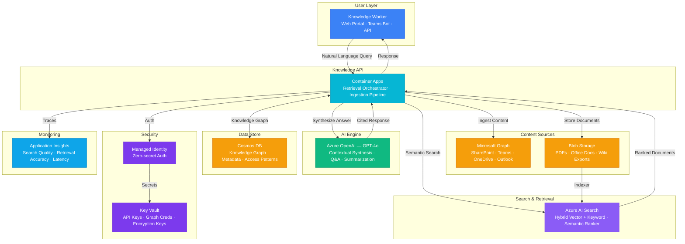

# Play 67 — AI Knowledge Management

Organizational knowledge platform — auto-capture from Teams/SharePoint/ServiceNow/Jira/meetings, LLM extraction with taxonomy classification, semantic deduplication (0.95 threshold), knowledge graph in Cosmos DB, expertise finder with contribution-based profiles, freshness scoring with TTL-based archival, and access control inherited from source systems.

## Architecture

| Component | Azure Service | Purpose |
|-----------|--------------|---------|
| Extraction | Azure OpenAI (GPT-4o) | Knowledge item extraction from sources |
| Classification | Azure OpenAI (GPT-4o-mini) | Taxonomy, entity extraction |
| Knowledge Index | Azure AI Search | Semantic search over knowledge base |
| Knowledge Graph | Azure Cosmos DB | Entity relationships, expertise profiles |
| Source Connectors | Microsoft Graph + APIs | Teams, SharePoint, ServiceNow, Jira |
| KM API | Azure Container Apps | Capture, search, expert finder |

📐 [Full architecture details](architecture.md)

## How It Differs from Related Plays

| Aspect | Play 01 (Enterprise RAG) | **Play 67 (Knowledge Management)** | Play 25 (Conversation Memory) |
|--------|------------------------|-------------------------------------|-------------------------------|
| Input | Uploaded documents | **Auto-captured from live sources** | Conversation history |
| Scope | Q&A over documents | **Organizational memory + expertise** | Session context |
| Dedup | N/A | **Semantic dedup (0.95 threshold)** | N/A |
| Experts | N/A | **Expertise finder (who knows what)** | N/A |
| Freshness | Manual re-index | **TTL-based auto-archival** | Session TTL |
| Graph | N/A | **Entity relationship graph** | N/A |

## Key Metrics

| Metric | Target | Description |
|--------|--------|-------------|
| Capture Rate | > 80% | Knowledge extracted from sources |
| Duplicate Detection | > 95% | Near-duplicates caught |
| Expert Relevance | > 80% | Found person knows the topic |
| Stale Content | < 10% | Items past TTL |
| NDCG@5 | > 0.70 | Search result quality |

## Cost Estimate

| Service | Dev | Prod | Enterprise |
|---------|-----|------|------------|
| Azure OpenAI | $35 | $300 | $1,200 |
| Azure AI Search | $0 | $250 | $500 |
| Cosmos DB | $3 | $50 | $180 |
| Microsoft Graph | $0 | $0 | $0 |
| Container Apps | $10 | $100 | $280 |
| Blob Storage | $3 | $25 | $80 |
| Key Vault | $1 | $3 | $10 |
| Application Insights | $0 | $25 | $90 |
| **Total** | **$52/mo** | **$753/mo** | **$2,340/mo** |

> Estimates based on Azure retail pricing. Actual costs vary by region, usage, and enterprise agreements.

💰 [Full cost breakdown](cost.json)

## WAF Alignment

| Pillar | Implementation |
|--------|---------------|
| **Operational Excellence** | Auto-capture from 6 sources, taxonomy, expertise tracking |
| **Security** | Access control inherited from source systems |
| **Reliability** | Semantic dedup, freshness scoring, auto-archival |
| **Cost Optimization** | gpt-4o-mini for classification, batch extraction |
| **Performance Efficiency** | AI Search for fast retrieval, cached profiles |
| **Responsible AI** | Fair expertise ranking, no demographic bias |

## FAI Manifest

| Field | Value |
|-------|-------|
| Play | `67-ai-knowledge-management` |
| Version | `1.0.0` |
| Knowledge | R2-RAG-Architecture, O2-Agent-Coding, T3-Production-Patterns, F1-GenAI-Foundations, O1-Semantic-Kernel |
| WAF Pillars | security, reliability, operational-excellence, cost-optimization, performance-efficiency |
| Groundedness | ≥ 85% |
| Safety | 0 violations max |
