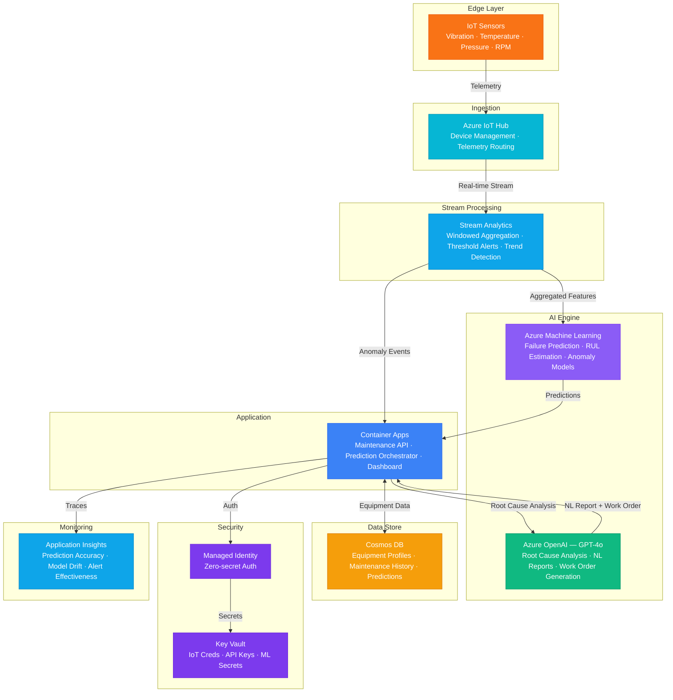

# Play 68 — Predictive Maintenance AI

Industrial predictive maintenance — IoT sensor telemetry (vibration, temperature, pressure, current), multivariate feature engineering, Gradient Boosting RUL prediction, condition-based scheduling (urgent/planned/monitor), LLM root cause analysis with parts + repair time, failure pattern recognition, and analyst feedback loop for model improvement.

## Architecture

| Component | Azure Service | Purpose |
|-----------|--------------|---------|
| Sensor Ingestion | Azure IoT Hub | Vibration, temperature, pressure, current |
| Time-Series Store | Azure Data Explorer | 90-day telemetry archive, feature queries |
| RUL Model | Azure ML + scikit-learn | Remaining Useful Life prediction |
| Root Cause | Azure OpenAI (GPT-4o) | Failure mode explanation + action + parts |
| Scheduler | Custom | Condition-based work order generation |
| Prediction API | Azure Container Apps | RUL endpoint + scheduling |

📐 [Full architecture details](architecture.md)

## How It Differs from Related Plays

| Aspect | Play 58 (Digital Twin) | **Play 68 (Predictive Maintenance)** |
|--------|----------------------|--------------------------------------|
| Focus | Full twin representation | **Failure prediction specifically** |
| Model | DTDL twin graph | **ML regression (GradientBoosting)** |
| Output | NL query results | **RUL days + work orders + root cause** |
| Features | Twin properties | **Multivariate sensor stats (kurtosis, trends)** |
| Scheduling | N/A | **Condition-based: urgent/planned/monitor** |
| Feedback | N/A | **Analyst confirms→model retrains** |

## Key Metrics

| Metric | Target | Description |
|--------|--------|-------------|
| RUL MAE | < 5 days | Prediction error margin |
| Critical Detection | > 95% | Failures within 7 days correctly flagged |
| False Alarm Rate | < 10% | Healthy equipment incorrectly flagged |
| Downtime Reduction | > 40% | vs reactive maintenance |
| ROI | > 10x | Value delivered / system cost |

## Cost Estimate

| Service | Dev | Prod | Enterprise |
|---------|-----|------|------------|
| Azure IoT Hub | $0 | $25 | $2,500 |
| Azure OpenAI | $25 | $200 | $800 |
| Azure Machine Learning | $15 | $150 | $500 |
| Stream Analytics | $80 | $240 | $960 |
| Cosmos DB | $3 | $60 | $240 |
| Container Apps | $10 | $100 | $280 |
| Key Vault | $1 | $3 | $10 |
| Application Insights | $0 | $30 | $100 |
| **Total** | **$134/mo** | **$808/mo** | **$5,390/mo** |

> Estimates based on Azure retail pricing. Actual costs vary by region, usage, and enterprise agreements.

💰 [Full cost breakdown](cost.json)

## WAF Alignment

| Pillar | Implementation |
|--------|---------------|
| **Reliability** | Condition-based scheduling, multi-sensor correlation, feedback loop |
| **Performance Efficiency** | Multivariate features, cross-sensor correlation, batch predictions |
| **Cost Optimization** | Reduced unplanned downtime, right-time maintenance, parts pre-ordering |
| **Operational Excellence** | Work order generation, root cause analysis, quarterly model retrain |
| **Security** | IoT device authentication, Key Vault for credentials |
| **Responsible AI** | Explainable predictions with top indicators, human review for urgent |

## FAI Manifest

| Field | Value |
|-------|-------|
| Play | `68-predictive-maintenance-ai` |
| Version | `1.0.0` |
| Knowledge | T3-Production-Patterns, F1-GenAI-Foundations, O2-Agent-Coding, T1-Fine-Tuning-MLOps |
| WAF Pillars | reliability, cost-optimization, operational-excellence, performance-efficiency, security |
| Groundedness | ≥ 85% |
| Safety | 0 violations max |
